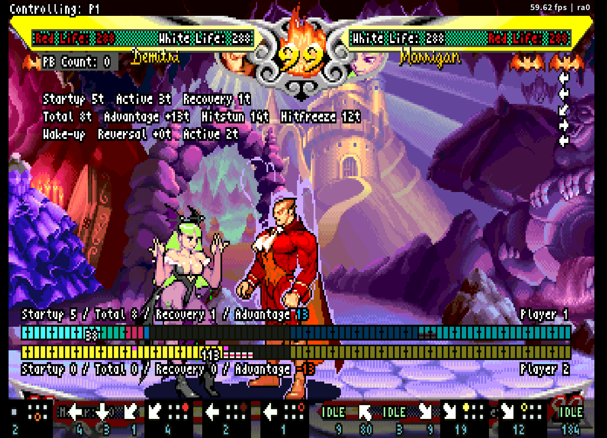

# VSAV_Training - The Warlord's Secret

See what the Warlord sees, and practice what the Warlord practices, in VSAV training mode for Fightcade 2.

English | [日本語](README.ja.md)

**Make expert-level execution your training partner.** This training mode for Fightcade 2 / FBNeo lets you define dummy actions with precise internal-frame (Tick) timing to practice your defense and test your offense. See where your inputs were accepted and when your attacks connected, then adjust your response.

This fork extends [VSAV_Training's fc2 branch](https://github.com/NBeing/VSAV_Training/tree/fc2). This README covers **v11.7.24.2**.

**[Download the latest release](https://github.com/vampiresavior001/VSAV_Training/releases/latest)** · [Installation](#windows-installation) · [Practice defense](#first-pb-drill) · [Test wake-up pressure](docs/PLAYER_MANUAL.en.md#wakeup-pressure-drill) · [English manual](docs/PLAYER_MANUAL.en.md)

**Start practicing PB and GC with the included Sasquatch pattern—no need to build a sequence first.** Follow the [illustrated tutorial](docs/PLAYER_MANUAL.en.md#sasquatch-pb-tutorial).

Left: check whether you still fit six presses when delaying PB. Right: see which GC directions and button presses the game accepted. See [how to read the screen](docs/PLAYER_MANUAL.en.md#screen-map) for each display.

## Reproduce, practice and adjust

1. **Reproduce the opponent.** Define actions and timing in Action Steps to repeatedly reproduce precise sequences, such as the earliest possible dash into an attack or crouching medium kick canceled into Tenraiha. On wake-up, after blocking and after landing, it can use **light attacks, throws, jumps and dashes** as well as special-move reversals.
2. **Practice and test.** Have the dummy repeat the same offense to practice PB, GC or interrupts after air guarding, or test your own wake-up pressure and strings against a fixed response.
3. **Read the result and adjust.** See where your inputs landed in the window and on which Tick your attack connected, then adjust your next attempt. PB Stats and GC Stats track your success rate and input time.

Randomness affects PB activation and GC input windows. These displays help you identify what to improve from the inputs the game accepted, rather than success or failure alone.

## What you can test and practice

### Practice defense

| Goal | How to use the tool |
|---|---|
| **Fix your PB execution** | Use [PB Counter](docs/PLAYER_MANUAL.en.md#08-pb) to see where in the window you pressed and how many presses counted. PB Stats tracks your success rate and averages |
| **Find why a GC failed** | Use [GC Command Trace](docs/PLAYER_MANUAL.en.md#09-gc) to see which directions and buttons the game accepted and where the input expired. Compare the left and right sides with [GC Stats](docs/PLAYER_MANUAL.en.md#gc-stats) |
| **Practice defense with varied attacks** | Randomize attacks or their timing to practice PB and GC without relying on a fixed rhythm. See [which setting to use](docs/PLAYER_MANUAL.en.md#dummy-button-timing) |
| **Explore situations after air guarding** | Use [Air Guard Gaps](docs/PLAYER_MANUAL.en.md#air-guard-gaps) to check gaps in air chains, interrupt timing and landing advantage |

### Test your offense

| Goal | How to use the tool |
|---|---|
| **Test wake-up pressure and attack strings** | Fix the dummy’s response, then use [Meaty Timing](docs/PLAYER_MANUAL.en.md#meaty-timing) to compare contact timing with the actual outcome |
| **Build setups** | Use [Action Timeline](docs/PLAYER_MANUAL.en.md#action-timeline) to measure time spent setting up wake-up pressure or walking into throw range |
| **Study option selects on a cross-up** | Set [Auto-Flip Inputs on Side Switch](docs/PLAYER_MANUAL.en.md#side-switch-os) to `no` so the dummy keeps sending the same input after a cross-up, and see what comes out |

After Demitri's heavy Demon Cradle, a forward-jump LP connects at `Reversal +0t`, right on Morrigan's reversal Tick. It lands almost at once, so even a reversal Shadow Blade can be blocked on the ground: a safe jump. The screenshot shows the moment of contact; see the [wake-up pressure drill](docs/PLAYER_MANUAL.en.md#safe-jump-example) for the landing block and how to check it.

### Examine moves

| Goal | How to use the tool |
|---|---|
| **In numbers** | [Tick Data](docs/PLAYER_MANUAL.en.md#tick-data) measures startup, active time, recovery and advantage in internal frames, with counting conventions aligned with [the frame data tables](http://darkstalkers.web.fc2.com/savior/savior.html) |
| **As colored bars** | [Frame Meter](docs/PLAYER_MANUAL.en.md#frame-meter) lays out startup, active frames, recovery, invulnerability and other states for both players, one tile per Tick |

### Build the opponent

The dummy performs the action you build here when something triggers it, such as blocking, being hit or waking up ([how the dummy works](docs/PLAYER_MANUAL.en.md#dummy-model)). Recordings can also be played back right away.

| Goal | How to use the tool |
|---|---|
| **Use actions you can perform yourself** | [Recording Wizard](docs/PLAYER_MANUAL.en.md#05-recording) captures your inputs from start to finish, then lets you review and save the recording. Recording and playback use displayed frames |
| **Reproduce precise sequences** | [Action Steps](docs/PLAYER_MANUAL.en.md#06-steps) defines actions and their timing in Ticks |
| **Run several sequences at random** | [Action Patterns](docs/PLAYER_MANUAL.en.md#07-patterns) saves sequences by name and picks one at random from those you select |

## Windows installation

The target game is **Vampire Savior - the lord of vampire (970519 Japan / `vsavj`)**.

**ROMs are not included. Supply your own files and first make sure the game runs in FBNeo.**

**Set FBNeo's `Video > Runahead` to `Disabled`.** With Runahead enabled, the dummy cannot reproduce reversal timing correctly. If you also play matches through Fightcade, copy the entire FBNeo folder for training so you never have to switch the setting. Launch matches through Fightcade and training through the copied batch file.

1. Close Fightcade and FBNeo.
2. Copy Fightcade's entire `emulator/fbneo` folder to another location, for example `C:/VSAV_Training/fbneo`.
3. Download and extract the [latest release zip](https://github.com/vampiresavior001/VSAV_Training/releases/latest). Put `run_vsav_training.bat` and the entire `scripts` folder in the **copied fbneo folder**, with the batch file next to `fcadefbneo.exe`.
4. Launch the copied batch file and select **`Video > Runahead > Disabled`** in FBNeo itself. Copying the folder also copies settings; it does not disable Runahead by itself.
5. Fully close FBNeo and relaunch through the same batch file. Confirm that `Disabled` is selected under `Video > Runahead`. If `RUN-AHEAD DETECTED` appears during a match, recheck the setting and which FBNeo installation you launched.
6. Use `Input > Map Game Inputs` to configure game controls and the functions below. Configure P2 game inputs too.

To play in full screen, check `Video > Blitter options > Windowed Fullscreen` first. The older full-screen mode cannot show the windows used to name, export and import patterns.

Use a short path without Japanese characters; spaces are fine. Before updating an existing installation, make a [backup](#updates-and-backups).

### Basic controls

**Always assign `Lua Hotkey 1` and `P1 Coin`: neither has a menu equivalent.** The other shortcuts can be replaced by the menu operations below.

Show shortcuts and their menu alternatives

| FBNeo input entry | Function | Menu alternative |
|---|---|---|
| `Lua Hotkey 1` | Open/close the training menu | No alternative — **required** |
| `Lua Hotkey 2` | Restore positions by holding a direction and pressing the hotkey | In `Dummy > Position`, use Left/Right to choose a layout. LP restores it again; HP also closes the menu |
| `Lua Hotkey 3` | Toggle looping for recorded inputs | In `Recording > Looped Playback`, use Left/Right to switch between `yes` and `no` |
| `Lua Hotkey 4` | Return to character select | Select `Game > Return to Character Select` and press Right or LP |
| `Volume Up` | Start/stop standard recording | Open `Recording > Recording Wizard` with Right or LP, choose a slot and use automatic recording (see below) |
| `Volume Down` | Start/stop playback | Select `Recording > Play Recording` and press Right or LP. Activate it again to stop |
| `P1 Coin` | Switch which character you control during a match; choose a stage at character select | No alternative — **required** |

Open the menu with `Lua Hotkey 1`. With a tab name selected, use Left/Right to switch tabs, then Up/Down to select an item. LP means light punch. `>` means “tab > item.”

**To record through the menu:** choose a slot in the wizard, release all inputs, then start moving to begin recording. Finish your action and release the controls. Recording ends automatically after about two seconds of no input while the dummy is free to act. On the confirmation screen, select the save option and press LP. Use `Volume Up` if you want to start and stop recording manually.

Recording's `Looped Playback` and Action Steps' `Loop Steps` are separate settings. See the [recording instructions](docs/PLAYER_MANUAL.en.md#05-recording) for details.

`Volume Up / Down` are FBNeo input entries. You can assign them to arcade-stick or controller buttons.

## First drill: Practice PB and GC against Sasquatch

Make Sasquatch perform short-dash LP, then practice PB (Push Block) and GC (Guard Cancel) against it. The included pattern lets you start practicing before building your own sequence.

Start by trying either PB or GC; looping and building your own actions can wait until you are comfortable. The steps below outline the drill. Follow the [illustrated tutorial](docs/PLAYER_MANUAL.en.md#sasquatch-pb-tutorial) for the settings and controls.

1. **Import it.** Choose Sasquatch as the dummy. Under `Reversal - Action Patterns`, use `Import from a File` to load `scripts/patterns/Sasquatch_Short_LP.json` from the release. Select only `Short LP` for use.
2. **Practice PB.** Make the dummy block your attack to trigger short-dash LP, then use PB against it. Use PB Counter and PB Stats to check, for example, whether you delayed your first press and still fit six valid presses within the window.
3. **Try GC too.** Block the same LP and enter your character’s GC command. Check the success indicator, accepted directions and buttons, and input intervals. Use [GC Stats](docs/PLAYER_MANUAL.en.md#gc-stats) to compare your success rate on the left and right sides.
4. **Repeat it.** Set `Loop Steps = yes` and `Loop Wait = Auto (Landing)` to repeat short-dash LP as soon as the dummy lands.
5. **Expand your practice.** The imported pattern is ready to use next time. When comfortable, build other attacks in Action Steps and save them in Action Patterns to practice against randomly selected sequences.

See [PB practice](docs/PLAYER_MANUAL.en.md#08-pb) and [GC practice](docs/PLAYER_MANUAL.en.md#09-gc) for how to read the input displays and decide what to adjust.

## Why Ticks

A Tick is an internal game frame. At Turbo 3, four Ticks pass in three displayed frames, so counting in displayed frames can throw off both input timing and move measurements. This fork controls the dummy's inputs on that internal clock.

| Game speed | Displayed frames and internal frames |
|---|---|
| Normal | One displayed frame = one Tick |
| Turbo 3 | Three displayed frames = four Ticks |

See [Action Steps](docs/PLAYER_MANUAL.en.md#06-steps) for the conditions required to act at the earliest possible moment.

**Recording and playback operate in displayed frames.** Define actions that need precise Tick-level timing in Action Steps. Measurement such as **Tick Data**, by contrast, is in Ticks, which avoids the turbo-frame variation of the original display-frame measurements. See [manual Section 11](docs/PLAYER_MANUAL.en.md#10-data) for measurement conditions and how to read the results.

Some older readouts, such as the dash trainers, still count displayed frames. See the list in [manual 11.1](docs/PLAYER_MANUAL.en.md#ticks-and-frames) for which unit each display uses.

## Manual

The **[English player manual](docs/PLAYER_MANUAL.en.md)** covers controls, settings and how to interpret the readouts.

- **Build the opponent:** [Dummy defense, recovery and counter actions](docs/PLAYER_MANUAL.en.md#04-dummy), [Recording and looping](docs/PLAYER_MANUAL.en.md#05-recording), [Action Steps](docs/PLAYER_MANUAL.en.md#06-steps), [Action Patterns](docs/PLAYER_MANUAL.en.md#07-patterns)
- **Practice:** [PB practice](docs/PLAYER_MANUAL.en.md#08-pb), [GC practice](docs/PLAYER_MANUAL.en.md#09-gc), [Practice recipes](docs/PLAYER_MANUAL.en.md#11-drills)
- **Analyze:** [Tick Data](docs/PLAYER_MANUAL.en.md#tick-data), [Meaty Timing](docs/PLAYER_MANUAL.en.md#meaty-timing), [Frame Meter](docs/PLAYER_MANUAL.en.md#frame-meter), [Air Guard Gaps](docs/PLAYER_MANUAL.en.md#air-guard-gaps), [Troubleshooting](docs/PLAYER_MANUAL.en.md#14-troubleshooting)

### Scope

These installation instructions target Windows. Linux launch scripts are included, but support for every feature of this fork on Linux/macOS was not verified when this README was prepared. Action Patterns naming and file dialogs are implemented for Windows.

## Updates and backups

Save your edits before closing FBNeo, then back up:

| Content | Location |
|---|---|
| Settings, Action Steps and Action Patterns | `training_data/training_settings.json` |
| Recordings | Entire `scripts/macro` folder |

The settings file is in the `training_data` folder, outside `scripts`. When you first start a version that uses `training_data`, an existing `scripts/training_settings.json` is copied there automatically. The old file stays where it was as a copy and is no longer updated. Recordings are still in `scripts/macro`, so back up both.

Update the separate training installation. The downloaded files may include recordings, so take care not to overwrite your own. Fully restart FBNeo afterward and confirm that `Disabled` is selected under `Video > Runahead`.

## Release history and reports

- [Release notes](docs/RELEASE_NOTES.md)
- [日本語リリースノート](docs/RELEASE_NOTES.ja.md)
- [This fork's Issues](https://github.com/vampiresavior001/VSAV_Training/issues)

When reporting a problem, include the version, P1/P2 characters, which character is on each side, screenshots of your settings and steps to reproduce the problem. Confirm that `Disabled` is selected under `Video > Runahead`, and mention any red Runahead warning in your report.

## Original project and credits

This project is based on [VSAV_Training's fc2 branch](https://github.com/NBeing/VSAV_Training/tree/fc2). The original already includes recording, reversal settings, a PB counter and a GC-window display. This fork builds on them with more precise action reproduction and more detailed feedback; see the [feature comparison](docs/PLAYER_MANUAL.en.md#fork-comparison). Thanks to the creators and contributors of the original training mode and its scripts, and to the VSAV community.

The Frame Meter comes from tirsod's [VSAV_FrameMeter](https://github.com/tirsod/VSAV_FrameMeter).

Credits from the original README

Shoutouts to: Dammit and Jed for their wizardry, Grouflon (Stole their 3s training mode menu, and settings workflow!) and the VSAV Community.

BIGGEST SHOUTOUT to KyleW! This definitely would not have happened or continued without you.

`N-Bee`

