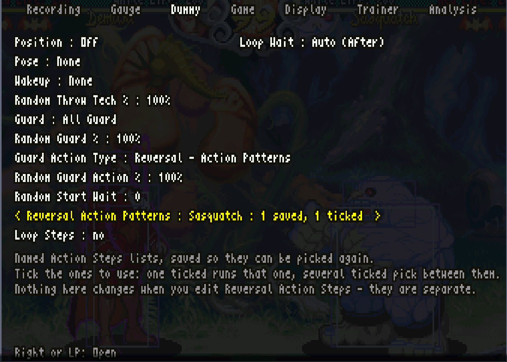
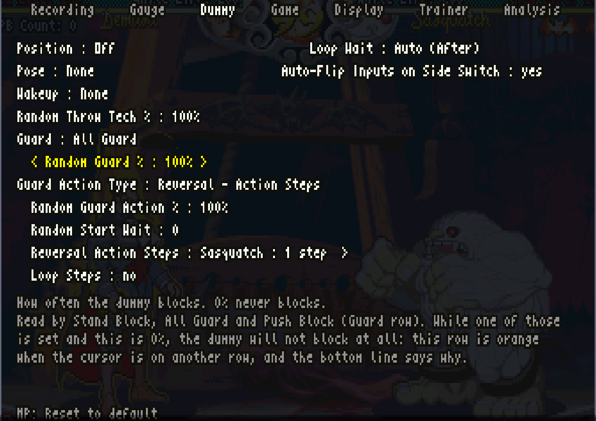
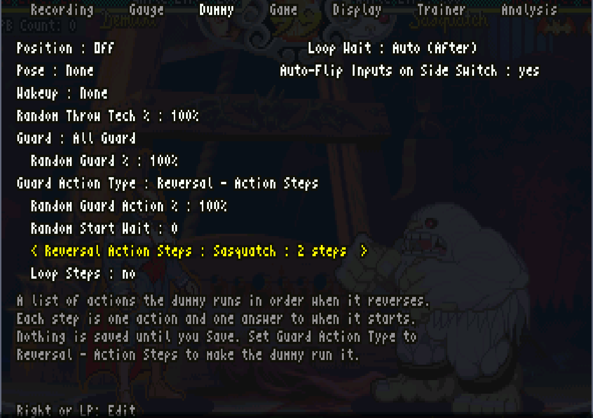
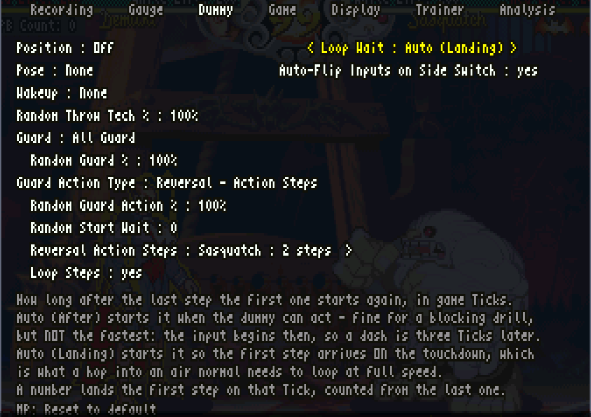
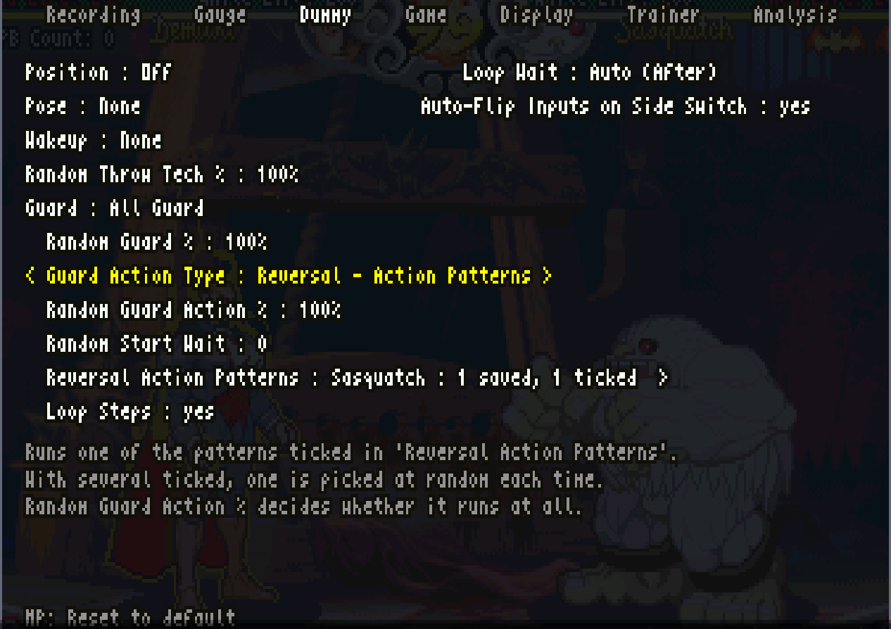
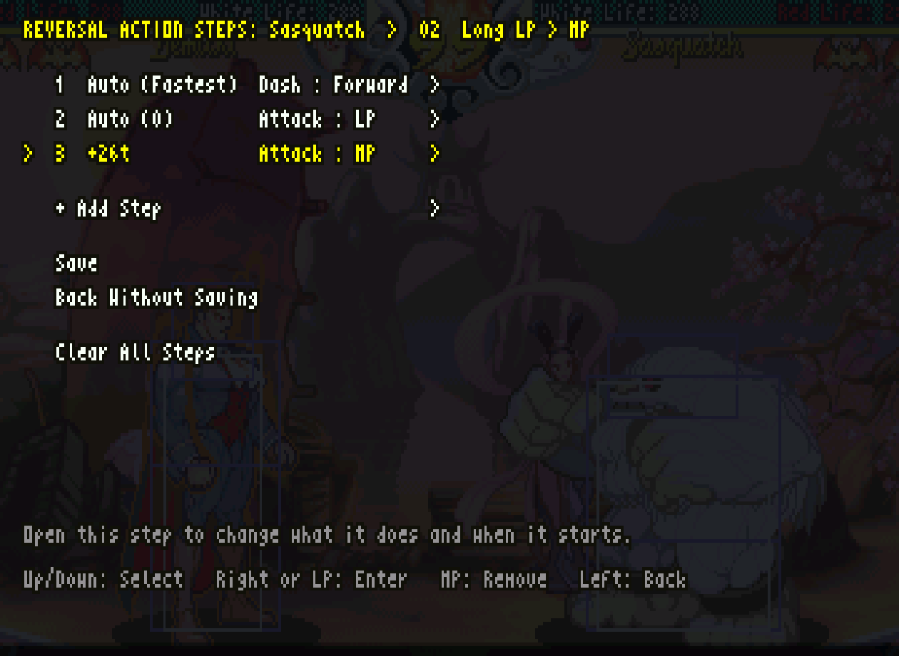
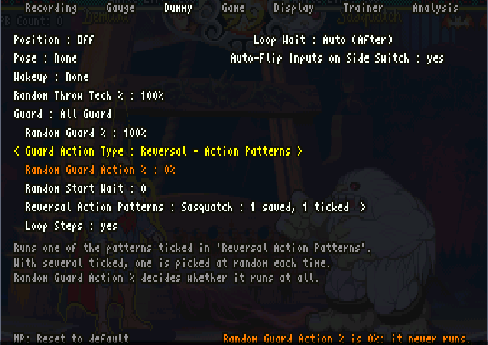
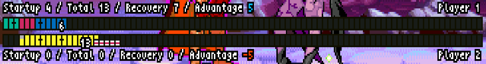
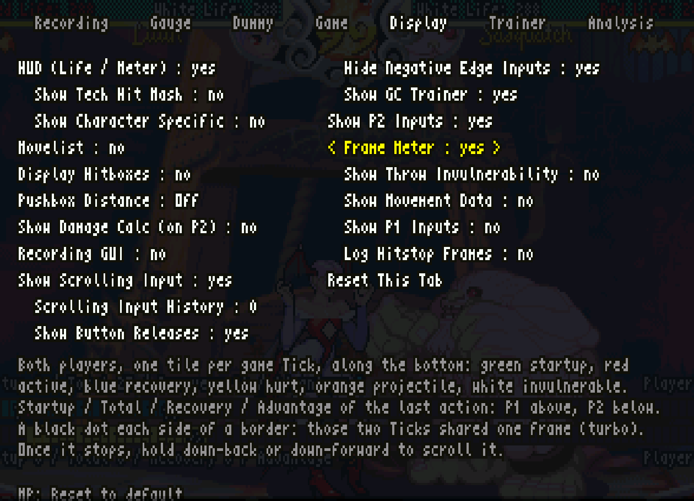

# VSAV_Training Player Manual

English | [日本語](PLAYER_MANUAL.ja.md)

Practice offense, defense and execution in Vampire Savior with repeatable dummy actions and detailed timing displays. Menu labels are reproduced as they appear in the tool so you can find the corresponding settings.

This guide uses **PB (Push Block)**, matching the English UI. Menu options are shown by their on-screen names, such as `Show PB Counter`.

For **v11.7.22.3 / Fightcade 2's FBNeo / Japanese `vsavj` (970519 Japan)**. Installation instructions are for Windows. Unless stated otherwise, you control P1 and the dummy is P2.

[Start with installation](#02-install) · [Already set up? Try the PB / GC drill](#sasquatch-pb-tutorial) · [Scope and verification](#verification-scope)

See the [README](../README.md) for a feature overview. This manual explains how to set up drills and interpret the results.

<details>
<summary>Tick control and comparison with the original</summary>

At Normal speed, one displayed frame equals one Tick. At Turbo 3, four Ticks pass in three displayed frames. This fork controls dummy inputs on those internal frames. It improves on the original version’s ability to reproduce actions at the earliest possible moment and lets you specify actions on wake-up, after blocking and after landing. Alongside special-move reversals, you can make the dummy use light attacks or throws, jump or dash when it becomes able to act.

Action Steps builds on this control to define actions in internal frames. It supports individual responses, strings and complex combos, including definitions that can complete infinite combos for Bulleta (B.B. Hood) or Bishamon. Repeat these sequences to test your responses against more demanding offense.

Recording and playback operate in displayed frames, so they do not reproduce input timing with Tick-level precision. Use Action Steps for drills that require precise internal-frame timing, especially at turbo speeds. Recording Wizard, added in this fork, makes it easy to capture an input sequence from start to finish.

For PB, you can check whether you delayed your input while still fitting six presses inside the window. For GC, you can see which inputs the game accepted and where you were late. For air guarding, you can see whether an interruptible gap existed, whether your press was well timed and who could act first after landing. This fork combines accurate dummy actions with detailed feedback on your response.

### Compared with the original

| Feature | Original | This fork |
|---|---|---|
| Counter actions and reversals | Specified inputs and character-specific move activation, with limitations on earliest timing at turbo speed and delays from entering motions | Input control in internal frames, with improved wake-up, post-block and landing timing; the start and the button press can also be varied at random each time |
| Move data | Frame Data uses displayed frames, giving unstable measurements at turbo speeds | Tick Data measures internal frames, with startup, active time, recovery and advantage conventions aligned with strategy sites |
| Building dummy behavior | Recording playback and individual counter actions | Recording Wizard simplifies recording; Action Steps defines Tick-based sequences, and Action Patterns saves, selects and shares them |
| PB practice | Input counter and success/failure statistics | Tick-by-Tick window history, simultaneous presses, late inputs and counts that include presses after activation; PB Stats shows averages and the success rate |
| GC practice | GC window in the input viewer | Tracks accepted commands, input intervals, expiry and contact during guard-pose persistence |
| Air-guard analysis | Frame Trap and Jump In readouts, among others | Dedicated Air Guard Gaps for gaps in air chains, actual interrupts, guard timing and landing advantage |

The distinction is **the precision of reproduced actions and the detail available to review your responses**, rather than the mere presence of features the original already had. `Runahead` must be set to `Disabled`. After does not enter motions in advance, and Landing's advance input depends on certain conditions; not every setting guarantees the earliest possible action in every situation. See [installation](#02-install) and [Action Steps](#06-steps).

</details>

## Contents

- [Start here: the screen and what to practice](#01-purpose)

**Part 1: Get started**

- [1. Installation and first setup](#02-install)
- [2. Controls and position shortcuts](#03-controls)
- [3. Guided practice: PB and GC against Sasquatch](#sasquatch-pb-tutorial)

**Part 2: Build the opponent**

- [4. Dummy defense, recovery and counter actions](#04-dummy)
- [5. Record opponent actions](#05-recording)
- [6. Build actions with Action Steps](#06-steps)
- [7. Save, randomize and share Action Patterns](#07-patterns)

**Part 3: Practice**

- [8. Practice PB](#08-pb)
- [9. Practice guard cancels](#09-gc)
- [10. Practice recipes](#11-drills)

**Part 4: Analyze and configure**

- [11. Read move data and gaps](#10-data)
- [12. Display and game settings](#12-options)
- [13. Saving, backups and updates](#13-save)
- [14. Troubleshooting](#14-troubleshooting)
- [15. Glossary and reference version](#15-reference)

<a id="01-purpose"></a>
## Start here: the screen and what to practice

<a id="screen-map"></a>
### The screen

Show only the displays for the drill you are practicing; they are easier to read that way. You can also show PB and GC displays together.

**Practicing PB** (`Show PB Counter` and `Show PB Stats` on the `Trainer` tab)


| No. | Display | What it shows | More |
|---|---|---|---|
| 1 | PB Count line | Your PB presses and where in the 14-Tick window you pressed | [Section 8](#08-pb) |
| 2 | Pressed-button list | The buttons you pressed in the window; `TECH HIT` marks the press that activated PB | [Section 8](#08-pb) |
| 3 | PB Stats | Your PB success rate and averages | [8.3](#pb-stats) |

**Practicing GC** (`Show GC Command Trace` and `Show GC Stats` on the `Trainer` tab, `Show Scrolling Input` on the `Display` tab)


| No. | Display | What it shows | More |
|---|---|---|---|
| 4 | GC Command Trace | The GC directions and buttons the game accepted, their intervals and the result | [Section 9](#09-gc) |
| 5 | GC Stats | Your GC success rate and input time, split into the 1P and 2P sides. Top left while PB Stats and the other top-left displays are off, bottom right otherwise | [9.4](#gc-stats) |
| 6 | Input bar | Your inputs, with the guard and GC marks (`G`, `GC`, `SUCCESS`) | [9.3](#gc-timing) |
| 7 | P2 inputs (`Show P2 Inputs`) | The dummy's inputs | [Section 12](#12-options) |

### Choose what to practice

| Goal | Feature | Where to start |
|---|---|---|
| Test combos and pressure strings | Dummy stance, blocking and health recovery | `Dummy`, `Gauge` |
| Make the dummy challenge on wake-up or after blocking | Individual counter actions, Action Steps | `Dummy > Guard Action Type` |
| Repeat offense seen in matches | Recording and looping | `Recording > Recording Wizard` |
| Specify a dash into an attack precisely | Action Steps | [Section 6](#06-steps) |
| Randomize several offensive sequences | Recording slots, Action Patterns | [Section 5](#05-recording), [Section 7](#07-patterns) |
| Improve PB execution | `Show PB Counter`, `Show PB Stats` | [Section 8](#08-pb) |
| Find why a GC failed | GC Command Trace, input history | [Section 9](#09-gc) |
| Track your GC success rate on the 1P and 2P sides | `Show GC Stats` | [Section 9.4](#gc-stats) |
| Examine advantage, interrupts and landing situations | Tick Data, Air Guard Gaps | [Section 11](#10-data) |

Start with [installation](#02-install) and [basic controls](#03-controls), then [practice PB and GC against Sasquatch](#sasquatch-pb-tutorial).

# Part 1: Get started

From installation to your first drill.

<a id="02-install"></a>
## 1. Installation and first setup

### 1.1 Requirements

- FBNeo included with Fightcade 2.
- This project's `run_vsav_training.bat` and the **entire `scripts` folder**.
- Your own game ROM files. **This project does not include ROMs.**

The launcher starts the Japanese `vsavj` set. First make sure the game runs in FBNeo on its own. If files are missing, check the missing-file list shown by FBNeo.

### 1.2 Create a separate FBNeo installation for training

**Set `Video > Runahead` to `Disabled` in FBNeo itself.** With Runahead enabled, the dummy cannot reproduce reversal timing correctly.

If you also play matches through Fightcade, **copy the entire `emulator/fbneo` folder and install the training mode in that copy** to avoid forgetting to switch settings. Copy everything under the FBNeo folder, not just the executable or scripts. Keep separate executables and settings for matches and training.

1. Close Fightcade and FBNeo.
2. Copy Fightcade's entire `emulator/fbneo` folder to another location, such as `C:/VSAV_Training/fbneo`.
3. Download the latest zip from [Releases](https://github.com/vampiresavior001/VSAV_Training/releases/latest) and extract it.
4. Put `run_vsav_training.bat` and `scripts` in the **copied fbneo folder**. The batch file must sit next to the copied `fcadefbneo.exe`.
5. Double-click `run_vsav_training.bat` **in the copy**.
6. In your training copy of FBNeo, select **`Video > Runahead > Disabled`** from the emulator menu. The original settings were copied too; copying the folder alone does not disable it.
7. Fully close FBNeo, start it again through the copied batch file and confirm that `Disabled` is selected under `Video > Runahead`.
8. Open `Input > Map Game Inputs` and assign game controls and the functions below.

If Runahead is still enabled, this red warning flashes at the top of the screen once the match has been running for a moment. It is inferred from the number of re-run Ticks, so it does not appear right after launch; check the setting in the menu itself. If you see the warning, select `Video > Runahead > Disabled` and restart FBNeo.


**To play in full screen, check `Video > Blitter options > Windowed Fullscreen`**, then switch with `Video > Toggle fullscreen mode` (`Alt+Enter`). Without the check, FBNeo uses its older full-screen mode, and the Windows dialogs used to name, export and import patterns cannot appear over it.


Launch matches through your usual Fightcade installation and training through the copied batch file. A shortcut named “VSAV Training” helps distinguish the two.

For a fresh installation, use a short path without spaces or Japanese characters to avoid problems with the existing launcher and Lua file access. Before updating, follow the [backup instructions](#13-save).

**Always assign `Lua Hotkey 1` and `P1 Coin`: neither has a menu equivalent.** The other shortcuts can be replaced by the menu operations below.

| FBNeo input entry | Function | Menu alternative |
|---|---|---|
| `Lua Hotkey 1` | Open/close the training menu | No alternative — **required** |
| `Lua Hotkey 2` | Restore positions by holding a direction and pressing the hotkey | In `Dummy > Position`, use Left/Right to choose a layout. LP restores it again; HP also closes the menu |
| `Lua Hotkey 3` | Toggle looping for recorded inputs | In `Recording > Looped Playback`, use Left/Right to switch between `yes` and `no` |
| `Lua Hotkey 4` | Return to character select | Select `Game > Return to Character Select` and press Right or LP |
| `Volume Up` | Start/stop standard recording | Open `Recording > Recording Wizard` with Right or LP, choose a slot and use automatic recording (see below) |
| `Volume Down` | Start/stop playback | Select `Recording > Play Recording` and press Right or LP. Activate it again to stop |
| `P1 Coin` | Switch which character you control during a match; choose a stage at character select | No alternative — **required** |

Open the menu with `Lua Hotkey 1`. With a tab name selected, use Left/Right to switch tabs, then Up/Down to select an item. LP means light punch. `>` means “tab > item.”

**To record through the menu:** choose a slot in the wizard, release all inputs, then start moving to begin recording. Finish your action and release the controls. Recording ends automatically after about two seconds of no input while the dummy is free to act. On the confirmation screen, select the save option and press LP. Use `Volume Up` if you want to start and stop recording manually.

Recording's `Looped Playback` and Action Steps' `Loop Steps` are separate settings. See the [recording instructions](#05-recording) for details.

`Volume Up / Down` are **entries in FBNeo's input mapping**, not instructions to change Windows audio volume.

Configure P2's game inputs as well as P1's; check these if input behavior is unusual. You can map the functions to arcade-stick or controller buttons.

### 1.3 First check

Start the copied training installation. Before proceeding, confirm that `Disabled` is selected under `Video > Runahead`.

1. Choose your character and the dummy, then wait for the match to begin. After P1 is selected, P1's controls can also select P2.
2. Open the menu with `Lua Hotkey 1`.
3. Set `Dummy > Guard = All Guard` and `Random Guard % = 100%`.
4. Leave `Guard Action Type = None`.
5. Close the menu and attack to confirm that the dummy blocks.

**Selecting `All Guard` alone is not enough. If `Random Guard %` is `0%`, the dummy will not auto-block.** The row turns orange as a reminder.

<a id="03-controls"></a>
## 2. Controls and position shortcuts

### 2.1 Menu navigation

| Context | Controls |
|---|---|
| Tab names at the top | Left/right switches tabs; up/down moves to the item list |
| Item list | Up/down selects an item; left/right changes its value |
| Items with a detail screen | Right or LP opens it; follow the control guide at the bottom |
| Ordinary settings | MP resets that item to its default |
| Open/close menu | `Lua Hotkey 1` |

LP/MP/HP mean light/medium/heavy punch; LK/MK/HK mean light/medium/heavy kick.

Moving beyond either end of a list returns to the tab selection. MP has different meanings in different screens: it toggles a pattern's selection in Action Patterns and records another take at the recording confirmation screen. Follow the on-screen control guide.

An indented row is a setting of the nearest less-indented row above it, its parent. Most such rows appear or disappear with the parent's value (for example, `Frame Meter = yes` opens four indented rows under it).

`Reset This Tab` on `Display`, `Trainer` and `Analysis` resets all settings on that tab. A confirmation dialog opens with `Cancel` selected. This also resets any child settings hidden because their parent setting is OFF.

### 2.2 Controlled side and character select

- During a match, `P1 Coin` switches the side you control.
- You cannot switch sides during recording playback. Stop playback first.
- Use `Lua Hotkey 4` or `Game > Return to Character Select` to choose characters again.
- Returning to character select stops playback and clears the match's recording savestate, input history and previous PB/GC readouts.

### 2.3 Quickly restore positions

During a match, hold the following direction and press `Lua Hotkey 2`. Left and right here mean screen directions.

| Direction | Arrangement |
|---|---|
| Neutral | Center, you on the left and dummy on the right |
| Down | Center, you on the right and dummy on the left |
| Left | Left corner, dummy against the wall |
| Down-left | Left corner, you against the wall |
| Right | Right corner, dummy against the wall |
| Down-right | Right corner, you against the wall |

Corner arrangements place the characters next to each other. Center arrangements restore round-start spacing. Wait until repositioning finishes before acting.

You can also use `Dummy > Position`. In its diagram, `1` is you, `2` is the dummy and `|` is a wall.

- Left/right: choose an arrangement.
- LP: reapply the selected arrangement.
- HP: reapply it and close the menu.
- MP: reset to `Off`. `Off` leaves positions unchanged.

<a id="sasquatch-ag-tutorial"></a>
<a id="sasquatch-pb-tutorial"></a>
## 3. Guided practice: PB and GC against Sasquatch

Make Sasquatch perform short-dash LP, then practice PB (Push Block) and GC (Guard Cancel) against it. Complete [installation and input mapping](#02-install) first.

- **Try it once:** Import the included pattern in steps 1–2, then try [PB (step 3)](#tutorial-pb) or [GC (step 4)](#tutorial-gc). **You can start practicing at this point.**
- **Repeat when ready:** Enable looping in [step 5](#tutorial-loop).
- **Save your own sequence:** If you build the action manually, save it as a pattern in [step 6](#tutorial-save). An imported pattern is saved for next time.

### Step 1: Prepare the counter action

Choose your character for P1 and **Sasquatch** for the P2 dummy. Face each other on the ground, initially close enough for both attacks to reach. Open the menu with `Lua Hotkey 1` and configure `Dummy`:

| Option | Setting |
|---|---|
| `Guard` | `All Guard` |
| `Random Guard %` | `100%` |
| `Guard Action Type` | `Reversal - Action Patterns` |
| `Random Guard Action %` | `100%` |
| `Random Start Wait` | `0` (default: no additional random wait) |
| `Loop Steps` | `no` (start with one response at a time) |

`Random Guard %` controls blocking probability; `Random Guard Action %` controls the response probability. Set both to 100% to keep the drill consistent.

### Step 2: Import short-dash LP

Keep Sasquatch as the dummy, as set in Step 1.

1. Open `Reversal Action Patterns`.
2. Choose `Import from a File` and import `scripts/patterns/Sasquatch_Short_LP.json` from the release.
3. Press MP on `Short LP` in the list to mark it `[x]`. Uncheck any other selected patterns.

The imported pattern is already saved. You do not need the save procedure in Step 6.



<a id="tutorial-check"></a>
Close the menu, make Sasquatch block a ground attack from P1, then immediately block his response.

**Check: Setup is complete when the dummy responds with short-dash LP. Try either PB or GC next.**

This response can also trigger after the dummy is hit or wakes up. Start with a blocked attack to keep the situation consistent.

<details>
<summary>Optional: Build the same action in Action Steps</summary>

Switch to `Guard Action Type = Reversal - Action Steps` and follow the steps below. Then continue to the drills; use [Step 6](#tutorial-save) to save your sequence as a pattern.



This image shows the setup before building the action manually. `Reversal Action Steps` reads `Empty` if no definition exists yet.

Open `Reversal Action Steps` with Right or LP and create **only these two steps**. To preserve an existing definition, save it in [Action Patterns](#07-patterns) first.

| Step | Action selection | Wait | Other settings |
|---|---|---|---|
| 1 | `Dash > Forward Cancel` | `Auto (Fastest)` | Cancels the forward dash |
| 2 | `Attack`, with Button `LP` | `Auto (8)` | Direction `Neutral` (no Hold row appears) |

1. For step one, select `Action > Dash > Forward Cancel`. Leave Wait at its default, `Auto (Fastest)`.
2. Use `+ Add Step` to add step two. Under Wait, **select `Fastest (8)`**. It will appear as `Auto (8)` after editing. This is different from manually entering a fixed `8 Ticks` wait.
3. Check that both steps have `Random Delay = 0`. When your list matches the one below, select **`Save`**.


Find `Forward Cancel` under `Action > Dash`.


The line below the Wait list describes the selected option. For step one, `Auto (Fastest)` is the lowest value under `Fixed Ticks`. For step two, select `Fastest (8)`.


`Auto (8)` is the wait from the dash to the LP input. It does not mean LP has eight-Tick startup.

After saving, the Dummy tab shows `Reversal Action Steps : Sasquatch : 2 steps`.



</details>

<a id="tutorial-ag"></a>
<a id="tutorial-pb"></a>
### Step 3: Practice PB against the LP

Open the menu and configure these readouts and practice settings:

| Location | Setting |
|---|---|
| `Trainer > Show PB Counter` | `yes` |
| `Trainer > Show PB Stats` | `yes` |
| `Game > P1 Min PB Presses` | `Normal` (practice with ordinary activation rules) |

Close the menu, make the dummy block your attack to trigger short-dash LP, then use PB against it. Use PB Counter and PB Stats to check, for example, whether you delayed your first press and still fit six valid presses within the window.


- First fit **six valid presses inside the window**. Pressing several buttons on the same Tick counts as a single PB input.
- Green means PB activated. Keep pressing to complete six even if it activates earlier. Post-activation presses remain in the counter so you can check that you completed the sequence.
- Once consistent, delay your first press relative to `Guard`. Aim to **start as late as possible while fitting six presses into the 14-Tick window**.

If you fall short of six valid presses, check for simultaneous presses or inputs after the window closes. See [Section 8](#08-pb) for the readouts and counting rules.

**Check: Complete six valid presses inside the window, even if PB activates before the sixth.**

<a id="tutorial-gc"></a>
### Step 4: Practice GC against the same LP

Keep the dummy settings unchanged and practice your character's GC against the same LP. Leave `Loop Steps = no` and enable these readouts:

| Location | Setting |
|---|---|
| `Display > Show Scrolling Input` | `yes` |
| Its child option `Show GC Trainer` | `yes` |
| `Trainer > Show GC Command Trace` | `yes` |

You can leave PB Counter / PB Stats enabled. GC Command Trace sits to the right of PB Stats.

1. Make Sasquatch block P1's attack to trigger the short-dash LP response.
2. Block the LP and enter **the GC command for your P1 character**.
3. Check `Success` in the trace or `SUCCESS` in the input history. **Activating GC and hitting the opponent with that move are separate outcomes.** First practice the input using the success indicator as your reference.
4. If it fails, check whether you blocked, whether the directions were accepted in order and whether the final button was pressed in time. Adjust one part of your input at a time. See [Section 9](#09-gc) for the readouts.


This example shows a successful GC with Demitri. **Orange highlights alone do not mean failure.** Use the GC command for your own character.

**Once comfortable, practice on both sides:** Set `Trainer > Show GC Stats = yes` and compare your success rate against the same attack on each side. Review failed attempts on your weaker side in the trace, adjust your input and try again ([Section 9.4: GC Stats](#gc-stats)).

<details>
<summary>Read the timing values in this GC example</summary>

The trace shows → 7t, ↓ 4t, ↘ 4t and the buttons 0t (on the same Tick as ↘), then `Success 14t`. The input bar also shows `SUCCESS 14t`. Orange highlights help identify slow inputs. See [Section 9](#09-gc) for the full guide.

</details>

**Check: `Success` / `SUCCESS` means the GC activated.**

<a id="tutorial-loop"></a>
### Step 5: Repeat short-dash LP and practice PB or GC

After practicing one response at a time, change these `Dummy` settings:

| Option | Setting |
|---|---|
| `Loop Steps` | `yes` |
| `Loop Wait` | `Auto (Landing)` |



`Loop Wait` is the row after `Loop Steps`. When the tab shows many rows, it appears at the top of the right-hand column, beside `Position`.

Close the menu and make the dummy block another attack to start the first response. **Enabling Loop alone does not start the first pass.**

Landing wait enters the required directions before the dummy lands, timing the final dash input to coincide with landing. Use it to practice against repeated short-dash LPs starting as early as possible on landing. `Auto (After)` starts inputs only once the dummy can act and does not produce the same timing. See [Section 6](#06-steps) for conditions that can prevent landing prediction.

Block the repeated LPs and perform consecutive push blocks. Check whether you can maintain six presses and delayed timing across repeated attempts. After PB pushes the dummy away, it approaches again with short dashes, so keep responding to its offense.

You can practice GC against the same repeated offense. Choose PB or GC for each attempt; when practicing GC, check `Success`. If a GC hit or another interaction changes the situation or spacing, reset the situation and trigger the response again.

To stop looping, open the menu and set `Loop Steps = no`. To disable counter actions too, set `Guard Action Type = None`.

<a id="tutorial-save"></a>
### Step 6: Save it as `Short LP`

Save the base sequence you built manually as `Short LP`. If you are using the included pattern as-is, skip this procedure and go to [the optional timing drill](#tutorial-varied-timing).

1. Set `Random Delay = 0` on both steps and select `Save` in Action Steps. Also check that `Random Start Wait = 0`.
2. Switch `Dummy > Guard Action Type` to `Reversal - Action Patterns`.
3. Open `Reversal Action Patterns` and choose **`Add from current Steps`**.
4. Enter **`Short LP`** in the separate name window and confirm. This copies your currently saved Steps.
5. Mark only `Short LP` as `[x]` in the list. MP toggles whether a pattern is selected.
6. Keep `Random Guard Action % = 100%` and make the dummy block your attack to test it. Use `Loop Steps = no` for individual responses, or `yes` with `Auto (Landing)` for repeated practice.

![The pattern list showing [x] 01 Short LP](images/tut_patterns_ticked.png)

**Check: Select `Short LP` and trigger a response. If the saved short-dash LP plays, you are done.**

This is a copy: editing the pattern later does not change the original Action Steps. Check Loop settings separately from these two steps.

**With random waits set to 0 and only `Short LP` selected, you can practice against fixed timing.** Save other offensive sequences and mark several `[x]` to select one at random for each time the dummy has an opportunity to respond ([optional drill](#tutorial-mixed-patterns)). This takes the drill from PB and GC against a known action to reacting to different attack sequences.

<details>
<summary>Show import screens and help with the name window</summary>

Switch `Guard Action Type`.



Choose `Add from current Steps`.


Enter the name in the separate window. The game pauses until you close it.


If the emulator covers the name window, it comes back in front automatically; click it to type. FBNeo's older full-screen mode cannot show it. Enable `Video > Blitter options > Windowed Fullscreen` (see [installation](#02-install)).

</details>

<a id="tutorial-varied-timing"></a>
### Optional: Practice against varied timing

If you disabled counter actions, restore `Guard Action Type = Reversal - Action Patterns` and mark only `Short LP` as `[x]`. Make the dummy block your attack and check that it responds.

Once consistent against fixed timing, change one of the following at a time.

- **Vary the start:** Use `Short LP` and gradually increase `Random Start Wait`. You do not need to edit the pattern.
- **Vary the LP timing:** Set `Random Start Wait = 0`. Use `Copy` in Action Patterns to duplicate `Short LP`. The copy appears right under the original with the same name and the same `[x]`; use `Rename` to call it something like `Short LP Varied`. Gradually increase `Random Delay` on the copy's attack step only, then save it.

When using the copy, mark only that pattern `[x]` and uncheck the original `Short LP`. Confirm that the intended short-dash LP still comes out before practicing PB or GC. See [Section 4.4](#dummy-button-timing) for the settings.

To return to fixed timing, set `Random Start Wait = 0` and select only the original `Short LP`.

<a id="tutorial-mixed-patterns"></a>
### Optional: Have the dummy choose between two attacks

`Long LP > MP`, the partner to `Short LP`, is also included. It is a full forward dash (no cancel) into LP, then MP after a gap. The gap is set to make jumping out difficult.

1. Open `Reversal Action Patterns` and use `Import from a File` to import `scripts/patterns/Sasquatch_Long_LP_MP.json` from the release. It appears under `Short LP` in the list.
2. Mark only `Long LP > MP` as `[x]` and check that `Random Start Wait = 0`. Make the dummy block your attack and check that it dashes in with LP into MP.



The third step's `+26t` inputs MP 26 Ticks after LP. It is a fixed gap, not `Auto (Chain)`.

3. Mark both `Short LP` and `Long LP > MP` as `[x]`. On each counter opportunity, one of the two is chosen at random. The same one can come up several times in a row.

![The pattern list with only Short LP and Long LP > MP marked [x]](images/tut_sasquatch_patterns_mixed.png)

**This moves you from practicing against one fixed sequence to reading which attack is coming and responding to it.**

To return to `Short LP` alone, uncheck `Long LP > MP` and leave only `Short LP` marked `[x]`.

### What to try next

- **Find why PB or GC failed:** [Read PB results and improve your inputs](#08-pb) / [Read GC results and improve your inputs](#09-gc).
- **Practice against another character or offensive sequence:** [Record actions](#05-recording) / [Build a sequence in Steps](#06-steps) / [Manage multiple patterns and run them at random](#07-patterns).
- **Test your own pressure and wake-up setups:** [Practice recipes](#11-drills) / [Read move data and gaps](#10-data).

# Part 2: Build the opponent

Set up what the dummy does. Practice starts with building the opponent.

<a id="04-dummy"></a>
## 4. Dummy defense, recovery and counter actions

### 4.1 Basic defense settings

| Option | Meaning |
|---|---|
| `Pose` | Direction held normally: `None`, crouching, forward/back or jumping directions |
| `Wakeup` | Movement on recovery from knockdown: `None`, `Towards`, `Away` or random choices |
| `Random Throw Tech %` | Throw-tech probability: `0% / 25% / 50% / 75% / 100%` |
| `Guard` | Blocking method |
| `Random Guard %` | Probability of blocking with the applicable guard methods: `0% / 25% / 50% / 75% / 100%` |

`Random Throw Tech %` defaults to `100%`. Set it to `0%` when examining throws without automatic techs.

| `Guard` value | Behavior and use |
|---|---|
| `None` | No automatic guard. A backward `Pose` can still cause blocking through that held input |
| `Stand Block` | Holds back when an attack approaches; does not automatically choose low blocking |
| `All Guard` | Crouches for lows, stands for overheads/jump attacks and follows `Pose` for attacks blockable either way |
| `Auto Guard` | Directly uses the game's guard flag, including in normally unblockable situations. Do not use it to validate unblockables |
| `Push Block (All Light / Medium / Heavy)` | Blocks like `All Guard` and performs a push block of the selected strength |

For consistent testing with `Stand Block`, `All Guard` or `Push Block (All …)`, set `Random Guard % = 100%`. PB selected under `Guard` can be combined with the counter-action settings below.

**A probability setting turns orange when 0% prevents the selected action from running.** While `Guard` is `Stand Block`, `All Guard` or `Push Block (All …)` and `Random Guard %` is `0%`, the `Random Guard %` row turns orange. With the cursor on `Guard` or `Random Guard %`, the right side of the bottom line reads `Random Guard % is 0%: the dummy never blocks.` The value is not changed for you, because 0% can be intentional.

<a id="dummy-guard-action"></a>
### 4.2 Actions after blocking, being hit or waking up

Selecting `Guard Action Type` reveals the settings for that type. Start with **`Random Guard Action % = 100%`** to verify behavior, then lower it to 25–75% to practice against a dummy that sometimes responds and sometimes does not. At `0%` the action never runs: the `Random Guard Action %` row turns orange, and with the cursor on `Guard Action Type` or that row the right side of the bottom line reads `Random Guard Action % is 0%: it never runs.`



Here the cursor is on `Guard Action Type`: the `Random Guard Action %` row below it is orange, and the reason is on the right of the bottom line. With the cursor on the orange row itself, the row shows the cursor color instead.

**`Random Start Wait` varies when the response starts.** It is in Ticks, 0–60, directly under `Random Guard Action %`. Each execution draws an integer from 0 up to the setting; the same value can occur consecutively. `0` adds no wait from this setting and preserves the timing set elsewhere. Button Wait and each step's Wait or Random Delay still apply.

It applies to every Reversal and Counter Attack type (Specified, Character Specific, Recording, Action Steps, Action Patterns) and to each `Loop Steps` pass. Guarding, Push Block, guard cancel and throw tech never wait. **A response whose initial draw is above 0 begins its input once the dummy can act.** Even with a small draw, the motion takes time to enter, so the move does not necessarily activate exactly that many Ticks later than it would without the random wait.

The row is hidden for `None`, `Guard Cancel` and `Push Block`. It shares its setting with `Random Start Wait` on the Recording tab.

| Type | Purpose |
|---|---|
| `None` | No counter action |
| `Guard Cancel` | Inputs a GC command; choose a button and `GC Input Delay (Ticks)` |
| `Push Block` | Enters the inputs for a push block; choose `Push Block Type` |
| `Reversal - Specified` | Specifies a motion and button after blocking, being hit or waking up |
| `Counter Attack - Specified` | Specifies an action after blocking or being hit, excluding wake-up |
| `Reversal - Recording` | Plays a recording after blocking, being hit or waking up |
| `Counter Attack - Recording` | Plays a recording after blocking |
| `PB Recording` | Plays a recording after PB |
| `Reversal - Action Steps` | Runs the edited sequence of steps |
| `Reversal - Action Patterns` | Selects and runs a checked saved pattern |
| `Reversal - Character Specific` | Activates a character-specific move through internal state changes, rather than normal command input |
| `Counter Attack - Character Specific` | Legacy character-specific response with an on-screen crash warning; prefer Specified or Steps for ordinary practice |

`Reversal` is also the name of a response mode in this tool. It does not mean the game will show `REVERSAL` for every normal attack performed at the earliest possible moment.

<a id="dummy-normal-response"></a>
### 4.3 Make the dummy challenge with a normal

1. Set `Guard = All Guard` and `Random Guard % = 100%`.
2. Set `Guard Action Type = Reversal - Specified`.
3. Set `Random Guard Action % = 100%` and `Random Start Wait = 0`.
4. Set `Input Motion = None`.
5. Set `Button = LP`.
6. Set `Button Lever = Neutral`, `Button Wait = 0` and `Random Delay = 0`.
7. Have the dummy block an attack, then test whether your pressure beats its LP after blockstun.

For a crouching normal, select the appropriate downward direction. For a special, match `Input Motion` and the button to the move. To press the button later, or at a different point each time, see [4.4](#dummy-button-timing).

<a id="dummy-button-timing"></a>
### 4.4 Delay the button press or vary it

With `Reversal - Specified` and `Counter Attack - Specified`, three rows decide the moment the button goes in, on top of the motion and the button.

| Option | What it does |
|---|---|
| `Button Lever` | The lever at the moment of the press. `As Is` keeps the motion's final direction (on a dash, the dash attack); `Neutral` releases it |
| `Button Wait` | The wait between the motion and the button press, in Ticks, up to 60. `Auto` is offered only for a dash and uses character-specific attack timing |
| `Random Delay` | The indented row under `Button Wait`. Every reversal or counter draws a fresh number from 0 up to the setting and adds it to `Button Wait` (0–60; 0 is off) |

`Button Wait` and `Random Delay` delay only the button press: for a dash into an attack, the dash itself is not delayed. `Random Start Wait` ([4.2](#dummy-guard-action)) delays the whole response instead, and the two can be combined.

- Dash attack: `Forward Dash` + `HP` with `Button Wait = Auto` and `Random Delay` at `0-5` adds a newly drawn 0–5 Ticks to the Auto timing.
- Jump attack: with `Up Forward` + a button, put the Tick to start pressing in `Button Wait` and the spread in `Random Delay`, and you can vary the height at which the jump attack comes out.

What happens when the press comes too late is up to the game. A special's command is kept for only 14–19 Ticks, so a normal comes out instead. Once a dash or jump is over, there is no dash attack or jump attack. The direction stays held while the button waits, so a jump may jump again after landing.

A timing measured after blocking may not also work after being hit. Changing the `Button Lever` direction on a dash cancel can overwrite the reverse direction needed for the cancel.

`Button Wait` was `Guard Action Delay (Ticks)` up to v11.7.21.1, and saved values carry over. With `Guard Action Type` set to `Push Block` or `PB Recording`, the same setting is the wait before the presses start.

**Choose which part of the timing to vary.**

| Practice goal | Setting |
|---|---|
| Make the start of the offense less predictable | `Random Start Wait` |
| Vary when an attack comes out during the same dash or jump | Specified's `Button Wait` and the `Random Delay` beneath it |
| Delay one particular attack within a sequence | That Action Step's `Random Delay` ([6.2](#steps-fields)) |

Change one setting at a time at first, and check that the intended attack still comes out.

<a id="05-recording"></a>
## 5. Record opponent actions

Choose how to prepare and manage the dummy's actions based on your goal.

| Goal | What to use |
|---|---|
| Start practicing with a ready-made sequence | [Import an included Action Pattern](#sasquatch-pb-tutorial) |
| Reproduce actions you can perform yourself | Record your inputs with Recording Wizard |
| Build a sequence by specifying actions and timing | [Action Steps](#06-steps) |
| Save and manage multiple sequences, then run them at random | [Action Patterns](#07-patterns) |

**Build a sequence in Steps, then save it with a name in Patterns. Select several patterns to have the dummy choose between different offensive sequences at random.**

A recording stores gameplay inputs for replay, not video.

Recording and playback operate in displayed frames, so they do not reproduce input timing with Tick-level precision. Use Action Steps for drills that require precise internal-frame timing, especially at turbo speeds.

### 5.1 Record with Recording Wizard

Added in this fork, Recording Wizard makes it easy to capture an input sequence from start to finish. It simplifies starting and ending a recording; it does not make recording Tick-accurate.

1. Choose the desired dummy character as P2 and arrange the starting position.
2. Open `Recording > Recording Wizard` with Right or LP.
3. Choose `Slot 1`–`Slot 5`. Pick another slot if you want to preserve an existing recording.
4. When control moves to P2, **release all inputs once**.
5. Wait for `START MOVING TO RECORD!`, then act. Your first input starts recording.
6. Finish the sequence and release the controls. Recording automatically ends after about two seconds of no input once the dummy has finished its action and is free to act.
7. The characters return to the starting positions and the recording plays once for review.
8. Select save at the confirmation screen and confirm with LP or Right. MP records again; LK replays for another check.

Saving returns to the slot list so you can record another action. `Lua Hotkey 1` cancels the wizard and discards the current unsaved take. On the confirmation screen, LP activates the selected option; if you moved the cursor, check the label before pressing it.

### 5.2 Playback and looping

1. Set `Use Random Recording Slot = no`.
2. Select the saved slot under `Recording Slot`.
3. Activate `Play Recording` with Right or LP, or use `Volume Down`.
4. To loop the recording, set `Looped Playback = yes`.
5. Stop by activating `Play Recording` or pressing `Volume Down` again.

Use `Before / After` in `Loop Interval (Frames)` to adjust pauses. `After` waits after the previous playback and recovery, before positions are restored. `Before` waits after that restoration and before the next playback. These values use **displayed frames**, unlike the Ticks used by Action Steps.

`Random Start Wait` (Ticks, 0–60) delays the start of playback by a fresh random number from 0 up to the setting each time: `Play Recording`, `Volume Down`, each `Looped Playback` pass (after `Loop Interval`) and the Recording responses. Pressing again while it waits stops it. The Recording Wizard's check playback does not wait. It is the same setting as `Random Start Wait` on the Dummy tab.

`Reset Distance Each Loop = yes` restores recorded spacing each pass. It works with recordings made from v11.4.1 onward that contain distance information. Playback directions are also mirrored when sides switch, but this alone does not guarantee identical spacing or game state.

### 5.3 Randomize recordings

1. Save different actions in multiple slots.
2. Set `Use Random Recording Slot = yes`.
3. Set the desired `Enable Slot 1`–`Enable Slot 5` entries to `yes`.
4. Enable `Looped Playback` and start playback.

Enable at least one slot and make sure it contains a recording. With `Use Character Specific Slots = yes`, the slots are separate for each dummy character. This is why different recordings appear after changing characters.

### 5.4 Standard recording and savestates

To record without the wizard, select the destination in `Recording Slot`. Use `P1 Coin` to control P2, press `Volume Up` to begin recording and press it again to finish. Switch control back to P1 before playback.

`Use Savestate Upon Recording` is an experimental feature that saves the state at the start of standard recording and restores it for playback. Use it when you need the whole situation restored, not just spacing. Savestate restoration takes precedence over `Reset Distance Each Loop`. Returning to character select discards that match's recording savestate.

<a id="06-steps"></a>
## 6. Build actions with Action Steps

**Reproduce expert-level execution without having to perform it yourself.** To make a recording, you need to perform the sequence yourself using the opponent's character. With Action Steps, you can define difficult sequences such as a dash followed by an attack, both timed as early as possible, or crouching medium kick canceled into Tenraiha. Specify the actions and their timing, then practice PB, GC and interrupting those sequences.

Action Steps defines a sequence by pairing “when” with “what” for each action. Saving does not immediately start the sequence; it begins at a response opportunity such as recovery from blocking, being hit or knockdown.

### 6.1 Open, edit and save

1. Set `Dummy > Guard Action Type = Reversal - Action Steps`.
2. Set `Random Guard Action % = 100%`.
3. Open `Reversal Action Steps` with Right or LP.
4. Open a step and set its `Action`, direction/button as needed, and `Wait`.
5. Add another action with `+ Add Step`.
6. Return to the list and select **`Save`**.
7. Close the menu and create a trigger, for example by making the dummy block an attack.

To reliably trigger from a block, also set `Guard = All Guard` and `Random Guard % = 100%`.

Edits do not take effect until `Save`. `Back Without Saving` discards changes. If you close the menu while editing, check whether you are saving or discarding. Step lists are stored per dummy character.

<a id="steps-fields"></a>
### 6.2 Fields

| Field | Meaning |
|---|---|
| `Action` | Attack, standing/crouching, dash, jump, special, Custom and other actions |
| `Direction / Motion` | Direction held with the button or the command motion; depends on the Action |
| `Button` | Attack button to press; `None` means no button |
| `Wait` | Delay **before this step starts**; measured from the response timing for step one and from the previous step thereafter |
| `Random Delay` | The row under Wait. Adds a random number of Ticks, from 0 up to the setting, to the timing the Wait gives (0–60; 0 is off), drawn again each time the step runs. The list shows it as `+6t +0-5t` |
| `Hold` | Keeps the direction held until the next step; does not repeatedly press the button. The reverse direction used for a dash cancel is held automatically |
| `Move Step` | Changes the step's position in the list |
| `Remove This Step` | Deletes the step after confirmation |

`Clear All Steps` returns the list to one empty step and asks for confirmation.

Use `Random Delay` to simulate variation in human input timing. For an attack after a dash, setting it to `0-5` adds a newly drawn 0–5 Ticks to the displayed `Auto (N)` timing. N depends on the character and action sequence. The same random value can occur consecutively.

The extra wait is counted from the moment the Wait condition is met, whether it is a number, After, Auto, Landing or Chain/Cancel. On Chain or Cancel, a large value can miss the window, and the step then comes out on its own. For step one, its draw is added to the `Random Start Wait` draw. If the sum is above 0, input begins once the dummy can act, so even a small value is subject to the time needed to enter the motion ([4.2](#dummy-guard-action)). The actual wait is included in the Wait value shown by `Show Step Wait Ticks`.

<a id="steps-wait"></a>
### 6.3 Read Wait settings

| Display | Meaning |
|---|---|
| `Auto (Fastest)` | Earliest setting for step one |
| `Auto (After)` | Starts command input once the dummy can act; no advance input, so the dash starts later than it could with advance input |
| `Auto (N)` | Uses the measured timing for this combination; N is that value |
| `Auto (Landing)` | Can enter the motion before landing so the action comes out on the landing Tick |
| `Auto (Rapid Fire)` | Rapid-fire cancels an applicable light attack; no hit required |
| `Auto (Chain)` | Uses the first legal chain timing |
| `Auto (Cancel)` | Uses the first legal cancel timing, such as into a special |
| `Auto (Late Cancel)` | Uses the known late cancel timing |
| `Auto (Not Measured)` | Timing for this combination has not been measured; switch to a numerical wait and adjust |
| `+30t` | List notation for 30 Ticks after the previous step; shown as `30 Ticks` in the detail screen |

The Wait selector offers `After / Landing / Rapid / Chain / Cancel / Late Cancel / Fixed Ticks`, as applicable. After a dash, a choice may read `Fastest (N)`. For step one, the minimum value inside `Fixed Ticks` appears as `Auto (Fastest)`. With the cursor on a choice, a one-line description of it appears below the list.

**After starts inputs once the dummy can act; Landing aims to complete inputs on landing.** A dash needs multiple directional inputs, so After adds the time required to finish the command after the dummy becomes actionable. Landing predicts touchdown and can start the motion in the air, placing its final input on the landing Tick. Actions that need no advance input, such as a single button press, are entered on the landing Tick.

If landing cannot be predicted, or hitstop causes the advance-input opportunity to be missed, input starts after touchdown. Landing therefore does not always guarantee the earliest action.

Available choices depend on the step's position and the preceding action. Auto cannot add a cancel option to a move or make the game accept an action that is not allowed.

### 6.4 Distinguish waiting from holding

To crouch as soon as possible, then stand 60 Ticks later, use:

| Step | Wait | Action | Hold |
|---|---|---|---|
| 1 | `Auto (Fastest)` | `Crouch : Neutral` | `Yes` |
| 2 | `60 Ticks` | `Stand : Neutral` | `No` |

The list shows `Crouch : Neutral (Hold 60t)` for step one and `+60t` for step two.

**Setting step one's Wait to 30 instead means waiting 30 Ticks before crouching.** The first step's numeric Wait is capped at 30. Hold duration is generally determined by the next step's Wait.

For charge moves, establish the required direction and duration in earlier steps. Selecting a special move by name does not automatically add the required charge time. Check Hold on intervening steps if the charge must be maintained across them.

### 6.5 Example: dash into an attack

1. Set step one's Action to `Dash > Forward` and Wait to `Auto (Fastest)`.
2. Set step two to `Attack` with the desired button.
3. Use Direction `Forward` for an attack with the dash direction held, or `Neutral` for a move requiring that direction to be released.
4. Set step two's Wait to Auto and check its displayed value or `Not Measured` status.
5. Save, then use `Tick Data Side = P2` or P2's input display to verify which move comes out.

This example shows how to build the sequence. Valid timing depends on the character, move and whether the dummy is recovering from a block or a hit.

### 6.6 Loop a sequence

Set `Dummy > Loop Steps = yes` and configure `Loop Wait`.

- `Auto (After)`: starts the next pass's command once the dummy can act. It does not enter the command in advance, so a dash is delayed by the input lead-in.
- `Auto (Landing)`: can enter the command before touchdown so the next pass's first action comes out on the landing Tick. Useful for repeating jumps or air attacks after dashing as soon as the dummy lands. See the conditions in [6.3](#steps-wait).
- A number: Ticks from the final step to the first step of the next pass.

With `Random Start Wait` above 0, each pass also starts that many Ticks later after `Loop Wait`, drawn again for every pass. Each step's `Random Delay` is drawn again on every pass too.

The first pass still requires a response trigger. Subsequent passes use `Loop Wait` at the boundary rather than simply reusing step one's Wait.

If a dash stops coming out from the second pass onward, check whether the preceding Hold keeps the same direction held. Setting an unnecessary Hold to `No` can resolve this.

<a id="07-patterns"></a>
## 7. Save, randomize and share Action Patterns

**Action Steps defines a sequence of actions. Action Patterns saves and manages multiple named sequences and lets you run them at random.** Save your Steps as a pattern so you can select that sequence again after building another one. With several patterns selected, the tool randomly chooses a whole sequence to run. Patterns are stored separately from the five recording slots.

### 7.1 Create and use a pattern

1. Set `Guard Action Type = Reversal - Action Patterns`.
2. Open `Reversal Action Patterns`.
3. Create one with `New` or import the current Steps with `Add from current Steps`.
4. Edit the contents and Save.
5. Press MP on the list to mark a pattern `[x]`, or set `Use in Random = Yes` in its individual screen.

   

6. Set `Random Guard Action % = 100%` and create a response opportunity.


`[x]` marks the patterns in use; MP checks or unchecks the pattern under the cursor. If several are checked, as in this example, one is chosen at random each time.

With one pattern checked, that pattern runs. With several checked, one is chosen at random. **Whole sequences are selected**, not individual steps mixed between patterns. With `Loop Steps`, another selection is made on the next pass.

Use `Edit / Rename / Copy / Move / Delete` to manage the list. Naming opens a separate Windows dialog. This window cannot appear over FBNeo's older full-screen mode; to play in full screen, check `Video > Blitter options > Windowed Fullscreen` (see [installation](#02-install)). Use ASCII names because of the in-game text display's limitations.

### 7.2 Exchange pattern files

| Option | Purpose |
|---|---|
| `Export to a File` on the list | Exports the pattern list |
| `Export this Pattern` on an individual pattern | Exports that pattern |
| `Import from a File` | Adds patterns from a file |

The game pauses until you close the file dialog. If the emulator covers it, it comes back in front on its own; click it to use it.

Import adds to the existing list without replacing it. Imported patterns start unchecked; review them before enabling them. A file identifying a different dummy character is rejected.

Exported files include each step's `Random Delay`. Importing into v11.7.21 or earlier ignores that value alone.

Naming and file dialogs are implemented for Windows. These operations have not been verified on Linux or macOS for this manual.

# Part 3: Practice

Try PB and GC against that opponent, read the results and adjust your input.

<a id="08-pb"></a>
## 8. Practice PB

**First fit six valid presses inside the window. Once consistent, delay the start of your inputs.**

### 8.1 Set up the drill

1. Prepare a repeatable attack using the [Sasquatch setup](#sasquatch-pb-tutorial) or a recording.
2. Set `Trainer > Show PB Counter = yes`.
3. Optionally set `Show PB Stats = yes`.
4. Block and use PB yourself.

Against the same attack, first make six valid presses consistently. If you fall short, check for simultaneous presses (`MultiPush`) or inputs after the window closes (`LateMash`). Once consistent, start a little later and see whether you can still fit all six presses. Keep the attack and other conditions the same when comparing success rate and input timing in PB Stats.

Then use random offense to distinguish execution problems from reactions.

### 8.2 Read PB Counter


In this example you pressed on six Ticks of the window: the bar shows 3, 1, 1, 1, 2 and 1 buttons on Ticks 5, 6, 9, 10, 11 and 13 (`at:5-13t`). Two of those Ticks had several buttons (`MultiPush: 2`). The green count means PB activated, and the list on the left shows it activated on the 6th press (`TECH HIT`). PB Stats is the box to the right; see [8.3](#pb-stats).

| Display | Meaning |
|---|---|
| Count | Game-counted PB inputs plus presses after activation; carries through a blocked string |
| Green | PB has activated |
| Timeline from `Guard` to `\|` | History of the latest window in Ticks; `\|` marks its end |
| Digits on the timeline | Number of buttons pressed that Tick; two or more are red simultaneous presses |
| `MultiPush` | Number of Ticks on which multiple buttons were pressed simultaneously |
| `LateMash` | Buttons pressed during the 14 Ticks after the 14-Tick window closes; `(+Nt)` shows lateness |
| `P2` | The dummy's result |

The PB window is 14 Ticks. **Six valid presses inside the window give a 100% activation rate, so make six presses your consistent practice target.** If PB activates on an earlier press, you do not need to react to that activation and stop pressing buttons.

The game checks for activation on each press: presses 1–2 never activate PB, the 3rd, 4th and 5th activate it at 25%, 50% and 75%, and the 6th always does. This was confirmed by reading the game's probability table while it ran.

**Presses after activation are counted so you can check whether you completed all six.** Green confirms activation; the final count shows the full input sequence. Read the delay from `Guard` to your first press.

`LateMash` means **inputs after the window closes, not inputs after PB activates**. Post-activation presses inside the window count toward the training total, not LateMash. If LateMash grows, check for excessive delay or extra presses. Inputs beyond the window can cause an unwanted normal when blockstun ends.

**What to try next**

| What you see | Try this |
|---|---|
| The count stays under six and `MultiPush` is 1 or more | Simultaneous presses on one Tick count once. Press one button at a time, on different Ticks |
| The count stays under six and `LateMash` is 1 or more | You pressed after the window closed. Start a little earlier or press faster |
| The count stays under six and `at` ends near 14 | Check where your first press landed and how far apart your presses are. Start a little earlier or press faster, and check whether simultaneous presses reduced the valid count |
| Six presses fit inside the window | Delay your first press after `Guard` a little at a time and see whether you can keep all six |

<a id="pb-stats"></a>
### 8.3 Statistics and practice conditions

`Show PB Stats` keeps the values of the PB Counter line and averages them. It appears in a dark box. Turn on `Show GC Command Trace` as well and the trace sits to its right, so you can practice PB and GC together.

```
Count Total 20
      Pass 14  Fail 6
      Success 70.00%
Avg   PB 4.22  at 5.89-11.50t
      Multi 1.44  Late 0.33
```

- `Total` counts ground contacts in which you pressed a button. A continuous blockstring counts as one contact. Contacts without a press, and those you guard-canceled out of, are not counted.
- `Pass`: you pressed and PB activated. `Fail`: it did not, or you were hit. `Success` is Pass divided by Total, to two decimals.
- `Avg`: the press count (`PB`), the timing of the first and last presses (`at`), `MultiPush` (`Multi`) and `LateMash` (`Late`), averaged over contacts during which you pressed buttons and continued blocking.
- To the left of the box, each press in the latest window is listed with its buttons. The press that activated PB is marked `TECH HIT` in green.
- Counts stop at 99999. Toggle it OFF then ON to reset the statistics. Returning to character select also clears the previous match's totals.

The `4 / 5 / 6` choices under `Game > P1 Min PB Presses` **modify game behavior for practice** by preventing PB from activating below the selected press count. Use `Normal` when practicing or comparing ordinary game behavior. This setting applies to P1; it does not change the dummy's required press count.

<a id="09-gc"></a>
## 9. Practice guard cancels

**Look for `Success` first. If GC fails, check the accepted directions and finishing button.**

### 9.1 Set up the drill

1. Prepare a repeatable attack using the [Sasquatch setup](#sasquatch-pb-tutorial) or a recording.
2. Set `Display > Show Scrolling Input = yes`.
3. Enable its child option, `Show GC Trainer`.
4. Set `Trainer > Show GC Command Trace = yes`.
5. To track your success rate as well, set `Trainer > Show GC Stats = yes` ([9.4](#gc-stats)).
6. Block and enter your character's GC command.

First make GC consistent against the same single attack. Then practice on both sides and compare success rates in GC Stats. Review failed attempts on your weaker side in the trace, adjust one part of your input and repeat under the same conditions.

**A GC is better the earlier it comes out, as long as it succeeds.** If rushing lowers your success rate, review the failed attempts in the trace. Once comfortable, move on to strings that keep you blocking.

**Getting a GC out faster after a single block**

1. **Start the dragon-punch motion as soon as you block.** The earlier you start, the better. After you release back to neutral, the guard pose holds for a short time (guard persistence, shown as `G-Persist n` in the trace and `GP n` on the input bar). Once you have confirmed that you can block in neutral, return to neutral early and start the motion from there. Holding forward (→) during persistence makes you walk and drops your guard, so enter → after contact.
2. **Press the button together with the last down-forward.** Press it at the same time as down-forward and release it right away. Even if the button lands first, aim to complete the command on the release; this makes the fastest timing easier to hit.

### 9.2 Input history versus command trace

- **Input history** shows your inputs over time. Newer inputs appear on the right of the bottom bar.
- **GC Command Trace** shows the directions the game accepted toward a GC, the finishing button and the result. It also follows motions begun before the block. It appears without a title in a dark box, placed to the right of PB Stats so the two can be shown together.


In this example the game accepted → 3 Ticks after the attack was blocked, ↓ 4 Ticks later, ↘ 6 Ticks later and the button 1 Tick after that. The dots represent buttons: punches on the top row and kicks below. In this example, all three punches were pressed. `Success 13t` is counted from the opening of the GC window (see [9.3](#gc-timing)).

The raw direction history and the sequence accepted by the game's command parser need not match exactly.

| Display | Meaning |
|---|---|
| `Guard` | Contact occurred while you held the guard direction |
| `G-Persist n` | Contact occurred during guard-pose persistence after releasing back; n is the Tick within that persistence |
| `Nt` beside directions/buttons | Interval from the previous input, or an intervening guard/expiry marker |
| `Success` | GC activated; the number measures from the opening of the GC window |
| `GC Expired` | The GC window ended |
| `Cmd Expired` | The command in progress expired |
| Orange numbers, arrows and related marks | An input interval of at least 12 Ticks, highlighting a delay |

An orange highlight does not necessarily mean the attempt failed. Successful results are gold. On a button row, the unpressed dots turn orange, while pressed dots keep their light/medium/heavy colors.

**What to try next**

| What the trace shows | Try this |
|---|---|
| The trace does not update | You may not have blocked. Check the input bar for the `G` and `GC` marks ([9.3](#gc-timing)) |
| `Cmd Expired` partway through the directions | The command broke at the red interval. Enter the next direction sooner after the last accepted one |
| `GC Expired` after all directions were accepted | The button missed the window. Press it together with down-forward (tip 2 above) |
| `GC Expired` with directions missing | You did not finish the command within the window. Start the motion as soon as you block (tip 1 above) |
| `Success` with orange numbers | It worked. Orange marks an interval of 12 Ticks or more, which does not always get through. If failures increase, check this interval first |
| One side's per-step average in GC Stats is large | That step is where the time goes; speeding it up speeds up the whole GC. The averages describe successful attempts, so look for the cause of failures in the trace of a failed attempt ([9.4](#gc-stats)) |

<a id="gc-timing"></a>
### 9.3 `G / GP / GC` and the one-Tick difference

The input bar places `G` or `GP n` on the contact column and `GC` on the window-opening column **one Tick later**.


- `G`: blocked while holding the direction.
- `GP n`: blocked on Tick n of guard-pose persistence.
- The Tick on which back is released counts as persistence Tick 1.

The trace's Guard row refers to contact; the Success number refers to the window opening. Adding the intervals after Guard can therefore differ from Success by one Tick. In the example above, the intervals from the guard add up to 3 + 4 + 6 + 1 = 14, and Success reads 13t from the window opening.

After a failure, check whether you blocked, whether the necessary directions were accepted, whether the command expired and whether the button arrived in time. Do not always read the number beside `GC Expired` as the full window length from the block. Some result intervals are measured from the last input.

<a id="gc-stats"></a>
### 9.4 Track your success rate with GC Stats

`Trainer > Show GC Stats = yes` shows your GC attempts and success rate, split into the 1P side and the 2P side.

Compare `Success` on both sides against the same attack to find your weaker side. Work on reducing `GC t` and `Input t` while keeping your success rate up; use the per-step averages and trace to find where you spend time.

<details>
<summary>Where the display appears</summary>

It appears without a title in a dark box. When `PB Stats`, `Tick Data`, `Air Guard Gaps` and `Recording GUI` are all OFF, it sits at the top left, left of the GC Command Trace; when any of them is ON, it sits at the bottom right, just above the input bar. The settings decide the position, so the box does not move during practice.

</details>


In this example PB Stats and the other top-left displays are off, so GC Stats appears at the top left. Demitri is on the right side of the screen, the 2P side. The `2P` row shows that 42 of the 51 attempts on the 2P side succeeded (82.35%). Below the table, the step averages for the 2P side are 3.81 Ticks from ← to ↓, 3.38 from ↓ to ↙ and 0.38 from ↙ to the buttons; together they make the 7.57 shown as `Input t`. The trace on the right is the latest attempt: the GC window closed on the Tick the game accepted ↙ (`GC Expired 0t`), so no GC came out.

The notation is the same as PB Stats: `Total`, `Pass`, `Fail` and `Success`, two decimals, and `-` where there is no value yet.

| Column | Meaning |
|---|---|
| `GC Side` | The side your character was on when the attempt began: `1P` on the left (facing right), `2P` on the right (facing left) |
| `Total` | The number of attempts (`Pass` + `Fail`) |
| `Pass` | Blocked strings in which a GC came out |
| `Fail` | Blocked strings that ended without a GC |
| `Success` | Pass divided by Total |
| `GC t` | Ticks from the opening of the GC window to the GC. The same number as `SUCCESS Nt` in the input bar and `Success` in the trace |
| `Input t` | Ticks from the first direction the game accepted, in the command that produced the GC, to the GC |

The two rows under the table average each step of the command over `Pass` attempts. They use the GC Command Trace's arrows: → ↓ ↘ on the 1P side and ← ↓ ↙ on the 2P side. Beside the second and third directions and the buttons is the average number of Ticks since the previous input. These values are averages of the input intervals shown in the trace. The first direction has no number because `Input t` starts there. The three together correspond to `Input t`, but because each is rounded to two decimals for display, their sum may differ slightly. Use them to see where the time goes.

- **One attempt is one blocked string.** It becomes an attempt once the game accepts a direction of your GC command during the string. A command you began before blocking counts if the game was still accepting it when you blocked. Blocking alone, or being hit, does not count.
- `Cmd Expired` and `GC Expired` do not finalize the result while the blocked string continues. If you enter the command again and GC a later attack, that string is one `Pass`.
- **Time averages cover `Pass` attempts only.** Smaller means a faster GC. Read them together with the success rate.
- Only P1 is measured. Nothing is counted while `P1 Coin` has switched your control to P2, or while a recording is controlling P1. Counting resumes when you control P1 again.

**A blocked string you walked forward into also counts as an attempt.** While you hold forward, the game keeps accepting the first direction of the GC command again. If you then block, the string starts with the GC command one step in, so it ends as `Fail` unless you GC. This can count as an attempt even if you did not intend to GC. To compare your progress, keep the practice conditions consistent, including whether you walk forward before blocking.

<details>
<summary>Average eligibility, interruptions and resets</summary>

- `Input t` and the per-step averages come from the successful attempts whose whole input was measured; both use the same attempts. A success whose input started before it could be measured, such as right after the script starts or a state loads, still counts as a `Pass` but is left out of these averages.
- `GC t` comes from the successful attempts whose GC window opening was measured, so it can cover a different number of attempts than `Input t`.
- If you enter the command again after it expires and then succeed, timing starts from the command that produced the GC.
- Nothing is counted while `Show GC Stats = no`. Switching the side you control, including during a Recording Wizard take, does not clear the counts. Loading a state, resetting positions and the end of a round discard the string in progress without counting it as `Fail`. Nothing is saved to the settings file.
- Counts stop at 99999. Toggle it OFF then ON to reset the statistics. Returning to character select also clears them. Both work as in PB Stats.

</details>

<a id="11-drills"></a>
## 10. Practice recipes

### A. Hit confirms and stopping on block

1. Set `Guard = All Guard` and `Random Guard % = 50%`.
2. Set `Guard Action Type = None`.
3. Repeat the same starter, continue the combo on hit and stop on block.
4. Then set a light normal under `Reversal - Specified` to check the gaps you leave after being blocked.

### B. Can your wake-up pressure beat the opponent’s fastest response?

1. Select `Guard Action Type = Reversal - Specified`, with `Random Guard Action % = 100%` and `Random Start Wait = 0`.
2. Configure the desired normal or special. Set `Button Wait = 0` and the `Random Delay` directly below it to `0`. See [4.3](#dummy-normal-response) for a normal example.
3. Start with `Wakeup = None` to keep conditions fixed.
4. Knock the dummy down and test your setup.
5. Once consistent, vary wake-up movement and response probability. Spreading the response with `Random Start Wait` or `Random Delay` checks that the setup does not rely on one fixed timing.

Do not judge whether a normal came out as early as possible solely by whether the game displays REVERSAL.

### C. What reaches after your attack is pushblocked?

1. Set `Guard = Push Block (All Light)` and `Random Guard % = 100%`.
2. Start with `Guard Action Type = None` and examine spacing and reach after pushback.
3. Try the same sequence against medium and heavy PB.
4. Add a counter action and check whether your follow-up beats the dummy's response.

Selecting PB under `Guard` leaves `Guard Action Type` available for the response.

### D. Examine air-guard interrupts and landing situations

1. Use a recording or Action Steps to prepare the dummy's air string.
2. Enable `Show Air Guard Gaps`.
3. Jump and block; first observe the Gap without pressing buttons.
4. Choose one move and practice interrupting with it.
5. `In Blockstun` means you pressed too early; `LATE` means too late; `NO GAP` suggests reconsidering the move or response.
6. Vary your jump timing and compare when you air-blocked and how the gap changed.
7. Also try landing without interrupting and read `Landing Advantage`. Compare jump attacks and air-dash attacks.

### E. Defend against mixed offense

1. Save different offensive sequences in recording slots or Action Patterns.
2. Play each one individually and verify the intended moves.
3. Enable several candidates and randomize playback.
4. For repeatable spacing in recordings, use `Reset Distance Each Loop`. For Steps, check positioning and the situation after each pass separately.

# Part 4: Analyze and configure

Measure moves and gaps, and adjust displays and settings.

<a id="10-data"></a>
## 11. Read move data and gaps

### 11.1 Ticks versus displayed frames

**A Tick (`t`) is an internal game frame.** Distinguish it from a displayed frame.

| Speed | Relationship |
|---|---|
| Normal (`Game Speed = 0`) | One displayed frame = one Tick |
| Turbo 3 (`Game Speed = 3`) | Three displayed frames = four Ticks |

At Turbo 3, some displayed frames contain two Ticks of game processing. You cannot compare move startup or input intervals by assuming one displayed frame always equals one Tick. Check each feature's unit.

| Measured in Ticks | Measured in displayed frames |
|---|---|
| Tick Data, Action Timeline, Frame Meter | Recording/playback and recording `Loop Interval (Frames)` |
| Action Steps Wait, Loop Wait, Random Start Wait, Button Wait, Random Delay | Show Jump In Trainer |
| PB/GC windows and histories | Show Dashes Interval, Show Dash Time |
| Air Guard Gaps, Frame Trap Trainer | Dash Attack Cancel / Attack Dash Gap Trainer |

Match the measured side, game speed and units before comparing numbers.

<a id="tick-data"></a>
### 11.2 Tick Data

The original Frame Data measured displayed frames, which made its results unstable at turbo speeds. This fork’s **Tick Data** measures internal frames to avoid variation caused by turbo frames. Its **counting conventions for startup, active time, recovery and frame advantage are aligned with those used by strategy sites**. This does not guarantee a match with every published value; check move conditions and counting conventions when comparing results.

Enable `Trainer > Tick Data` and select P1 or P2 under `Tick Data Side`. P2 is useful for checking a move performed by a recording or Action Steps.


This example shows Jedah blocking Demitri's Demon Cradle after a dash. Start with these three values:

- **Startup 4t:** the attack hitbox appears on the move's fourth Tick.
- **Recovery 19t:** recovery after the attack hitbox ends.
- **Advantage −18t:** Demitri is at a disadvantage of 18 Ticks after the move is blocked.

<details>
<summary>Read active periods and calculate Total</summary>

`Active 3 / 20t` shows two active periods lasting 3 and 20 Ticks. Multi-hit moves show one number per active period.

Here, `Total 45t` is 4 + 3 + 20 + 19 − 1. Startup and active time both include the first Tick with an attack hitbox, so subtract one.

</details>

The green history below is [Action Timeline](#action-timeline). The next section explains how to read it separately from the move data.

| Field | Meaning |
|---|---|
| `Startup` | Startup until the attack hitbox appears |
| `Active` | Duration of the attack hitbox |
| `Recovery` | Recovery portion of the move |
| `Total` | Measured duration of the whole action, including gaps between the hits of a multi-hit move; the attacker's own hitstop is excluded |
| `Advantage` | Advantage for the measured side; positive means that side can act first |
| `Hitstun / Wakeup` | Measurements relating to the opponent's stun or wake-up |
| `Hitfreeze` | Contact freeze; `*` means the attacker was not frozen |

Startup, active and recovery use the attack hitbox; startup is not simply the moment the move contacts the opponent. The attacker's own hitstop is excluded from these values.

Keep these limits in mind:

- A chain may be measured as one continuous sequence. Do not copy its result directly into a single-move data table.
- Moves with a super flash may produce large Total or Recovery values.
- Projectile active time does not represent all the time the projectile continues flying after the character's measurement ends.
- Startup and active share the first hitbox Tick. For a basic single move, read `Total = Startup + Active + Recovery − 1`: startup 4, active 3 and recovery 7 give Total 13.

<a id="action-timeline"></a>
### 11.3 Action Timeline and Step Wait Ticks

**Action Timeline in Tick Data** displays a sequence of actions so you can examine the total time a setup takes in Ticks, as well as individual move data.

For example, you can test **how many Ticks to spend setting up an attack timed to the opponent’s wake-up**, or **how far away you can start a walk-up throw and still perform it within 15 displayed frames (20 Ticks at Turbo 3)**. Check the elapsed time in Action Timeline, vary the starting distance and compare the actual results to develop practical setups.

Enable `Trainer > Tick Data` to show the green history below the move data. Timestamps start at 1t; subtract them to find the interval between events. In the screenshot, `20t Demon Cradle` to `23t Guard` is a three-Tick interval, or the fourth Tick when counting the move’s starting Tick. `Total 45t` measures the move, while `65t Free` marks when you could act again on the history’s clock; they cover different spans.

To hide only the green history, set `Show Action Timeline = no` under `Tick Data`. The Tick Data rows stay.

The history is finalized when you remain actionable and neutral for ten Ticks after entering that state. `Timeline Cut (Free Ticks)`, indented under `Show Action Timeline`, changes that length from 0 to 60 Ticks (0 finalizes it on the first actionable Tick). Its ending `Free` timestamp marks the first actionable Tick, not the end of that wait. A long neutral pause splits a setup into separate histories; to keep it in one, set `Timeline Cut (Free Ticks)` longer than the pause. Continuing to walk does not meet this ending condition.

The green `ACTION TIMELINE` in Tick Data shows the stages of an action on a shared clock. For example, `1t PreJump > 4t Air > 10t MP` identifies the Ticks when prejump, airborne state and MP occurred. Do not add these timestamps together.

`Show Step Wait Ticks` displays the actual wait between Action Steps. `Step.2 Wait:13` is the measured interval from the preceding step. `Act` is the Ticks spent entering that step's own inputs. `Loop Wait` measures the boundary between passes. This lets you distinguish a configured timing from its measured result.

### 11.4 Air Guard Gaps

**Check `Gap` for time in which you could act. A gap alone does not mean your chosen attack is fast enough.**

**This feature visualizes where you could act after air guarding, whether your actual interrupt was well timed and who can act first after landing.** Use it against jump attacks and air-dash attacks as well as air chains.

Enable `Trainer > Show Air Guard Gaps` and air-block the dummy's offense.


In this example you air-blocked Jedah's air chain. The first row shows that Jedah started J.LP on the 7th Tick of his jump; the move had 6 Ticks of startup. Each subsequent row shows a hit, the following attack and the gap between them: 2, 6, 4, 6 and 0 Ticks. On the last row the orange `L` is Jedah landing and the blue `L` is your own landing, 18 Ticks into the gap. `Landing Advantage P2 +14t`: Jedah could act 14 Ticks before you. You pressed nothing, so the right column shows only your jump: 3 Ticks of prejump, then your first guard on Tick 14 after leaving the ground.

| Question | What to inspect |
|---|---|
| Can I interrupt an air chain that looks like continuous blockstun? | Gap between hits and the startup of your chosen response |
| Was my actual interrupt timed well? | Press time, contact time and WIN/LATE/blockstun-input results |
| Who has advantage after I air-block a jump or air-dash attack and land? | Side and Tick value in Landing Advantage |
| When did I air-block? | Opponent's Jump/Dash-to-attack timing and your PreJump-to-Guard display |

Change the timing of your air guard against the same attack to compare gaps and landing advantage.

| Example or symbol | Meaning |
|---|---|
| `Jump > 6t J.LP(5t)` | Opponent started J.LP on jump Tick 6; the move has 5-Tick startup |
| `PreJump … > Guard …` | Your prejump and guard timing; compare it with the opponent's opening action |
| `Gap` | Time you could act before the next contact or landing |
| `\|` | Next contact |
| `L` | Landing; blue for P1, orange for P2 |
| `LP 2t>6t (5t) WIN` | LP pressed on gap Tick 2 and hit on Tick 6, with 5-Tick startup |
| `LATE 4t` | Four Ticks later than the latest input that could have won |
| `NO GAP` | Even the earliest press of that move would not be fast enough |
| `In Blockstun 14t at 9,13t` | Presses occurred on Ticks 9 and 13 of 14-Tick blockstun; normal inputs during stun are discarded |
| `Landing Advantage P2 +15t` | After the last contact, P2 could act 15 Ticks earlier |

`NO GAP` applies to the move being examined. It does not mean every possible response is impossible.

An Action Steps setting of `Auto (10)` can appear here as `Dash > 12t`. The script and the game count from different starting points. Do not compare those values as if they started from the same Tick.

### 11.5 Other trainers

| Option | What it measures |
|---|---|
| `Show Frame Trap Trainer` | Gap from P2 leaving hitstun/blockstun to the next contact |
| `Show Jump In Trainer` | Displayed frames from contact with P2 to your landing |
| `Show IAD Trainer` | Air-dash height, not time |
| `Show Dashes Interval` | Displayed frames between dashes |
| `Show Dash Time` | Dash duration in displayed frames |
| `Show Dash Attack Cancel Trainer` | Displayed frames from dash start to attack start |
| `Show Attack Dash Gap Trainer` | Displayed frames from attack recovery to dash start |
| `Show Short Hop Counter (Sas)` | Consecutive Sasquatch short hops |
| `Show Bishamon UBK Trainer` | Standing/crouching unblockable-range aid on P2 for the supported Bishamon moves |

<a id="frame-meter"></a>
### 11.6 Frame Meter

**Frame Meter gives you a visual view of normal and special moves.** Colored bars show how startup, active frames, recovery, invulnerability and other states unfold. Use it alongside the numbers if colors and lengths make move properties easier to understand.



In this example, P2 (Sasquatch) turns yellow (hit or block stun) from P1's (Lilith's) attack. P1's row runs green (startup), red (active), then blue (recovery). The black dots between tiles mark pairs of Ticks that fell in the same displayed frame at turbo.

**The number on a run of tiles is how many tiles of that color are in a row (shown for runs of 6 or more).** The figures in the text rows count differently. `Startup` includes the first active Tick, so it is one more than the green tiles (7 green tiles read `Startup 8`). `Recovery` is also one more than the blue tiles (18 blue tiles read `Recovery 19`).

With `Frame Meter = yes`, the last row on the `Display` tab, both players' states run along the bottom of the screen, one tile per Tick. Turning it on opens the four rows in the table below, indented under it. The upper row is P1 and the lower row is P2. P1's `Startup / Total / Recovery / Advantage` sits above the meter and P2's below it.



| Tile color | State |
|---|---|
| Green | Startup |
| Red | Attack box out |
| Blue | Recovery |
| Yellow | Hit or block stun |
| Orange | Projectile out |
| White | Invulnerable |
| Red-purple | Throw invulnerable (with `Show Throw Invulnerability` ON) |
| Light blue | Jump or dash (with `Show Movement Data` ON) |
| Dark gray | Doing nothing |

**Black dots mark a pair of Ticks processed within the same displayed frame.** At Turbo 3, four Ticks pass in three displayed frames. The dots sit on either side of the shared border between the two tiles. Idle tiles get no dot. At Normal speed (`Game Speed = 0`), there are none.

When neither player has done anything for five Ticks, the meter stops. While it is stopped, hold down-back or down-forward to scroll the log back and forth. The next action starts a new log.

| Child row | What it does |
|---|---|
| `Show Throw Invulnerability` | Marks throw-invulnerable Ticks |
| `Show Movement Data` | Shows jumps and dashes. Off: attacks and hit or block stun only |
| `Show P1 Inputs` | Draws P1's (your) inputs above the meter on each Tick they change |
| `Log Hitstop Frames` | Keeps logging through hitstop (impact freeze). Off: those Ticks are skipped |

Frame Meter counts differently from [Tick Data](#tick-data). **Display settings can affect both the states recorded and the measured values.** For example, enabling `Show Throw Invulnerability` records affected Ticks as throw invulnerability in preference to active attack frames, which also affects the numerical calculations. Keep throw-invulnerability, movement and hitstop settings the same when comparing results. The Frame Meter's numbers were not checked against the game for this manual.

The Frame Meter comes from tirsod's [VSAV_FrameMeter](https://github.com/tirsod/VSAV_FrameMeter).

<a id="12-options"></a>
## 12. Display and game settings

### 12.1 Keep the screen readable

Enable only the readouts you need under `Display`.

| Option | Purpose |
|---|---|
| `HUD (Life / Meter)` | Life, meter and related readouts |
| `Movelist` | Character move list |
| `Display Hitboxes` | Hitbox display |
| `Display Pushbox X Center` | Pushbox center; available when Hitboxes is enabled |
| `Pushbox Distance` | Character spacing: horizontal only, or horizontal/vertical/triangle |
| `Show Damage Calc (on P2)` | Damage taken by P2 |
| `Recording GUI` | Recording status |
| `Show Scrolling Input` | Your input history at the bottom |
| `Scrolling Input History` | How far back to view; 0 is newest. Does not pause the game |
| `Show Button Releases` | Marks button releases |
| `Hide Negative Edge Inputs` | Omits columns with no new input; does not remove dedicated release markers |
| `Show P2 Inputs` | Dummy inputs on the right |
| `Frame Meter` | Both players' states, one tile per Tick, along the bottom. Turning it on opens four more rows under it ([11.6](#frame-meter)) |

Child options are hidden when their parent is OFF. The GC input bar requires `Show Scrolling Input`; some other readouts require `HUD (Life / Meter)`.

### 12.2 Life, Dark Force and speed

- `Gauge`: separate P1/P2 `Max Life`, `Refill Timer (seconds)` and `Infinite Dark Force`. Turn infinite DF OFF to let it end.
- `Game > Game Speed`: 0 is Normal; 1–3 are Turbo. Default is 3.
- `Game > BGM On`: after changing it, return through character select for it to take effect.

Character-specific options include `Anak Projectile`, `Gloomy Puppet Show` and `Lei-Lei Always Stun Item`. Some depend on the P1 character; settings under Dummy are not limited to P2.

With Anakaris as the dummy, `Pit of Blame` offers `None / Normal / ES / Random`. Random chooses no move, normal or ES once per knockdown. Its purpose is separate from an ordinary wake-up reversal, but `Random Guard Action %` also affects whether it runs.

### 12.3 Use Analysis when needed

`Analysis` provides internal timers for invulnerability, throw invulnerability, PB and other states. Leave these OFF for ordinary practice unless you need them.

`Random Guard Action % Check` checks how often `Random Guard Action %` allows the dummy to act. It shows the setting, the number of opportunities (`opp`) and how many passed the probability check (`roll+`). After eight chances it turns green when the measured rate is within five percentage points of the setting, and red otherwise. It was the GC Frequency Counter on the Trainer tab before v11.7.16.1.

`Knockdown Logger` writes diagnostic logs under `scripts/reversal_logs`, including air-guard situations. `Show Pursuit Indicator` is explicitly marked incomplete; do not rely on it as a definitive OTG eligibility indicator.

<a id="13-save"></a>
## 13. Saving, backups and updates

| Content to preserve | Location or method |
|---|---|
| Settings, Action Steps and Action Patterns | `scripts/training_settings.json` |
| Character-specific recordings | `scripts/macro/<character name>/slot_1.mis` through `slot_5.mis` |
| Shared recordings | `scripts/macro/slot_1.mis` through `slot_5.mis` |
| Last recording and other recording data | Under `scripts/macro`; back up the entire folder |
| Patterns to share | Files created with Action Patterns Export |

General settings are saved when you close the menu. Action Steps edits are separate: **you must select Save for them to be included**.

To update:

1. Save any Action Steps edits, then close the training menu.
2. Close FBNeo.
3. Copy `scripts/training_settings.json` and the entire `scripts/macro` folder elsewhere.
4. Install the update in the separate training copy. The downloaded files may include recordings, so take care not to overwrite your own `.mis` files.
5. Restart from the copied batch file and confirm that `Disabled` is selected under `Video > Runahead` and that your settings and recordings remain.

When resetting settings for diagnosis, move the JSON aside instead of deleting it. It contains your Steps and Patterns too. To share patterns, use Export so you can send the patterns without sharing your entire settings file.

<a id="14-troubleshooting"></a>
## 14. Troubleshooting

| Symptom | Check first |
|---|---|
| Does not start | Whether FBNeo alone runs `vsavj`; batch/EXE placement; complete `scripts` folder; spaces or Japanese characters in the path; whether antivirus software is blocking `fcadefbneo.exe` |
| `gd.dll` error | Check that the entire FBNeo folder was copied. If the error persists, report the full message and the action that triggered it, such as launching the game or loading the script |
| Dummy actions or readouts behave incorrectly | Whether you launched the separate training copy and selected `Video > Runahead > Disabled`. The absence of a warning does not confirm that Runahead is disabled. If a red warning appears, recheck the setting and installation, then restart |
| Menu will not open | Whether the match has started and `Lua Hotkey 1` is assigned; do not rely on Start to open the menu |
| Dummy will not block | Check `Random Guard %` as well as `Guard`; an orange row means it is 0%. Set it to 100% |
| Dummy will not respond | `Random Guard Action %` (an orange row means 0%), whether the required button is None, and whether a trigger occurred |
| Response or step timing changes every time, or is never the fastest | Whether `Random Start Wait` (one setting shared by Dummy and Recording), the Specified `Random Delay` and each step's `Random Delay` are 0. For the earliest normal or special under Specified, also set `Button Wait = 0`; for Action Steps, check the Wait condition |
| Steps will not run | `Guard Action Type`, `Random Guard Action %`, whether you saved, and whether this is the current dummy's list |
| Patterns will not run | At least one `[x]`, the correct dummy character and `Random Guard Action %` above 0% |
| Crouch duration is wrong | This step's Wait is the delay before it; Hold and the next Wait determine duration |
| Dash fails from the second loop | Whether the preceding Hold keeps the same direction held |
| Auto does not produce the expected move | `Not Measured`, direction/button, charge and air-action restrictions. Steps cannot force the game to accept an input it rejects |
| Recording will not start | Release all inputs once in the wizard; check `Ready`, `Held` and P2 mappings |
| Recording will not finish | It needs about two seconds with no input after the dummy's action has finished |
| Recording cannot be found | Character-specific slots, selected character, Recording Slot and random candidates |
| Coin will not switch control to P2 | Stop recording playback first |
| An option is missing | Parent settings, Guard Action Type and character selection can hide it |
| Numbers differ from a guide | Ticks versus displayed frames, speed, single move versus chain, measured side, super flash and projectile measurement limits |
| File operation appears frozen | A Windows dialog is waiting for you. If the emulator covers it, it comes back in front on its own; click it. It cannot appear over the older full-screen mode: check `Video > Blitter options > Windowed Fullscreen` |
| Behavior did not change after updating | Fully close FBNeo and restart using the updated copy's batch file |

For reports, include version, P1/P2 characters, which character is on each side, screenshots of your settings and steps to reproduce the problem.

<a id="15-reference"></a>
## 15. Glossary and reference version

| Term | Meaning here |
|---|---|
| PB / Push Block | The defensive mechanic that pushes the opponent away while blocking |
| GC / Guard Cancel | Guard cancel |
| Tick / t | Internal frame: Normal has one Tick per displayed frame; Turbo 3 has four Ticks in three displayed frames |
| Frame | Displayed/emulator frame in this guide; check the option's label and description |
| Forward / Back | Relative to the character's facing, unlike screen-left/right position shortcuts |
| 1P side / 2P side | Screen left / right. Your character is on the 1P side on the left (facing right) and on the 2P side on the right (facing left). Not the same as players P1 / P2 |
| QCF / QCB | Quarter-circle forward / back |
| DPF / DPB | Dragon-punch motion forward / back |
| HCF / HCB | Half-circle forward / back |
| 360 | One full-circle stick motion, 360 degrees |
| 720 | Two full-circle stick motions, 720 degrees |
| Hold | Maintain the direction until the next step |
| Trigger | An event that starts a sequence |

<a id="verification-scope"></a>
### Reference version and sources

> This manual was checked against the target version's source code and release notes. The procedures were not tested in an emulator during preparation of this document. Example drills do not guarantee success with every character or setup.

- Documentation updated and checked for consistency: 2026-10-05. This does not include testing the procedures in an emulator.
- Upstream comparison: [`fc2`, 92980a5](https://github.com/NBeing/VSAV_Training/tree/92980a561a10f81fdaf7c8e8b4e4b956bd1316c6). Earliest-input limitations and existing trainers were checked in [upstream menu.lua](https://github.com/NBeing/VSAV_Training/blob/92980a561a10f81fdaf7c8e8b4e4b956bd1316c6/scripts/menu.lua), and input delivery in [upstream controller.lua](https://github.com/NBeing/VSAV_Training/blob/92980a561a10f81fdaf7c8e8b4e4b956bd1316c6/scripts/controller.lua).
- The comparison covers source-level features and control methods. An emulator A/B comparison and execution of the infinite-combo definitions were not performed while preparing this manual. The infinite-combo examples reflect use cases supplied by the developer.
- Fork version: v11.7.22.3; labels checked 2026-10-04. First checked at [351e310 (v11.7.16)](https://github.com/vampiresavior001/VSAV_Training/tree/351e31034a3e4eb067e60c4f74f17ec59277ca20).
- [English README](../README.md) / [English release notes](RELEASE_NOTES.md).
- Menus/settings: [menu.lua](../scripts/menu.lua), [config.lua](../scripts/config.lua).
- Controls: [controller.lua](../scripts/controller.lua), [position.lua](../scripts/position.lua).
- Recording: [recordingWizard.lua](../scripts/recordingWizard.lua), [macro.lua](../scripts/macro.lua).
- Steps/patterns: [actionSequenceEditor.lua](../scripts/actionSequenceEditor.lua), [actionSequenceRunner.lua](../scripts/actionSequenceRunner.lua).
- PB/GC displays: [hud.lua](../scripts/hud.lua), [guardCancel.lua](../scripts/guardCancel.lua), [inputHistory.lua](../scripts/inputHistory.lua), [gcStats.lua](../scripts/gcStats.lua).
- Measurements: [tickData.lua](../scripts/tickData.lua), [airGuardGap.lua](../scripts/airGuardGap.lua).

When labels or behavior change in a later version, update the affected sections and reference version.
