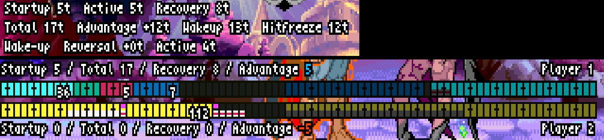
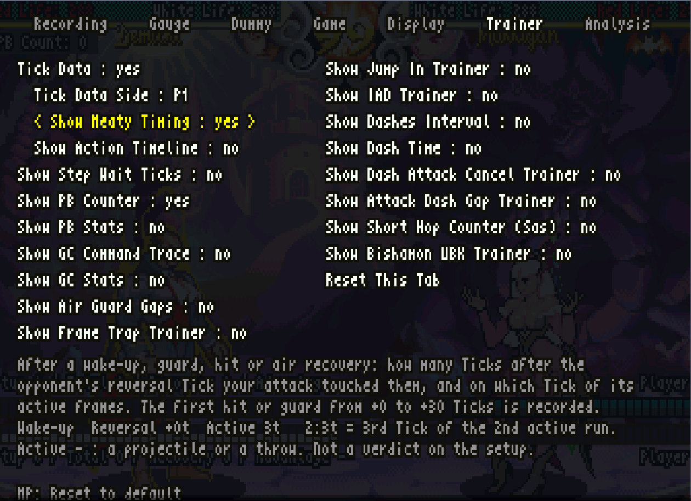

# VSAV_Training プレイヤーマニュアル

[English](PLAYER_MANUAL.en.md) | 日本語

『ヴァンパイア セイヴァー』の攻め・守り・入力を、相手の動きと数値で確かめながら練習するためのガイドです。画面に表示される英語の項目名を併記しているので、同じ名前をメニューで探してください。

本書では **AG（アドバンシングガード）** と表記します。英語UIの **Push Block／PB** は同じ機能を指します。設定を探せるよう、`Show PB Counter` などの実際の項目名は変更せず記載します。

対象：**v11.7.23／Fightcade 2 の FBNeo／日本版 `vsavj`（970519 Japan）**。導入手順は Windows 向けです。基本は自分が P1、ダミーが P2 の状態で説明します。

[初めて使う方は導入から](#02-install) · [設定済みならAG・GCの実践へ](#sasquatch-ag-tutorial) · [対象環境・確認範囲](#verification-scope)

機能の概要は[README](../README.ja.md)へ。本書では、練習の手順と結果の読み方を説明します。

<details>
<summary>Tick制御の特徴とフォーク元との比較</summary>

ノーマルでは表示1フレーム＝1 Tickですが、ターボ3では表示3フレームの間に4 Tick進みます。本フォークでは、この内部フレームに合わせてダミーの入力を制御します。フォーク元で制約のあった最速タイミングの再現を改良し、起き上がり・ガード後・着地後の行動を指定できます。必殺技のリバーサルに加え、小技や投げによる暴れ、ジャンプ・ダッシュも、その場面の行動可能なタイミングに合わせて実行させられます。

この制御を生かすAction Stepsでは、動作を内部フレーム単位で組み立てられます。単発の反撃だけでなく、連係や複雑なコンボも定義でき、バレッタやビシャモンの永久コンボを完遂するような定義も可能です。用意した動きを繰り返し再現させ、自分の対処を検証する、より高度なトレーニングに使えます。

記録・再生は表示フレーム単位であり、Tick単位の入力タイミングを正確に再現するものではありません。特にターボ時の細かなタイミングを指定する練習には、Action Stepsを使ってください。本フォークで追加したRecording Wizardは、操作開始から操作終了までを簡単に記録するための機能です。

さらに、AGでは「なるべく遅らせて受付内に6回入力できたか」、GCでは「どの入力が受け付けられ、どこで遅れたか」、空中ガードでは「割り込める隙間があるか・押したタイミングはよかったか・着地後にどちらが有利か」を確認できます。正確な相手の動きと、詳しい振り返りの両方を揃えることが本フォークの狙いです。

### フォーク元との違い

| 機能 | フォーク元 | 本フォーク |
|---|---|---|
| 反撃・リバーサル | 指定入力・キャラ別の技発動などを搭載。ただしターボ時の最速入力やコマンド入力の遅れに制約あり | 内部フレームで入力を制御し、起き上がり・ガード後・着地後のタイミング指定を改良。開始やボタンを押す時期を毎回ランダムにずらすことも可能 |
| 技の性能測定 | Frame Dataは表示フレーム単位で、ターボ時に測定値が不安定 | Tick Dataで内部フレーム単位に測定。発生・持続・戻り・有利不利の数え方・考え方を攻略サイトに合わせる |
| ダミーの動作作成 | 記録の再生と単発の反撃指定 | Recording Wizardで記録を簡略化。Tick単位の動作はAction Stepsで構築し、Action Patternsで保存・選択・共有 |
| AG練習 | 入力カウンター、成功・失敗集計 | 受付の内部フレーム履歴、同時押し、受付終了後の入力、成立後も含めた入力回数を確認。PB Statsで平均と成功率も確認 |
| GC練習 | 入力ビューアにGC受付を表示 | ゲームが受け付けたコマンド、入力間隔、失効、ガード持続中の接触まで追跡 |
| 空中ガードの分析 | Frame Trap／Jump Inなどの表示を搭載 | 専用のAir Guard Gapsで、空中チェーンの隙間、実際の割り込み、ガードのタイミング、着地有利不利を表示 |

元にもある機能の存在そのものではなく、**相手の行動を再現する精度と、自分の対処を振り返る情報の詳しさ**が比較上の特徴です。使用条件は`Runahead = Disabled`です。Afterは先行入力を行わず、Landingの先行入力にも条件があるため、すべての設定・場面で無条件に最速になるという意味ではありません。詳細は[導入](#02-install)と[Action Steps](#06-steps)を参照してください。

</details>

## 目次

- [はじめに：画面の見方と練習の選び方](#01-purpose)

**第1部　始める**

- [1. 導入と最初の設定](#02-install)
- [2. 基本操作と位置の戻し方](#03-controls)
- [3. 実践チュートリアル：サスカッチを相手にAG・GCを練習する](#sasquatch-ag-tutorial)

**第2部　相手を作る**

- [4. ダミーのガード・受け身・反撃](#04-dummy)
- [5. 相手の動きを記録する](#05-recording)
- [6. Action Stepsで動きを組む](#06-steps)
- [7. Action Patternsで保存・ランダム化・共有する](#07-patterns)

**第3部　練習する**

- [8. AGを練習する](#08-pb)
- [9. ガードキャンセルを練習する](#09-gc)
- [10. 目的別の練習レシピ](#11-drills)

**第4部　調べる・設定する**

- [11. 技の性能と攻防の隙間を読む](#10-data)
- [12. 表示とゲーム設定を調整する](#12-options)
- [13. 保存・バックアップ・更新](#13-save)
- [14. 困ったとき](#14-troubleshooting)
- [15. 用語と確認対象](#15-reference)

<a id="01-purpose"></a>
## はじめに：画面の見方と練習の選び方

<a id="screen-map"></a>
### 画面の見方

AGとGCは、それぞれ練習に使う表示だけを出すと見やすくなります。両方を同時に出すこともできます。

**AGを練習するとき**（`Trainer`の`Show PB Counter`・`Show PB Stats`）


| 番号 | 表示 | 何がわかるか | 詳しく |
|---|---|---|---|
| 1 | PB Countの行 | AGの入力回数と、受付の14 Tickのどこで押したか | [8章](#08-pb) |
| 2 | 押したボタンの一覧 | 受付中に押したボタン。AGを成立させた押しに`TECH HIT` | [8章](#08-pb) |
| 3 | PB Stats | AGの成功率と平均 | [8.3](#pb-stats) |

**GCを練習するとき**（`Trainer`の`Show GC Command Trace`・`Show GC Stats`、`Display`の`Show Scrolling Input`）


| 番号 | 表示 | 何がわかるか | 詳しく |
|---|---|---|---|
| 4 | GC Command Trace | ゲームが受け付けたGCコマンドの方向・ボタン・間隔と結果 | [9章](#09-gc) |
| 5 | GC Stats | GCの成功率と入力時間を、1P側・2P側に分けて集計。PB Statsなどを出していないときは左上、出しているときは右下 | [9.4](#gc-stats) |
| 6 | 入力の帯 | 自分の入力と、ガード・GCの印（`G`・`GC`・`SUCCESS`） | [9.3](#gc-timing) |
| 7 | P2の入力（`Show P2 Inputs`） | ダミーの入力 | [12章](#12-options) |

### 練習の選び方

| やりたいこと | 使う機能 | 最初に見るところ |
|---|---|---|
| コンボや連係を試す | ダミーの姿勢・ガード、体力回復 | `Dummy`、`Gauge` |
| 起き上がりやガード後に暴れさせる | 単発の反撃、Action Steps | `Dummy > Guard Action Type` |
| 実戦で見かける攻めを繰り返させる | 記録とループ | `Recording > Recording Wizard` |
| ダッシュ→攻撃などを正確に指定する | Action Steps | [6章](#06-steps) |
| 複数の攻めをランダムに出す | 記録スロット、Action Patterns | [5章](#05-recording)、[7章](#07-patterns) |
| AGの押し方を改善する | `Show PB Counter`、`Show PB Stats` | [8章](#08-pb) |
| GCの失敗原因を調べる | GC Command Trace、入力履歴 | [9章](#09-gc) |
| GCの成功率を1P側・2P側に分けて集計する | `Show GC Stats` | [9.4](#gc-stats) |
| 有利不利、割り込み、着地の状況を調べる | Tick Data、Air Guard Gaps | [11章](#10-data) |

初めてなら、[導入](#02-install)と[基本操作](#03-controls)を確認してから、[サスカッチでAG・GCを練習](#sasquatch-ag-tutorial)してみてください。

# 第1部　始める

導入から、最初の練習までを説明します。

<a id="02-install"></a>
## 1. 導入と最初の設定

### 1.1 必要なもの

- Fightcade 2 に含まれる FBNeo。
- 本プロジェクトの `run_vsav_training.bat` と **`scripts` フォルダー全体**。
- 使用するゲームのROM。**このプロジェクトにROMは含まれません。**

ランチャーは日本版 `vsavj` を起動します。先にFBNeo単体でそのゲームが起動できる状態にしてください。ROM不足の場合はFBNeoの表示する不足ファイルを確認します。

### 1.2 トレーニング専用のFBNeoを用意する

**FBNeo本体の `Video > Runahead` は `Disabled` にしてください。** 有効なままでは、ダミーの反撃などのタイミングが正しく再現されません。

Fightcadeで対戦もする場合は、設定の切り替え忘れを防ぐため、**`emulator/fbneo` フォルダーを中身ごと複製し、複製先にトレーニングモードをセットアップしてください。** EXEやscriptsだけでなく、FBNeoフォルダー以下を丸ごとコピーします。対戦用と練習用で、起動するFBNeoと設定を分けます。

1. FightcadeとFBNeoを終了します。
2. Fightcadeの `emulator/fbneo` フォルダー全体を、別の場所へコピーします。たとえば `C:/VSAV_Training/fbneo` をトレーニング専用にします。
3. [Releases](https://github.com/vampiresavior001/VSAV_Training/releases/latest)から最新版のzipをダウンロードし、展開します。
4. `run_vsav_training.bat` と `scripts` を、**複製先のfbneoフォルダー**へ配置します。複製先の `fcadefbneo.exe` とバッチファイルが同じ階層になります。
5. **複製先の** `run_vsav_training.bat` をダブルクリックして起動します。
6. 起動したトレーニング用FBNeo本体で **`Video > Runahead > Disabled`** を選びます。元の設定もコピーされるため、複製しただけでは無効になりません。
7. FBNeoを完全に終了して複製先のバッチから起動し直し、`Video > Runahead`で`Disabled`が選ばれていることを確認します。
8. FBNeoの `Input > Map Game Inputs` を開き、ゲーム操作と下表の機能を割り当てます。

Runaheadが有効なまま試合が進むと、画面の上に次の赤い警告が点滅します。この警告は再実行されたTickの数から推定して出すもので、起動直後には出ません。設定はメニューの表示で確認し、警告が出たら`Video > Runahead > Disabled`を選び、FBNeoを起動し直してください。


**全画面で遊ぶときは、`Video > Blitter options > Windowed Fullscreen` にチェックを入れてください。** 全画面の切り替えは `Video > Toggle fullscreen mode`（`Alt+Enter`）です。チェックがないと古い形式の全画面になり、パターンの名前入力やExport・Importで開くWindowsのウィンドウを表示できません。


対戦は通常のFightcadeから、練習は複製先のバッチから起動します。複製先のバッチへのショートカットを「VSAVトレーニング」などの名前で作ると、起動先を区別しやすくなります。

初回は、配置先に日本語を含まない短いパスを使うと、Luaのファイル読み込みに起因する問題を避けやすくなります。空白は含んでも構いません。更新時は、先に[13章](#13-save)のバックアップを行ってください。

**`Lua Hotkey 1`と`P1 Coin`はメニューで代用できないため、必ず割り当ててください。** ほかの項目は、下表のメニュー操作で代用できます。

| FBNeoの入力項目 | 機能 | メニューでの代用操作 |
|---|---|---|
| `Lua Hotkey 1` | トレーニングメニューを開閉 | 代用不可・**必須** |
| `Lua Hotkey 2` | レバーとの組み合わせで位置を戻す | `Dummy > Position`で左右を押して配置を選ぶ。LPで同じ配置に戻す。HPなら戻してメニューも閉じる |
| `Lua Hotkey 3` | 記録のループ再生を切り替える | `Recording > Looped Playback`を左右で`yes`／`no`に切り替える |
| `Lua Hotkey 4` | キャラクター選択へ戻る | `Game > Return to Character Select`で右またはLP |
| `Volume Up` | 入力記録の開始・終了（手動） | `Recording > Recording Wizard`で右またはLP。スロットを選び、自動記録で代用する（下記参照） |
| `Volume Down` | 記録の再生・停止 | `Recording > Play Recording`で右またはLP。もう一度実行すると停止 |
| `P1 Coin` | 試合中は操作側を切り替え。キャラ選択中はステージ選択 | 代用不可・**必須** |

メニューは`Lua Hotkey 1`で開き、上端のタブ名で左右を押してタブを切り替え、上下で項目を選びます。LPは弱Pです。`>`は「タブ > 項目」の順を表します。

**記録をメニューで代用する場合：** ウィザードでスロットを選び、いったん入力を離してから操作すると記録が始まります。操作を終えて入力を離し、ダミーが動ける状態で約2秒待つと自動終了します。確認画面で保存を選び、LPで決定してください。手動で開始・終了を指定したい場合は`Volume Up`を使います。

記録の`Looped Playback`と、Action Stepsの`Loop Steps`は別の設定です。[記録の詳しい手順](#05-recording)も参照してください。

ここでの `Volume Up / Down` は、**FBNeoの入力設定にある項目名**です。Windowsの音量操作そのものを指すわけではありません。

P1だけでなくP2側のゲーム入力も設定してください。入力が不自然な場合の確認対象になります。アーケードコントローラーなどのボタンにも各機能を割り当てられます。

### 1.3 最初の動作確認

トレーニング専用の複製先から起動します。`Video > Runahead`で`Disabled`が選ばれていることを確認してから進めます。

1. 自分とダミーのキャラクターを選び、試合開始まで待ちます。キャラクター選択ではP1決定後、P1側の操作でP2も選べるようになります。
2. `Lua Hotkey 1` でメニューを開きます。
3. `Dummy > Guard` を `All Guard`、`Random Guard %` を `100%` にします。
4. `Guard Action Type` は `None` にしておきます。
5. メニューを閉じて攻撃し、ダミーがガードすることを確かめます。

**`All Guard` を選ぶだけでは不十分です。`Random Guard %` が `0%` ならガードしません。** このとき行がオレンジ色になります。

<a id="03-controls"></a>
## 2. 基本操作と位置の戻し方

### 2.1 メニュー操作

| 場所 | 操作 |
|---|---|
| 上端のタブ名を選んでいるとき | 左右でタブ変更、上下で項目へ移動 |
| 項目一覧 | 上下で項目移動、左右で値変更 |
| 詳細画面を持つ項目 | 右またはLPで開く。画面下の操作案内に従う |
| 通常の設定項目 | MPでその項目を初期値に戻す |
| メニューの開閉 | `Lua Hotkey 1` |

LP＝弱P、MP＝中P、HP＝強P、LK＝弱K、MK＝中K、HK＝強Kです。

一覧の端を越えて上下へ移動すると、タブ選択へ戻ります。MPの意味は画面ごとに異なり、Action Patternsでは使用チェックの切り替え、記録確認では記録し直しになります。画面下の操作案内を優先してください。

字下げされた行は、すぐ上の一段浅い行（親）の設定です。多くは親の値によって表示されたり消えたりします（例：`Frame Meter = yes` で、その下に字下げした3行が開く）。

`Display`、`Trainer`、`Analysis` の `Reset This Tab` は、そのタブの設定をまとめて初期化します。確認画面が開き、初期選択は `Cancel` です。親設定がOFFで隠れている子項目も初期化されます。

### 2.2 操作側とキャラクター選択

- 試合中の `P1 Coin` で、自分が操作する側を切り替えます。
- 記録の再生中は操作側を切り替えられません。先に再生を止めてください。
- `Lua Hotkey 4` または `Game > Return to Character Select` でキャラクターを選び直します。
- キャラクター選択へ戻ると再生が止まり、その試合用の記録開始時のステートや入力履歴、AG・GCなどの前試合の表示がクリアされます。

### 2.3 位置を素早く戻す

試合中、レバーを次の方向に入れて `Lua Hotkey 2` を押します。左右は画面上の方向です。

| レバー | 配置 |
|---|---|
| ニュートラル | 中央、自分が左・ダミーが右 |
| 下 | 中央、自分が右・ダミーが左 |
| 左 | 左端、ダミーが壁側 |
| 左下 | 左端、自分が壁側 |
| 右 | 右端、ダミーが壁側 |
| 右下 | 右端、自分が壁側 |

壁際では二人を密着させ、中央ではラウンド開始時の間合いに戻します。配置が終わってから操作を始めてください。

同じ機能を `Dummy > Position` からも使えます。図の `1` は自分、`2` はダミー、`|` は壁です。

- 左右：配置を選ぶ。
- LP：現在選んでいる配置にもう一度戻す。
- HP：配置に戻し、メニューも閉じる。
- MP：`Off` に戻す。`Off` は位置を変更しません。

<a id="sasquatch-ag-tutorial"></a>
## 3. 実践チュートリアル：サスカッチを相手にAG・GCを練習する

サスカッチにショートダッシュ小Pをさせて、AG（アドバンシングガード）とGC（ガードキャンセル）を練習します。導入と操作設定がまだなら、先に[1章](#02-install)を済ませてください。

- **まず一度試す：** ステップ1〜2で同梱パターンを取り込み、[AG（ステップ3）](#tutorial-ag)か[GC（ステップ4）](#tutorial-gc)を試します。**ここまでで練習を始められます。**
- **慣れたら繰り返す：** [ステップ5](#tutorial-loop)で連発させます。
- **自分で作った動きを残す：** 手動で作成した場合は、[ステップ6](#tutorial-save)でパターンとして保存します。同梱パターンは取り込むだけで次回も使えます。

### ステップ1：反撃の準備をする

自分をP1、ダミーのP2を**サスカッチ（Sasquatch）**にします。地上で向かい合い、まずは互いの攻撃が届く間合いから始めます。`Lua Hotkey 1`でメニューを開き、`Dummy`で次を設定します。

| 項目 | 設定 |
|---|---|
| `Guard` | `All Guard` |
| `Random Guard %` | `100%` |
| `Guard Action Type` | `Reversal - Action Patterns` |
| `Random Guard Action %` | `100%` |
| `Random Start Wait` | `0`（初期値。ランダムな追加待ちなし） |
| `Loop Steps` | `no`（最初は一回ずつ） |

`Random Guard %`はガードする確率、`Random Guard Action %`は反撃を行う確率です。ここでは両方100%にして、同じ条件で練習します。

### ステップ2：ショートダッシュ小Pを取り込む

ステップ1でダミーをサスカッチにした状態で進めます。

1. `Reversal Action Patterns`を開きます。
2. `Import from a File`で、配布物の`scripts/patterns/Sasquatch_Short_LP.json`を取り込みます。
3. 一覧の`Short LP`でMPを押し、使用チェックを`[x]`にします。ほかのパターンが選ばれていればチェックを外します。

取り込んだパターンは保存済みです。ステップ6の保存操作は不要です。


<a id="tutorial-check"></a>
メニューを閉じ、P1でサスカッチに地上の技をガードさせてから、すぐにガードしてください。

**確認：ショートダッシュ小Pで反撃してくれば準備完了です。次はAGかGCのどちらかを試してみましょう。**

この反撃は、被弾後や起き上がりもきっかけになります。最初はガードさせて確かめると条件を揃えやすくなります。

<details>
<summary>応用：同じ動きをAction Stepsで自分で作る</summary>

`Guard Action Type = Reversal - Action Steps`に切り替え、次の手順で作ります。作成後は下の練習へ進み、次回用の保存は[ステップ6](#tutorial-save)で行います。


画像は手動作成前の例です。既存の定義がなければ`Reversal Action Steps`は`Empty`と表示されます。

`Reversal Action Steps`を右またはLPで開き、次の**2ステップだけ**を作ります。既存の定義がある場合は、先に[Action Patterns](#07-patterns)へ保存しておくと残せます。

| ステップ | Actionの選択 | Wait | その他 |
|---|---|---|---|
| 1 | `Dash > Forward Cancel` | `Auto (Fastest)` | ダッシュを途中でキャンセルする動作 |
| 2 | `Attack`、Buttonを`LP` | `Auto (8)` | Directionは`Neutral`（Holdの行は出ません） |

1. 1ステップ目は`Action > Dash > Forward Cancel`を選びます。Waitは初期値の`Auto (Fastest)`のままにします。
2. `+ Add Step`で2ステップ目を追加します。Waitでは**`Fastest (8)`を選択**してください。編集後は`Auto (8)`と表示されます。数値の`8 Ticks`を手入力する設定とは異なります。
3. 両ステップの`Random Delay = 0`を確認し、次の一覧になったら**`Save`**します。


`Forward Cancel`は`Action > Dash`の中にあります。


Waitの一覧の下には、選択肢の説明が出ます。1ステップ目の`Auto (Fastest)`は`Fixed Ticks`の最小値です。2ステップ目では`Fastest (8)`を選びます。


`Auto (8)`は、ダッシュから小Pを入力するまでの待ち時間です。小Pの発生が8 Tickという意味ではありません。

保存すると、Dummyタブに`Reversal Action Steps : Sasquatch : 2 steps`と表示されます。


</details>

<a id="tutorial-ag"></a>
### ステップ3：その小PにAGする

メニューを開き、次の表示をONにします。

| 場所 | 設定 |
|---|---|
| `Trainer > Show PB Counter` | `yes` |
| `Trainer > Show PB Stats` | `yes` |
| `Game > P1 Min PB Presses` | `Normal`（通常の成立条件で練習） |

メニューを閉じ、こちらの技をガードさせてショートダッシュ小Pを出させ、これにAGします。PB Counter／PB Statsで、例えば遅らせAGで受付内に6回入力できたか確認します。英語UIのPush Block／PBはAG（アドバンシングガード）です。


- まず**受付内に6回の有効入力**を収めます。同じTickでの複数ボタン同時押しは、ゲーム側では1回分です。
- カウントが緑ならAG成立です。途中で成立しても6回まで入力して構いません。成立後も数えるのは、入力を最後まで入れ切れたか確認するためです。
- 安定したら、`Guard`から最初の入力までを遅らせます。**なるべく遅らせ、かつ14 Tickの受付内に6回を収める**ことを目標にします。

6回に届かなければ、同時押しや受付終了後の入力がないかを確認します。表示の読み方と集計条件は[8章](#08-pb)へ。

**確認：AG成立後も入力を続け、受付内に6回の有効入力を収められたか確認します。**

<a id="tutorial-gc"></a>
### ステップ4：同じ小PにGCする

ダミーの設定は変えず、今度は同じ小Pに自分のキャラクターでGCを出します。`Loop Steps = no`のまま、次の表示をONにしてください。

| 場所 | 設定 |
|---|---|
| `Display > Show Scrolling Input` | `yes` |
| その子項目 `Show GC Trainer` | `yes` |
| `Trainer > Show GC Command Trace` | `yes` |

PB Counter／PB StatsはONのままで構いません。GC Command TraceはPB Statsの右に並びます。

1. P1の技をサスカッチにガードさせ、ショートダッシュ小Pの反撃を始めます。
2. 小Pをガードし、**P1で使用しているキャラクターのGCコマンド**を入力します。
3. トレースの`Success`、または入力履歴の`SUCCESS`でGC成立を確認します。**GCが成立したかと、その技が相手に当たったかは別です。** まず成功表示を基準に入力を練習します。
4. 失敗したら、ガードできたか、方向が順番に受け付けられたか、最後のボタンが間に合ったかを確認し、一か所ずつ入力を調整します。表示の意味は[9章](#09-gc)で確認できます。


この例はデミトリのGC成功です。**オレンジの表示だけでは失敗を意味しません。** GCコマンドは自分のキャラクターに合わせてください。

**慣れたら左右で試す：** `Trainer > Show GC Stats = yes` にして、同じ攻撃に対する左右の成功率を比べます。苦手な側の失敗をトレースで確認し、入力を調整して再び試しましょう（[9.4 GC Stats](#gc-stats)）。

<details>
<summary>このGC結果の数値を読む</summary>

トレースは→ 7t、↓ 4t、↘ 4t、ボタン0t（↘と同じTick）の後に`Success 14t`、入力履歴にも`SUCCESS 14t`が出ています。オレンジは入力の遅れを見る目印です。詳しい読み方は[9章](#09-gc)を参照してください。

</details>

**確認：`Success`／`SUCCESS`が出ればGC成立です。**

<a id="tutorial-loop"></a>
### ステップ5：連発させて、AG・GCを繰り返し練習する

一回ずつ練習できたら、`Dummy`で次を変更します。

| 項目 | 設定 |
|---|---|
| `Loop Steps` | `yes` |
| `Loop Wait` | `Auto (Landing)` |


`Loop Wait` は `Loop Steps` の次の行です。表示される行が多いときは、右の列の一番上（`Position` の右）に出ます。

メニューを閉じ、もう一度こちらの技をガードさせて最初の反撃を始めます。**LoopをONにしただけでは初回は始まりません。**

Landing待ちは着地に次のダッシュの入力完成を合わせるため、必要な方向入力を着地前から入れます。これを使って、着地から最速でショートダッシュ小Pを繰り返す練習をします。`Auto (After)`は動けるようになってから入力を始めるので、同じタイミングにはなりません。着地予測が得られない場合などの制約は[6章](#06-steps)を参照してください。

繰り返される小Pをガードし、連続でAGを入力してみましょう。一回の成功だけでなく、反復しても6回入力と遅らせるタイミングを保てるか確認します。AGで離れてもダミーがショートダッシュで寄ってくるので、その攻めに続けて対応します。

GCも同じ反復で練習できます。一回の試行ではAGかGCのどちらを練習するか決め、GCを選んだら`Success`を確認します。GCが当たるなどして攻防や間合いが変わったら、状況を整えて再び反撃のきっかけを作ってください。

止めるときはメニューを開き、`Loop Steps = no`にします。反撃自体も止めたい場合は`Guard Action Type = None`にします。

<a id="tutorial-save"></a>
### ステップ6：`Short LP`として保存する

手動で作った基本形を、`Short LP`として保存します。同梱パターンをそのまま使っている場合、この操作は不要です。[応用](#tutorial-varied-timing)へ進めます。

1. 2ステップとも`Random Delay = 0`にしてAction Stepsを`Save`し、`Random Start Wait = 0`も確認します。
2. `Dummy > Guard Action Type = Reversal - Action Patterns`に切り替えます。
3. `Reversal Action Patterns`を開き、**`Add from current Steps`**を選びます。
4. 別に開く名前入力ウィンドウで **`Short LP`** と入力して確定します。保存済みの現在のStepsがコピーされます。
5. 一覧で`Short LP`だけを`[x]`にします。MPで使用チェックを切り替えられます。
6. `Random Guard Action % = 100%`のまま、こちらの技をガードさせて動作を確認します。一回ずつなら`Loop Steps = no`、連続練習なら`yes`と`Auto (Landing)`を使います。

![パターン一覧に[x] 01 Short LPが並ぶ](images/tut_patterns_ticked.png)

**確認：`Short LP`を選び、保存したショートダッシュ小Pが出れば完了です。**

コピーなので、後からパターンを編集しても元のAction Stepsは変わりません。Loopの設定はこの2ステップとは別に確認してください。

**追加のランダム待ちを0にし、`Short LP`一つだけを選択すれば、固定のタイミングで練習できます。** 別の攻めもパターンとして登録して複数を`[x]`にすると、反撃の機会ごとに候補から一つをランダムに実行できます（[応用](#tutorial-mixed-patterns)）。固定の動きへのAG・GC練習から、異なる攻めを見て対応する練習へ発展させられます。

<details>
<summary>取り込み画面・名前入力で困ったとき</summary>

`Guard Action Type`を切り替えます。


`Add from current Steps`で取り込みます。


別ウィンドウに名前を入力します。閉じるまでゲームは止まります。


名前入力がエミュレーターの裏に隠れても自動で手前に戻るので、クリックして入力してください。FBNeoの古い形式の全画面では表示できません。`Video > Blitter options > Windowed Fullscreen`にチェックを入れてください（[1章](#02-install)）。

</details>

<a id="tutorial-varied-timing"></a>
### 応用：タイミングを変えた攻めに対応する

停止していた場合は、`Guard Action Type = Reversal - Action Patterns`に戻し、`Short LP`だけを`[x]`にしてください。こちらの技をガードさせ、反撃が出ることを確認します。

固定のタイミングで安定したら、一方だけを変えて試します。

- **始動をばらつかせる：** `Short LP`を使い、`Random Start Wait`を少しずつ増やします。パターン自体の編集は不要です。
- **小Pを出す時期をばらつかせる：** `Random Start Wait = 0`に戻します。Action Patternsの`Copy`で`Short LP`を複製します。同じ名前のコピーが元のすぐ下にでき、`[x]`もそのまま写ります。`Rename`で`Short LP Varied`などに変えます。コピーの攻撃ステップだけ`Random Delay`を少しずつ増やし、保存してください。

コピーを使うときは、それだけを`[x]`にして元の`Short LP`は外します。狙ったショートダッシュ小Pが出ることを確認してから、AG・GCを練習します。詳しい設定の使い分けは[4.4](#dummy-button-timing)へ。

固定の練習に戻すときは、`Random Start Wait = 0`にし、元の`Short LP`だけを`[x]`にします。

<a id="tutorial-mixed-patterns"></a>
### 応用：2種類の攻めをランダムに出させる

`Dummy > Guard Action Type = Reversal - Action Patterns`、`Loop Steps = no`にして、一回ずつ動作を確認します。

`Short LP`と対になる`Long LP > MP`も同梱しています。キャンセルしない前ダッシュから小Pを出し、間を空けて中Pを出す連係です。ジャンプで逃げにくい間隔にしてあります。

1. `Reversal Action Patterns`を開き、`Import from a File`で配布物の`scripts/patterns/Sasquatch_Long_LP_MP.json`を取り込みます。一覧の`Short LP`の下に入ります。
2. `Long LP > MP`だけを`[x]`にし、`Random Start Wait = 0`を確認します。こちらの技をガードさせ、ダッシュからの小P→中Pが出ることを確認します。


3ステップ目の`+26t`は、小Pから26ティック後に中Pを入力する指定です。`Auto (Chain)`ではなく、間隔を固定しています。

3. `Short LP`と`Long LP > MP`の両方を`[x]`にします。反撃の機会ごとに、どちらか一方がランダムに選ばれます。同じほうが続くこともあります。

![Short LPとLong LP > MPの2つだけが[x]のパターン一覧](images/tut_sasquatch_patterns_mixed.png)

**同じ動きを固定で練習する段階から、どちらの攻めが来るかを見て対応する練習へ進めます。**

`Short LP`だけの練習に戻すときは、`Long LP > MP`の`[x]`を外し、`Short LP`だけを`[x]`にします。

### 次に試すこと

- **AG・GCの失敗を詳しく調べる：** [AGの表示と改善方法](#08-pb)／[GCの表示と改善方法](#09-gc)。
- **別の相手や攻めで練習する：** [動きを記録する](#05-recording)／[Stepsで一連の動きを作る](#06-steps)／[Patternsで複数管理・ランダム実行する](#07-patterns)。
- **自分の起き攻めや連係を検証する：** [目的別の練習レシピ](#11-drills)／[技の性能と攻防の隙間を読む](#10-data)。

# 第2部　相手を作る

練習相手の動きを用意します。練習は相手を作ることから始まります。

<a id="04-dummy"></a>
## 4. ダミーのガード・受け身・反撃

### 4.1 基本の防御設定

| 項目 | 内容 |
|---|---|
| `Pose` | 通常時に保持する方向。`None`、しゃがみ、前後移動、ジャンプ方向など |
| `Wakeup` | ダウン後の移動起き上がり。`None`、`Towards`、`Away`、ランダムなど |
| `Random Throw Tech %` | 投げ抜けの確率。`0% / 25% / 50% / 75% / 100%` |
| `Guard` | ガード方法 |
| `Random Guard %` | 対応するガード方法で、ガードする確率。`0% / 25% / 50% / 75% / 100%` |

初期設定の `Random Throw Tech %` は `100%` です。投げ自体を調べたいときは `0%` にします。

| `Guard` の値 | 動作・使い分け |
|---|---|
| `None` | 自動ガードをしない。`Pose` が後ろ方向なら、その入力によるガードは起こり得る |
| `Stand Block` | 攻撃が近づくと後ろ入力でガード。下段対応を自動選択する設定ではない |
| `All Guard` | 下段にはしゃがみ、中段・ジャンプ攻撃には立ちを選ぶ。どちらでも防げる技は `Pose` に従う |
| `Auto Guard` | ゲーム内部のガードフラグを直接使う。通常はガードできない状況も防ぐため、ガード不能の検証には使わない |
| `Push Block (All Light / Medium / Heavy)` | `All Guard` と同様にガードし、指定強度のAGを入力する |

`Stand Block`、`All Guard`、`Push Block (All …)` を確実に試すときは、`Random Guard % = 100%` にします。`Guard` 側のAGは、次の反撃設定と併用できます。

**選んだガードを0%が止めているときは、オレンジ色で知らせます。** `Guard` が `Stand Block`、`All Guard`、`Push Block (All …)` で `Random Guard %` が `0%` のとき、`Random Guard %` の行がオレンジ色になります。`Guard` か `Random Guard %` にカーソルを合わせると、最下行の右側に `Random Guard % is 0%: the dummy never blocks.` と表示されます。0%を意図して使うこともあるため、値は自動では変えません。

<a id="dummy-guard-action"></a>
### 4.2 ガード後・被弾後・起き上がりの行動

`Guard Action Type` を選ぶと、その種類に必要な設定が表示されます。まず **`Random Guard Action % = 100%`** にして動作を確認し、その後25～75%に下げると、反撃するかどうかの読み合いを練習できます。`0%` では実行されません。このとき `Random Guard Action %` の行がオレンジ色になり、`Guard Action Type` かその行にカーソルを合わせると、最下行の右側に `Random Guard Action % is 0%: it never runs.` と表示されます。


この画像ではカーソルが `Guard Action Type` にあり、その下の `Random Guard Action %` の行がオレンジ、理由が最下行の右側に出ています。オレンジの行そのものにカーソルを合わせると、その行はカーソルの色になります。

**`Random Start Wait` で、反撃の開始タイミングをばらつかせられます。** 単位はTickで0〜60、`Random Guard Action %` のすぐ下にあります。実行ごとに0から設定値までの整数を抽選します。同じ値が続くこともあります。`0` はこの設定による追加待ちなしで、元の設定どおりのタイミングです。Button Waitや各ステップのWait・Random Delayなどによる待ちは残ります。

対象はReversalとCounter Attackのすべての種類（Specified、Character Specific、Recording、Action Steps、Action Patterns）と、`Loop Steps` の各周です。ガード、AG（Push Block）、GC、投げ抜けは遅らせません。**始動時に1以上を引いた反撃は、行動可能になってから入力を始めます。** 小さい抽選値でもコマンド入力に必要な時間より早くは出せないため、元の発動時点から抽選値だけ遅れるとは限りません。

`Guard Action Type` が `None`、`Guard Cancel`、`Push Block` のときは表示されません。Recordingタブの `Random Start Wait` と同じ設定です。

| 種類 | 用途 |
|---|---|
| `None` | 反撃を設定しない |
| `Guard Cancel` | GCコマンドを入力させる。ボタンと `GC Input Delay (Ticks)` を指定 |
| `Push Block` | AG入力を行わせる。`Push Block Type` を指定 |
| `Reversal - Specified` | ガード・被弾・起き上がり後の行動を、コマンドとボタンで指定 |
| `Counter Attack - Specified` | ガード・被弾後の行動を指定。起き上がりを含めない |
| `Reversal - Recording` | ガード・被弾・起き上がり後に記録を再生 |
| `Counter Attack - Recording` | ガード後に記録を再生 |
| `PB Recording` | AG後に記録を再生 |
| `Reversal - Action Steps` | 編集した一連のステップを実行 |
| `Reversal - Action Patterns` | 使用チェックを付けた保存パターンから選んで実行 |
| `Reversal - Character Specific` | キャラクター別の技を内部操作で発動。通常のコマンド入力とは異なる |
| `Counter Attack - Character Specific` | 旧来のキャラ別反撃。画面内にもクラッシュの注意書きがあり、通常の練習はSpecifiedやStepsを優先 |

`Reversal` は本ツールの反撃設定名でもあります。通常技の最速行動まで、ゲーム内の `REVERSAL` 表示が出るという意味ではありません。

<a id="dummy-normal-response"></a>
### 4.3 単発の通常技で暴れさせる

1. `Guard = All Guard`、`Random Guard % = 100%`。
2. `Guard Action Type = Reversal - Specified`。
3. `Random Guard Action % = 100%`、`Random Start Wait = 0`。
4. `Input Motion = None`。
5. `Button = LP`。
6. `Button Lever = Neutral`、`Button Wait = 0`、`Random Delay = 0`。
7. 攻撃をガードさせ、硬直後の弱Pに自分の連係が勝てるか試します。

しゃがみ技は対応する下方向を指定します。必殺技なら `Input Motion` とボタンをその技に合わせます。ボタンを押す時期を遅らせる・ばらつかせる方法は[4.4](#dummy-button-timing)を参照してください。

<a id="dummy-button-timing"></a>
### 4.4 ボタンを押す時期を遅らせる・ばらつかせる

`Reversal - Specified` と `Counter Attack - Specified` では、モーションとボタンに加えて、ボタンを押す瞬間を次の3行で決めます。

| 項目 | 内容 |
|---|---|
| `Button Lever` | ボタンを押す瞬間のレバー。`As Is` はモーションの最後の方向のまま（ダッシュならダッシュ攻撃）、`Neutral` は方向を離す |
| `Button Wait` | モーションの後、ボタンを押すまでの待ち。単位はTickで、上限は60。`Auto` はダッシュのときだけ選べ、キャラクターごとの攻撃タイミングを使う |
| `Random Delay` | `Button Wait` の下に字下げして出る行。反撃やカウンタのたびに0から設定値までの乱数を引き直し、`Button Wait` に足す（0〜60、0は使わない） |

`Button Wait` と `Random Delay` で遅れるのはボタンだけです。たとえばダッシュ＋攻撃では、ダッシュ自体は遅れません。反撃全体の開始を遅らせるのは `Random Start Wait`（[4.2](#dummy-guard-action)）で、両方を同時に使えます。

- ダッシュ攻撃：`Forward Dash`＋`HP`、`Button Wait = Auto`、`Random Delay` を `0-5` にすると、Autoのタイミングに0〜5 Tickを抽選して加えます。
- ジャンプ攻撃：`Up Forward`＋ボタンで、`Button Wait` に押し始めのTick、`Random Delay` に散らす幅を入れると、ジャンプ攻撃を出す高さをばらつかせられます。

遅すぎたときにどうなるかはゲームが決めます。必殺技はコマンドが14〜19 Tickしか保持されないため、通常技になります。ダッシュやジャンプが終わった後では、ダッシュ攻撃・ジャンプ攻撃になりません。待っている間も方向は入れたままなので、ジャンプは着地した後にもう一度跳ぶことがあります。

ガード後に合わせた値が、被弾後にも必ず成立するとは限りません。ダッシュキャンセルで `Button Lever` の方向を変えると、キャンセルに必要な逆方向を上書きすることがあります。

`Button Wait` は v11.7.21.1 までの `Guard Action Delay (Ticks)` で、保存した値はそのまま使えます。`Guard Action Type` が `Push Block` か `PB Recording` のときも同じ設定で、押し始めるまでの待ちになります。

**どのタイミングを変えるかで選びます。**

| 練習したいこと | 使う設定 |
|---|---|
| 攻めが始まるタイミングを読ませない | `Random Start Wait` |
| 同じダッシュ・ジャンプから、攻撃を出す時期を変える | Specifiedの `Button Wait`＋その下の `Random Delay` |
| 連係途中の特定の攻撃だけを遅らせる | そのAction Stepの `Random Delay`（[6.2](#steps-fields)） |

最初は一つの設定だけを変え、狙った攻撃が出ることを確認します。

<a id="05-recording"></a>
## 5. 相手の動きを記録する

やりたいことに合わせて、動きの用意と管理の方法を選びます。

| やりたいこと | 選ぶもの |
|---|---|
| 用意された動きですぐ練習する | 同梱のAction Patternを[取り込む](#sasquatch-ag-tutorial) |
| 自分で操作できる動きを再現する | Recording Wizardで入力を記録する |
| 動作とタイミングを指定して、一連の動きを作る | [Action Steps](#06-steps) |
| 作った動きを複数保存・管理し、ランダムに実行する | [Action Patterns](#07-patterns) |

**Stepsで一連の動きを作り、Patternsに名前を付けて保存します。複数を使用候補にすれば、異なる攻めをランダムに出させられます。**

記録（Recording）は、レバーやボタンの入力を保存し、ダミーの操作として再生する機能です。

記録・再生は表示フレーム単位であり、Tick単位の入力タイミングを正確に再現するものではありません。特にターボ時の細かなタイミングを指定する練習には、Action Stepsを使ってください。

### 5.1 Recording Wizardで記録する

本フォークで追加したRecording Wizardは、操作開始から操作終了までを簡単に記録するための機能です。記録開始・終了の手間を減らすもので、記録をTick単位に高精度化する機能ではありません。

1. ダミーに使わせたいキャラクターをP2に選び、記録開始位置に置きます。
2. `Recording > Recording Wizard` を右またはLPで開きます。
3. `Slot 1`～`Slot 5` を選びます。既存の記録を残す場合は別のスロットを選んでください。
4. 操作がP2に移ったら、**一度すべての入力を離します**。
5. `START MOVING TO RECORD!` を確認してから操作します。最初の入力で記録が始まります。
6. 攻撃などを終え、入力を離して待ちます。ダミーが動作を終えて自由に動ける無入力状態で約2秒経つと、自動で終了します。
7. 開始位置へ戻して一度再生されるので、内容を確認します。
8. 確認画面で保存を選び、LPまたは右で決定します。MPは記録し直し、LKは再確認の再生です。

保存するとスロット一覧へ戻り、続けて別の動きを記録できます。途中で `Lua Hotkey 1` を押すと、今回の未保存の記録を破棄して中止します。確認画面のLPは「現在選択中の項目の決定」なので、カーソルを動かした後は項目名を確認してください。

### 5.2 再生とループ

1. `Use Random Recording Slot = no` にします。
2. `Recording Slot` で保存したスロットを選びます。
3. `Play Recording` を右またはLPで実行します。`Volume Down` でも再生できます。
4. 繰り返す場合は `Looped Playback = yes` にします。
5. 停止はもう一度 `Play Recording` または `Volume Down`。

`Loop Interval (Frames)` の `Before / After` で待ちを調整できます。`After` は前の再生と動作終了の後、位置を戻す前の待ち、`Before` は位置を戻した後、次の再生を始めるまでの待ちです。単位は**表示フレーム**で、Action Stepsのティックとは異なります。

`Random Start Wait`（Tick、0〜60）を設定すると、再生の開始を毎回0からその値までの乱数だけ遅らせます。`Play Recording`、`Volume Down`、`Looped Playback` の各回（`Loop Interval` の後）、Recording系の反撃が対象です。待っている間にもう一度押すと止まります。Recording Wizardの確認用の再生は遅らせません。Dummyタブの `Random Start Wait` と同じ設定です。

`Reset Distance Each Loop = yes` は、各ループで記録時の間合いへ戻します。対応する距離情報が入ったv11.4.1以降の記録で使えます。左右が入れ替わったときの再生方向も補正されますが、間合いや状況まで自動的に同一になるとは限りません。

### 5.3 複数の記録をランダムに出す

1. 複数のスロットに、異なる行動を保存します。
2. `Use Random Recording Slot = yes`。
3. 再生候補の `Enable Slot 1`～`Enable Slot 5` を `yes`。
4. `Looped Playback = yes` にして再生します。

使用するスロットは少なくとも一つ有効にし、記録が入っていることを確認してください。`Use Character Specific Slots = yes` では、スロットはダミーのキャラクターごとに分かれます。キャラ変更後に別の記録が見えるのはこのためです。

### 5.4 通常の記録とステート利用

ウィザードを使わず記録する場合は、まず `Recording Slot` で保存先を選びます。次に `P1 Coin` でP2を操作し、`Volume Up` で記録開始、再度押して終了します。記録後はP1操作に戻して再生します。

`Use Savestate Upon Recording` は、通常の記録開始時の状態を保存し、再生時に復元する実験的な機能です。距離以外も含めて同じ状況から試したいときに使います。`Reset Distance Each Loop` よりステート復元が優先されます。キャラクター選択に戻ると、その試合の記録開始時のステートは破棄されます。

<a id="06-steps"></a>
## 6. Action Stepsで動きを組む

**自分では難しい操作も、定義するだけでダミーに再現させられます。** レコーディングでは、相手キャラクターの動きを自分で操作して記録する必要があります。Action Stepsなら、「最速ダッシュからの最速攻撃」「中足払いキャンセル天雷破」といった難しい行動も、動作とタイミングを指定して再現できます。達人の動きを練習相手にして、AG・GCや割り込みを繰り返し練習できます。

Action Stepsは「いつ」「何をするか」を一つずつ並べ、ダミーの動きを作る機能です。保存しただけで即座に動き出す機能ではなく、ガード・被弾・起き上がり後などの反撃機会から始まります。

### 6.1 開いて保存する

1. `Dummy > Guard Action Type = Reversal - Action Steps`。
2. `Random Guard Action % = 100%`。
3. `Reversal Action Steps` を右またはLPで開きます。
4. ステップを開き、`Action` と必要な方向・ボタン、`Wait` を設定します。
5. `+ Add Step` で次の動作を追加します。
6. 一覧に戻って **`Save`** を選びます。
7. メニューを閉じ、ダミーに攻撃をガードさせるなどして開始のきっかけを作ります。

確実にガードをきっかけにしたいときは、`Guard = All Guard` と `Random Guard % = 100%` も設定します。

編集内容は `Save` するまで反映されません。`Back Without Saving` は変更を捨てます。編集途中でメニューを閉じる場合も、保存するかどうかを確認してください。ステップ一覧はダミーのキャラクター別に保持されます。

<a id="steps-fields"></a>
### 6.2 各項目の意味

| 項目 | 意味 |
|---|---|
| `Action` | 攻撃、立ち・しゃがみ、ダッシュ、ジャンプ、必殺技、Customなど |
| `Direction / Motion` | ボタンと組み合わせる方向、または入力コマンド。Actionによって表示が変わる |
| `Button` | 使用する攻撃ボタン。`None` はボタンなし |
| `Wait` | **このステップが始まるまで**の待ち。1ステップ目は反撃の基準、2ステップ目以降は前のステップから数える |
| `Random Delay` | Waitの下の行。Waitで決まるタイミングに、0から設定値までの乱数のTickを足す（0〜60、0は使わない）。ステップが出るたびに引き直す。一覧では `+6t +0-5t` のように表示 |
| `Hold` | その方向を次のステップまで保持する。ボタンを連打し続ける設定ではない。ダッシュキャンセルの逆方向は自動で保持される |
| `Move Step` | ステップの順番を変更 |
| `Remove This Step` | このステップを削除。確認あり |

`Clear All Steps` は一覧を空の1ステップへ戻す操作です。確認が出ます。

`Random Delay` は、人間の入力タイミングのばらつきを再現するときに使います。たとえばダッシュ後の攻撃で、画面に表示された `Auto (N)` に `0-5` を足すと、そのタイミングに0〜5 Tickを抽選して加えます。Nはキャラクターや動作の組み合わせによって変わります。同じ抽選値が続くこともあります。

Wait の種類（数値、After、Auto、Landing、Chain／Cancel 系）を問わず、条件がそろった時点から数えます。Chain や Cancel では値を大きくすると受付を外れ、単発の技として出ます。1ステップ目は、そのステップの抽選値と `Random Start Wait` の抽選値を合計します。合計が1以上なら行動可能になってから入力するため、小さい値でも入力に必要な時間の制約を受けます（[4.2](#dummy-guard-action)）。実際に待った量は `Show Step Wait Ticks` の Wait に含まれて表示されます。

<a id="steps-wait"></a>
### 6.3 Waitの読み方

| 表示 | 読み方 |
|---|---|
| `Auto (Fastest)` | 1ステップ目の最速設定 |
| `Auto (After)` | 行動可能になってからコマンド入力を始める。先行入力を行わないため、ダッシュは最速にならない |
| `Auto (N)` | この組み合わせ用の測定済みタイミングを使う。Nはその値 |
| `Auto (Landing)` | 着地フレーム（内部フレーム）に行動が出るよう、必要なコマンドを着地前から先行入力できる |
| `Auto (Rapid Fire)` | 対応する弱攻撃を連打キャンセルする。ヒット不要 |
| `Auto (Chain)` | チェーン可能な最初のタイミングを使う |
| `Auto (Cancel)` | 必殺技などへキャンセル可能な最初のタイミングを使う |
| `Auto (Late Cancel)` | 把握されている遅いキャンセルタイミングを使う |
| `Auto (Not Measured)` | この組み合わせのタイミングが未測定。数値指定へ切り替えて調整する |
| `+30t` | 一覧での数値表示。前のステップから30ティック後。詳細画面では `30 Ticks` |

Waitの選択画面では `After / Landing / Rapid / Chain / Cancel / Late Cancel / Fixed Ticks` などを選びます。ダッシュ後などは `Fastest (N)` と表示されることもあります。1ステップ目は `Fixed Ticks` の詳細で最小値を選ぶと `Auto (Fastest)` になります。カーソルを合わせた選択肢の説明が、一覧の下に1行で表示されます。

**Afterは「動けるようになってから入力開始」、Landingは「着地に入力完成を合わせる」設定です。** ダッシュは複数の方向入力を必要とするため、Afterでは行動可能になった時点からコマンド完成までの時間だけ遅れます。Landingでは着地時点を予測して空中から入力を始め、最後の入力を着地フレームに合わせられます。単発ボタンなど先行入力の準備が不要な行動は、着地時点に入力します。

着地予測が得られない場合や、ヒットストップなどで先行入力の開始機会を逃した場合は、着地してから入力を始めるため、Landingでも常に最速になるわけではありません。

選べる種類はステップの位置や前の行動によって変わります。Autoは、その技に存在しないキャンセルや、ゲームが受け付けない行動を可能にする設定ではありません。

### 6.4 「待ち」と「保持」を取り違えない

「最速でしゃがみ、60ティック後に立つ」なら、次の構成です。

| ステップ | Wait | Action | Hold |
|---|---|---|---|
| 1 | `Auto (Fastest)` | `Crouch : Neutral` | `Yes` |
| 2 | `60 Ticks` | `Stand : Neutral` | `No` |

一覧では1ステップ目が `Crouch : Neutral (Hold 60t)`、2ステップ目が `+60t` と表示されます。

**1ステップ目のWaitを30にすると「30ティック待ってからしゃがむ」という指定になります。** 1ステップ目の数値Waitの上限は30です。保持時間は、基本的に次のステップのWaitで決まります。

タメ技は、前のステップで必要な方向と時間を確保します。必殺技名を選ぶだけでタメ時間が自動的に足されるわけではありません。複数ステップにまたがってタメを維持する場合は、途中のHoldも確認してください。

### 6.5 ダッシュ→攻撃の例

1. 1ステップ目のActionを `Dash` の `Forward`、Waitを `Auto (Fastest)` にします。
2. 2ステップ目を `Attack`、使用したいボタンにします。
3. ダッシュ方向を入れた攻撃ならDirectionを `Forward`、方向を離して出す技なら `Neutral` にします。
4. 2ステップ目のWaitをAutoにし、表示された値や `Not Measured` の有無を確認します。
5. Save後、実際にその技が出るか、`Tick Data Side = P2` やP2入力表示で確認します。

これは構成例です。キャラクター、技、ガード後か被弾後かによって成立条件は異なります。

### 6.6 ループする

`Dummy > Loop Steps = yes` にし、`Loop Wait` を設定します。

- `Auto (After)`：ダミーが行動可能になってから次の周のコマンド入力を始めます。コマンドの先行入力を行わないため、ダッシュは入力完成まで遅れ、最速にはなりません。
- `Auto (Landing)`：着地フレーム（内部フレーム）に次の周の1ステップ目が出るよう、必要なコマンドを着地前から先行入力できます。最速着地ダッシュからジャンプ・空中技を繰り返す練習に使います。着地予測などの条件は[6.3](#steps-wait)を参照してください。
- 数値：最後のステップから、次の周の1ステップ目までのティック数です。

`Random Start Wait` が1以上なら、各周の開始も `Loop Wait` の後に、周ごとに引き直した乱数の分だけ遅れます。各ステップの `Random Delay` も、周ごとに引き直します。

最初の一周を始めるには反撃のきっかけが必要です。ループ境界では `Loop Wait` が使われ、単純に1ステップ目のWaitを毎回繰り返すわけではありません。

2周目からダッシュが出ないときは、直前のHoldで同じ方向を入れ続けていないか確認します。不要なHoldを `No` にすると改善する場合があります。

<a id="07-patterns"></a>
## 7. Action Patternsで保存・ランダム化・共有する

**Action Stepsは一連の動きを定義する機能、Action Patternsは作った動きを名前付きで複数保存・管理し、ランダムに実行する機能です。** 作ったStepsをパターンとして残しておけば、別の動きを作った後も選び直して使えます。複数を使用候補にすると、一連の動きごとにランダムに選ばれます。記録の5スロットとは別の保存場所です。

### 7.1 パターンを登録して使う

1. `Guard Action Type = Reversal - Action Patterns` にします。
2. `Reversal Action Patterns` を開きます。
3. `New` で作成するか、`Add from current Steps` で現在のStepsを取り込みます。
4. 内容を編集し、Saveします。
5. 一覧でMPを押して、使用するパターンを `[x]` にします。個別画面の `Use in Random = Yes` でも指定できます。

   

6. `Random Guard Action % = 100%` にして、反撃のきっかけを作ります。


`[x]` が使うパターンの印で、カーソルの行をMPで付け外しします。この例のように複数に付けると、毎回そのうち1つがランダムに選ばれます。

チェックが一つならそのパターン、複数ならその中からランダムに選びます。一つのパターン内のステップを混ぜるのではなく、**一連の動きを丸ごと選びます**。`Loop Steps` を使う場合は次の周でも選び直します。

`Edit / Rename / Copy / Move / Delete` で編集・名前変更・複製・並べ替え・削除ができます。名前の入力ではWindowsの別ウィンドウが開きます。FBNeoの古い形式の全画面ではこのウィンドウを表示できないので、全画面で遊ぶときは`Video > Blitter options > Windowed Fullscreen`にチェックを入れてください（[1章](#02-install)）。ゲーム内表示の制約があるため、名前は半角英数字を基本にしてください。

### 7.2 ファイルで受け渡す

| 項目 | 用途 |
|---|---|
| 一覧の `Export to a File` | パターン一覧をファイルへ出す |
| 個別画面の `Export this Pattern` | 選んだパターンを出す |
| `Import from a File` | ファイルからパターンを追加する |

ファイル選択ウィンドウを閉じるまでゲームは止まります。エミュレーターの裏に隠れても自動で手前に戻るので、クリックして操作してください。

インポートは既存一覧への追加で、置き換えません。追加されたパターンは使用チェックがOFFです。内容を確認してから有効にしてください。キャラクター情報が現在のダミーと異なるファイルは拒否されます。

書き出したファイルには、各ステップの `Random Delay` も入ります。v11.7.21 以前の版で取り込むと、この値だけが無視されます。

名前入力・ファイル入出力はWindows向けの実装です。Linux／macOSで同じ操作が使えるとは本書では確認していません。

# 第3部　練習する

用意した相手に、AG・GCを試し、結果を読んで入力を直します。

<a id="08-pb"></a>
## 8. AGを練習する

**まず見るのは、受付内に6回の有効入力を収められたかです。安定したら入力開始を遅らせます。**

### 8.1 練習の準備

1. [サスカッチの設定例](#sasquatch-ag-tutorial)や記録で、繰り返し練習する攻撃を用意します。
2. `Trainer > Show PB Counter = yes`。
3. 必要なら `Show PB Stats = yes`。
4. 自分でガードしてAGを入力します。

同じ攻撃に対して、まず6回の有効入力を安定させます。足りなければ同時押し（`MultiPush`）や受付終了後の入力（`LateMash`）を確認してください。安定したら入力開始を少し遅らせ、6回を維持できるか試します。PB Statsで成功率と入力タイミングを比べるときも、相手の攻撃などの条件をそろえます。

その後ランダムな攻めに切り替えると、入力精度と反応の問題を分けて確認できます。

### 8.2 AGカウンター（PB Counter）の読み方


この例では、受付内の6ティックで押しています。帯の数字はそのティックに押したボタン数で、5・6・9・10・11・13ティック目に3・1・1・1・2・1個です（`at:5-13t`）。複数ボタンを同時に押したティックが2つあり（`MultiPush: 2`）、カウントが緑なのでAGは成立しています。左の一覧から、6回目の押しで成立したこと（`TECH HIT`）が分かります。右の枠はPB Statsです（[8.3](#pb-stats)）。

| 表示 | 意味 |
|---|---|
| カウント | ゲームが数えたAG入力に、成立後の入力も加えて見せる数。連続ガードの流れでも保持される |
| 緑色 | AGが成立した状態 |
| `Guard`～`\|` の帯 | 直近の受付のティック単位の履歴。`\|` は受付終了 |
| 帯の数字 | そのティックに押したボタン数。2以上は同時押しとして赤く表示 |
| `MultiPush` | 複数ボタンを同時に押したティックの数 |
| `LateMash` | 14ティックの受付終了後、さらに14ティック以内に押したボタン。`(+Nt)` は遅れ |
| `P2` | ダミー側の結果 |

AG受付は14ティックです。**受付内で有効な入力を6回行えば成立率は100%となるため、毎回6回を入力することを練習の基本目標にします。** 途中の少ない回数で成立しても、それを見て手を止める必要はありません。

ゲームは入力ごとに抽選します。1～2回目では成立せず、3・4・5回目はそれぞれ25%・50%・75%、6回目で必ず成立します。ゲームが実行中に使う確率表を読んで確認した値です。

**成立後も数えるのは、6回を入れ切れたか確認するためです。** 緑色で成立を、最終カウントで一連の入力を確認します。遅らせ具合は、`Guard`から最初の入力までの間隔で読みます。

`LateMash` は**成立後の入力ではなく、受付終了後の入力**です。成立後でも受付内の入力は練習カウントとして扱い、LateMashには加算しません。LateMashが増える場合は、遅らせすぎや余分な入力を見直します。受付を過ぎた入力は、ガード硬直が終わった際に通常技が漏れる原因になります。

**表示から次に直すこと**

| 表示 | 次に試すこと |
|---|---|
| カウントが6に届かず、`MultiPush`が1以上 | 同じティックの同時押しは1回分です。ボタンを1つずつ、ティックをずらして押します |
| カウントが6に届かず、`LateMash`が1以上 | 受付が終わってから押しています。入力開始を少し早めるか、押す間隔を詰めます |
| カウントが6に届かず、`at`の終わりが14近い | 最初の入力位置と押す間隔を確認します。開始を少し早めるか間隔を詰め、同時押しで有効回数が減っていないかも確かめます |
| 受付内に6回を収められている | `Guard`から最初の入力までを少しずつ遅らせ、6回を保てるか試します |

<a id="pb-stats"></a>
### 8.3 成功率と練習条件

`Show PB Stats` は、PB Counterの行の値を積み上げて平均します。暗い枠で表示されます。`Show GC Command Trace` もONにするとその右に並ぶので、AGとGCを一緒に練習できます。

```
Count Total 20
      Pass 14  Fail 6
      Success 70.00%
Avg   PB 4.22  at 5.89-11.50t
      Multi 1.44  Late 0.33
```

- `Total` は、地上で攻撃に触れ、ボタンを押した回だけを数えます。連続ガードは1回です。押していない回と、GCが出た回は数えません。
- `Pass` は押してAGが出た回、`Fail` は出なかったか食らった回です。`Success` はPass÷Totalで、小数点以下2桁まで表示します。
- `Avg` は押した数（`PB`）、押した最初と最後のティック（`at`）、`MultiPush`（`Multi`）、`LateMash`（`Late`）の平均です。押してガードし切った回で平均します。
- 枠の左には、直近の受付で押したボタンが押した順に並びます。AGを成立させた押しには緑の `TECH HIT` が付きます。
- 各数は99999で止まります。OFF→ONで集計をリセットできます。キャラクター選択へ戻ったときも前試合の集計はクリアされます。

`Game > P1 Min PB Presses` の `4 / 5 / 6` は、指定数未満の入力によるAG成立を抑える**練習用のゲーム動作変更**です。通常の仕様で練習・比較する場合は `Normal` にします。P1向けの設定であり、ダミーの必要入力数を変えるものではありません。

<a id="09-gc"></a>
## 9. ガードキャンセルを練習する

**まず見るのは`Success`です。失敗したら、方向と最後のボタンの受付を確認します。**

### 9.1 練習の準備

1. [サスカッチの設定例](#sasquatch-ag-tutorial)や記録で、繰り返し練習する攻撃を用意します。
2. `Display > Show Scrolling Input = yes`。
3. その子項目 `Show GC Trainer = yes`。
4. `Trainer > Show GC Command Trace = yes`。
5. 成功率も集計するなら `Trainer > Show GC Stats = yes`（[9.4](#gc-stats)）。
6. 自分でガードし、使用キャラクターのGCコマンドを入力します。

まず同じ単発攻撃に対してGC成立を安定させます。次に左右で試し、GC Statsの成功率を比べてください。苦手な側の失敗をトレースで確認し、入力を一か所ずつ調整して、同じ条件で再び試します。

**GCは、成功させたうえで早く出せるほど良い結果です。** 急いで成功率が下がったときは、失敗した入力をトレースで確認しましょう。慣れたら連続ガードになる攻めで試します。

**1回のガードからGCを早く出すコツ**

1. **ガードしたら、すぐ昇竜の入力を始める。** 入力の開始は早いほど有利です。後ろを離してニュートラルにしても、少しの間はガードが続きます（ガード持続。トレースでは`G-Persist n`、入力の帯では`GP n`と出ます）。ニュートラルでもガードできることを確かめたら、早めにニュートラルに戻し、そこから昇竜の入力を始めます。ただし、持続中に前（→）を入れ続けると歩きになり、ガードが外れます。→は接触の後に入れてください。
2. **最後の斜め下とボタンは同時でよい。** 斜め下と同時にボタンを押し、すぐ離します。ボタンが先に入ってしまっても、離したときの入力で成立させるつもりで押すと、最速を狙いやすくなります。

### 9.2 入力履歴とトレースの役割

- **入力履歴**：自分の入力を時系列で確認します。下の帯は右側が新しい入力です。
- **GC Command Trace**：ゲームがGCコマンドとして受け取った方向、最後のボタン、結果を確認します。ガード前から入れ始めたコマンドも追跡します。見出しのない暗い枠で、PB Statsの右に並ぶ位置に表示されます。


この例では、ガードから3ティック後に→、その4ティック後に↓、6ティック後に↘、さらに1ティック後にボタンが受け付けられています。ボタンの点は上段がパンチ、下段がキックで、ここではパンチ3つです。`Success 13t` はGC受付開始から数えた値です（[9.3](#gc-timing)参照）。

同じ操作でも、単純なレバー入力の履歴と、ゲームがコマンドとして受け取った並びが完全に一致するとは限りません。

| 表示 | 読み方 |
|---|---|
| `Guard` | ガード方向を入れた状態で接触した |
| `G-Persist n` | 後ろを離した後のガードポーズ持続中に接触した。nは持続の何ティック目か |
| 方向・ボタンに付く `Nt` | 直前の入力や、間に入ったガード・失効を基準にした間隔 |
| `Success` | GC成立。数字はGC受付開始から成立まで |
| `GC Expired` | GC受付が終了した |
| `Cmd Expired` | 入力途中のコマンドが失効した |
| オレンジの数値・矢印など | 入力間隔が12ティック以上になった箇所。遅れを見つける目印 |

オレンジは失敗確定の判定ではありません。成功結果は金色です。ボタン行は未押下の点がオレンジになり、押したボタンの点は弱・中・強の色を保ちます。

**表示から次に直すこと**

| トレースの形 | 次に試すこと |
|---|---|
| トレースが新しくならない | ガードできていない可能性があります。入力の帯に`G`と`GC`の印が出ているか確認します（[9.3](#gc-timing)） |
| 方向の途中で`Cmd Expired` | 赤い数字の間隔でコマンドが切れています。最後に受け付けられた方向から、次の方向までを早めます |
| 方向がすべて受け付けられた後に`GC Expired` | ボタンが受付に間に合っていません。斜め下と同時にボタンを押します（上のコツ2） |
| 方向が足りないまま`GC Expired` | 受付中にコマンドを入れ切れていません。ガードしたらすぐ入力を始めます（上のコツ1） |
| `Success`だがオレンジの数値がある | 成立しています。オレンジは12ティック以上空いた間隔の目印で、毎回は通らないことがあります。失敗が増えたら、まずこの間隔を見直します |
| GC Statsで片側の方向ごとの平均が大きい | その区間で時間がかかっています。そこを早くできればGC全体も早くなります。平均は成功した回の傾向なので、失敗の原因は失敗したときのトレースで確認します（[9.4](#gc-stats)） |

<a id="gc-timing"></a>
### 9.3 `G / GP / GC` と1ティックの違い

入力履歴の帯では、接触した列に `G` または `GP n`、**その1ティック後**の受付開始列に `GC` が出ます。


- `G`：方向を入れたままガード。
- `GP n`：ガードポーズ持続のnティック目にガード。
- 持続の数え方は、後ろを離したティックが1です。

トレースのGuard行は接触時点、Successの数値は受付開始時点が基準です。このため、Guardからの行の間隔を足した値とSuccessが1ティック違うことがあります。上の例では、ガードからの間隔の合計は3 + 4 + 6 + 1 = 14、Successは受付開始から13tです。

失敗したら、「ガード自体が成立したか」「必要な方向が受け取られたか」「途中でコマンドが切れたか」「ボタンが受付に間に合ったか」の順に確認してください。`GC Expired` の数値を、常にガードからの受付全長と読むのは誤りです。最後の入力を基準にする結果表示もあります。

<a id="gc-stats"></a>
### 9.4 GC Statsで成功率を集計する

`Trainer > Show GC Stats = yes` にすると、GCの試行回数と成功率を、1P側・2P側に分けて表示します。

同じ攻撃に対する左右の`Success`を比べ、苦手な側を確認します。成功率を保ちながら`GC t`・`Input t`を短くし、時間のかかる区間は下の方向別平均とトレースで見直します。

<details>
<summary>表示位置を確認する</summary>

見出しのない暗い枠です。`PB Stats`・`Tick Data`・`Air Guard Gaps`・`Recording GUI` がすべてOFFのときは左上（GC Command Traceの左）に、どれかがONのときは画面右下、入力履歴の帯のすぐ上に出ます。位置は設定で決まるので、練習中に枠が移動することはありません。

</details>


この例ではPB Statsなどを出していないので、GC Statsは左上に出ています。デミトリは画面の右側（2P側）です。`2P` の行は、2P側で試した51回のうち42回が成立（82.35%）したことを示しています。その下の方向ごとの平均は、← から ↓ まで3.81、↓ から ↙ まで3.38、↙ からボタンまで0.38ティックで、足すと `Input t` の7.57になります。右のトレースは最後の試行で、↙ を受け付けたティックでGC受付が終わり（`GC Expired 0t`）、GCは成立していません。

表記はPB Statsと同じです（`Total`／`Pass`／`Fail`／`Success`、小数点以下2桁、まだ値が無い欄は `-`）。

| 列 | 意味 |
|---|---|
| `GC Side` | 試行が始まったとき、自分のキャラクターがいた側。画面の左（右向き）なら `1P`、右（左向き）なら `2P` |
| `Total` | 試行の回数（`Pass` + `Fail`） |
| `Pass` | 連続ガードの途中でGCが成立した回数 |
| `Fail` | GCが成立しないまま連続ガードが終わった回数 |
| `Success` | Pass÷Total |
| `GC t` | GC受付開始から成立までのティック数。入力履歴の `SUCCESS Nt`、トレースの `Success` と同じ値 |
| `Input t` | 成立したコマンドで、ゲームが最初に受け取った方向から成立までのティック数 |

表の下の2行は、`Pass` の回の方向ごとの平均です。GC Command Traceと同じ矢印で、1P側は → ↓ ↘、2P側は ← ↓ ↙ と並び、2つ目以降の方向とボタンの横に、1つ前の入力からの平均ティック数を出します。トレースの各行の数字を平均したものです。最初の方向は `Input t` の起点なので数字はありません。3つの合計は `Input t` に相当しますが、それぞれを小数点以下2桁に丸めて表示するため、わずかな差が出る場合があります。どこで時間がかかっているかを見るのに使います。

- **1回の試行は1本の連続ガードです。** 連続ガードの途中で、ゲームがGCコマンドの方向を1つでも受け取ると試行になります。ガード前に入れ始めて、ガードした時点でまだ受け付けられているコマンドも含みます。ガードしただけ、食らっただけでは数えません。
- 途中で `Cmd Expired` や `GC Expired` になっても、連続ガードが続いている間は確定しません。次の攻撃で入れ直してGCすれば、その連続ガードは `Pass` 1回です。
- **時間の平均は `Pass` の回だけです。** 小さいほど早くGCを出せています。成功率と合わせて見てください。
- 測るのはP1だけです。`P1 Coin` で操作側をP2にしている間と、記録の再生がP1を操作している間は数えません。P1に戻すと続きから数えます。

**前に歩いてからガードした連続ガードも試行に数えます。** 前を入れ続けている間、ゲームはGCコマンドの最初の方向を受け取り直し続けます。そのままガードするとGCコマンドが1段進んだ状態で始まるため、GCしなければ `Fail` になります。GCを狙っていなくても集計される場合がある点に注意してください。上達を比較するときは、前歩きの有無など、練習条件をそろえましょう。

<details>
<summary>平均の対象・中断時の扱い・リセット</summary>

- `Input t` と方向ごとの平均は、入力過程をすべて計測できた成功から算出します（両方とも同じ成功が対象です）。起動直後やステートのロード直後などで入力の始まりを計測できなかった成功は、`Pass` には数えますが、これらの平均には入れません。
- `GC t` は、GC受付開始を計測できた成功から算出します。対象の回数が `Input t` と違うことがあります。
- 失効した後に入れ直して成功したときは、成立につながったコマンドから数えます。
- `Show GC Stats = no` の間は数えません。操作側の切り替え（Recording Wizardでの記録を含む）では消えません。ステートのロード、位置の戻し、ラウンドの終了では、途中の連続ガードを `Fail` にせず捨てます。設定ファイルには保存しません。
- 各数は99999で止まります。OFF→ONで集計をリセットできます。キャラクター選択へ戻ったときもクリアされます。いずれもPB Statsと同じです。

</details>

<a id="11-drills"></a>
## 10. 目的別の練習レシピ

### A. ヒット確認とガード時の止め方

1. `Guard = All Guard`、`Random Guard % = 50%`。
2. `Guard Action Type = None`。
3. 同じ始動を繰り返し、ヒット時だけコンボを続け、ガード時は止めます。
4. 次に `Reversal - Specified` の弱攻撃を反撃として設定し、ガードされた後の隙も確認します。

### B. 起き攻めが最速暴れに勝つか

1. `Guard Action Type = Reversal - Specified`、`Random Guard Action % = 100%`、`Random Start Wait = 0`。
2. 相手に使わせたい通常技・必殺技を設定し、`Button Wait = 0`、その下の`Random Delay = 0`にします。通常技の例は[4.3](#dummy-normal-response)を参照。
3. 最初は `Wakeup = None` で条件を固定します。
4. ダウンを取り、起き攻めを試します。
5. 安定したら移動起き上がりや反撃頻度を変えます。`Random Start Wait` や `Random Delay` で暴れのタイミングを散らすと、決まったタイミングに頼らない起き攻めかを確かめられます。

ゲーム内のREVERSAL表示の有無だけで、通常技の最速入力を判定しないでください。

### C. AGされた後に何が届くか

1. `Guard = Push Block (All Light)`、`Random Guard % = 100%`。
2. まず `Guard Action Type = None` で、押し返された後の距離と攻撃の届き方を調べます。
3. 中・強のAGでも同じ連係を試します。
4. 続いて反撃を設定し、AG後の自分の追撃が相手の行動に勝つか確認します。

AGを `Guard` 側で設定することで、`Guard Action Type` を反撃用に使えます。

### D. 空中ガード後の割り込みと着地の状況を調べる

1. 記録またはAction Stepsで、ダミーの空中連係を用意します。
2. `Show Air Guard Gaps = yes`。
3. 自分でジャンプしてガードし、まずボタンを押さずにGapを観察します。
4. 使用技を一つに絞って割り込みます。
5. `In Blockstun` なら入力が早すぎ、`LATE` なら遅れ、`NO GAP` なら技の選択や別の対応を検討します。
6. 自分のジャンプのタイミングを変え、いつ空中ガードしたかと、隙間の変化を比べます。
7. 割り込まずに着地する場合も試し、`Landing Advantage` で着地後の有利不利を確認します。相手のジャンプ攻撃や空中ダッシュ攻撃それぞれで比較できます。

### E. 二択・複数の攻めを見て守る

1. 記録の複数スロット、またはAction Patternsに異なる攻めを保存します。
2. 一つずつ再生し、意図した技が出ているか確認します。
3. 候補を複数有効にしてランダム再生します。
4. 同じ間合いで試すなら、記録は `Reset Distance Each Loop` を使います。Stepsは位置や周回後の状況を別途確認します。

# 第4部　調べる・設定する

技の性能や攻防の隙間を測り、表示や設定を整えます。

<a id="10-data"></a>
## 11. 技の性能と攻防の隙間を読む

### 11.1 ティックと表示フレーム

**Tick（`t`）は内部フレームです。** 画面に表示されるフレームと区別して使います。

| ゲーム速度 | 表示フレームと内部フレームの関係 |
|---|---|
| ノーマル（`Game Speed = 0`） | 表示1フレームにつき1 Tick（内部1フレーム） |
| ターボ3（`Game Speed = 3`） | 表示3フレームで4 Tick（内部4フレーム） |

ターボ3では、表示1フレームの間に内部処理が2 Tick進むフレームが含まれます。そのため「1表示フレーム＝1 Tick」として入力間隔や技の発生を比較できません。以下のように機能ごとの単位を確認してください。

| ティックで見るもの | 表示フレームで見るもの |
|---|---|
| Tick Data、Action Timeline、Frame Meter | 記録・再生、記録の `Loop Interval (Frames)` |
| Action StepsのWait、Loop Wait、Random Start Wait、Button Wait、Random Delay | Show Jump In Trainer |
| AG／GCの受付と履歴 | Show Dashes Interval、Show Dash Time |
| Air Guard Gaps、Frame Trap Trainer | Dash Attack Cancel／Attack Dash Gap Trainer |

数値を比べる前に、測定対象・ゲーム速度・単位を揃えます。

<a id="tick-data"></a>
### 11.2 Tick Data

従来のFrame Dataは表示フレーム単位の測定だったため、ターボ時には測定値が安定しませんでした。本フォークの**Tick Data**は内部フレーム単位で測定し、ターボフレームによる数値の揺れを抑えています。さらに、**発生・持続・戻り・有利不利の数え方・考え方を攻略サイトのフレームデータに合わせています**。個々の掲載値との一致を保証するものではなく、比較時には技の条件や数え方も確認してください。

`Trainer > Tick Data = yes` にし、`Tick Data Side` でP1かP2を選びます。P2は記録やAction Stepsでダミーに出させた技を確認するときに便利です。


この例は、デミトリのダッシュ後のデモンクレイドルをジェダがガードした場面です。まず次の3点を読みます。

- **発生4t**：技の4ティック目に攻撃判定が出ています。
- **硬直19t**：攻撃判定が終わった後の硬直です。
- **有利不利−18t**：ガードさせたデミトリが18ティック不利です。

<details>
<summary>持続とTotalの計算を見る</summary>

`Active 3 / 20t`は、攻撃判定が3ティックと20ティックの2区間に分かれて出たことを示します。多段技では区間ごとに数字が並びます。

この例の`Total 45t`は、4 + 3 + 20 + 19 − 1です。発生と持続が最初の攻撃判定の1ティックを共有するため、1を引きます。

</details>

技の性能の下には、結果があれば[Meaty Timing](#meaty-timing)、その下に緑色の履歴[Action Timeline](#action-timeline)が出ます。履歴は技の性能とは分けて、次の節で読み方を説明します。

| 表示 | 意味 |
|---|---|
| `Startup` | 攻撃判定が出るまでの発生 |
| `Active` | 攻撃判定の持続 |
| `Recovery` | 技の後半の硬直 |
| `Total` | 動作全体の測定値。多段技のヒット間の隙間を含み、攻撃側自身のヒットストップは除く |
| `Advantage` | 測定対象側の有利不利。プラスなら対象側が先に動ける |
| `Hitstun / Wakeup` | 相手側の硬直・起き上がりに関する測定値 |
| `Hitfreeze` | 接触による停止時間。`*` は攻撃側が止まらなかったことを示す |

発生・持続・硬直は攻撃判定を基準に測り、単に相手に当たった時点を発生として扱いません。攻撃側自身のヒットストップはこれらの値から除外されます。

注意点：

- チェーンは一連の流れとして測定される場合があります。表示をそのまま単発技の性能表へ転記しないでください。
- 暗転を含む技では、TotalやRecoveryが大きくなる場合があります。
- 飛び道具の持続は、本体の測定が終わった後に飛び続ける時間をすべて表すものではありません。
- 発生と持続は最初の攻撃判定の1ティックを共有します。単発の基本的な読み方は `Total = Startup + Active + Recovery − 1` です。たとえば発生4・持続3・硬直7ならTotalは13となります。

<a id="meaty-timing"></a>
**Meaty Timing**（`Tick Data` の下の `Show Meaty Timing`、初期値はON）は、動けるようになる相手に自分の攻撃がいつ、持続の何Tick目で当たったかを、Tick Dataの行と緑の履歴の間に1行で表示します。

`Wake-up  Reversal +0t  Active 3t`

- 先頭は状況です。`Wake-up`（ダウンからの起き上がり）、`After Guard`（ガード硬直明け）、`After Hit`（やられ硬直明け）、`Air Recovery`（空中やられ復帰）。
- `Reversal +0t` は、接触したTickから相手のリバーサルTickを引いた値です。リバーサルTickは、相手が再び動ける最初のTickで、ガードと必殺技だけができるTickです（Frame Meterが上端のマゼンタの線で示すTick。[11.6](#frame-meter)）。入力を送ったTickや、通常技が出せる最初のTickではありません。同じTickで当たれば `+0t` です。
- `Active 3t` は、自分の攻撃の持続の何Tick目で当たったかです。1から数え、Tick Dataの `Active` と同じ数え方です。ヒットストップで止まっていたTickは数えず、止まっている間も動く技は数えます。持続が複数に分かれる技では、`Active 2:3t` が2つ目の持続の3Tick目です。`Active -` は飛び道具か投げが当たったときで、技の何Tick目かは分かりません。
- 復帰ごとに、`+0t`～`+30t` の最初のヒットまたはガードを記録します。同じ連係の2発目以降、空振り、範囲外の接触では表示を変えず、次の結果が出るまで残します。リバーサルTickより前（相手がまだ硬直中）の接触は記録しません。
- 相手は `Tick Data Side` の反対側です。キュービーの起き上がりにはこのリバーサルTickがないため測りません。キャラクターの変更、ラウンドの終了、ステートの読み込み、`Tick Data Side` の変更、OFFで表示が消えます。測り始めた時点ですでに途中だった復帰は測りません。
- 連係の成否や、ジャンプを防げたかは判定しません。



この例では、P1の攻撃をP2の起き上がりに重ねています。P2のリバーサルTickに（`+0t`）、持続5 Tick（上の行の `Active 5t`）のうち4 Tick目で接触しました。Frame Meterでは、同じ接触がP1の4つ目の赤いマスの真下にあるP2のマゼンタの線として見えます。その手前の下半分が白いマスは、起き上がり中のP2が無敵だったTickです。

`Show Meaty Timing` は、Tick DataがONのとき、`Trainer` タブの `Tick Data` の下に字下げして出ます。メニュー下部の説明文に、行の読み方の要約が出ます。



<a id="action-timeline"></a>
### 11.3 Action Timeline／Step Wait Ticks

**Tick DataのAction Timeline**では一連の行動履歴を表示し、単発技だけでなく、セットプレイ全体に何Tickかかるかも調べられます。技ごとの性能と一連の流れの所要時間を、内部フレーム単位で確認できます。

たとえば、**起き攻めで何Tick消費すれば狙ったタイミングに攻撃を重ねられるか**、**15表示フレーム（ターボ3では20 Tick）以内に歩き投げを仕掛けるには、どの距離から開始できるか**といった、実戦的な連係を検証できます。Action Timelineで所要時間を確認し、開始距離を変えて実際の結果と照らし合わせます。

`Trainer > Tick Data = yes`で、技の数値の下に緑色の履歴が表示されます。開始を1tとする時刻表示なので、出来事の間隔は差で読みます。画像の`20t Demon Cradle`から`23t Guard`までは3 Tick間隔で、技の開始を含めると4ティック目です。`Total 45t`は技の測定値、`65t Free`は履歴の開始から数えて再び行動可能になったTickで、測定範囲が異なります。

緑の履歴だけを消すときは、`Tick Data` の下の `Show Action Timeline = no` にします。Tick Dataの数値は残ります。

ニュートラルで行動可能な状態が続き、その状態の開始から10 Tick経過すると履歴が確定します。この長さは、`Show Action Timeline` の下に字下げして出る `Timeline Cut (Free Ticks)` で0〜60 Tickに変えられます（0は最初に行動可能になったTickで確定）。終了の`Free`はその待ち時間の末尾ではなく、最初に行動可能になったTickを示します。長いニュートラルの待ちを挟むセットプレイは履歴が分かれます。一続きで見たいときは `Timeline Cut (Free Ticks)` を待ちより長くしてください。歩き続けている間は、この終了条件には入りません。

Tick Dataの緑の `ACTION TIMELINE` は、ひとつの行動を同じ時計で追った表示です。たとえば `1t PreJump > 4t Air > 10t MP` は、ジャンプ移行・空中・MPが、それぞれ何ティック目に起きたかを示します。数値を順番に足す表示ではありません。

`Show Step Wait Ticks` は、Action Stepsが実際に待った時間を表示します。`Step.2 Wait:13` は前のステップからの実測値、`Act` はそのステップ自身の入力に費やしたティック、`Loop Wait` は周回境界の待ちです。設定した数値と実測値を区別して確認できます。

### 11.4 空中ガードの隙間：Air Guard Gaps

**まず`Gap`で行動できる隙間を確認します。隙間があっても、使う技の発生が間に合うかは別に確認します。**

**空中ガード後にどこで動けるか、実際の割り込みが適切なタイミングだったか、着地後にどちらが先に動けるかを可視化する機能です。** 空中チェーンだけでなく、相手のジャンプ攻撃や空中ダッシュ攻撃を空中ガードした場面にも使えます。

`Trainer > Show Air Guard Gaps = yes` にし、ダミーの攻撃を自分で空中ガードします。


この例では、ジェダの空中チェーンを空中ガードしています。1行目は、ジェダがジャンプの7ティック目にJ.LP（発生6ティック）を出したことを示します。以降は1行が1つのヒットと次の攻撃で、その間の隙間は2・6・4・6・0ティックでした。最後の行のオレンジの `L` はジェダの着地、青の `L` は隙間の18ティック目にあたる自分の着地です。`Landing Advantage P2 +14t` は、ジェダが14ティック先に動けたことを示します。ボタンを押していないので、右の列には自分のジャンプだけが出ています。地上での跳び始めが3ティック、離陸から14ティック目に最初のガードです。

| 知りたいこと | 表示から確認すること |
|---|---|
| 連続ガードに見える空中チェーンに、本当は割り込めるか | 技と技の間のGapと、割り込みに使う技の発生 |
| 実際に割り込んだタイミングはよかったか | 押した時点、当たった時点、WIN／LATE／硬直中入力の結果 |
| ジャンプ攻撃・空中ダッシュ攻撃を空中ガードして着地すると、どちらが有利か | Landing Advantageの側とティック数 |
| どのタイミングで空中ガードしたか | 相手のJump／Dashから攻撃までの時点と、自分のPreJumpからGuardまでの表示 |

同じ攻撃でも、空中ガードしたタイミングを変えて、割り込める隙間や着地後の有利不利がどう変わるかを比較できます。

| 表示例・記号 | 読み方 |
|---|---|
| `Jump > 6t J.LP(5t)` | 相手がジャンプの6ティック目にJ.LPを出した。括弧は発生5ティック |
| `PreJump … > Guard …` | 自分のジャンプ移行とガードのタイミング。相手の初動と併せ、いつ空中ガードしたかを確認 |
| `Gap` | 次の接触または着地までに、自分が行動できた隙間 |
| `\|` | 次の接触 |
| `L` | 着地。P1は青、P2はオレンジ |
| `LP 2t>6t (5t) WIN` | 隙間の2ティック目にLPを押し、6ティック目に当たった。発生は5ティック |
| `LATE 4t` | 勝てる最後の押しタイミングより4ティック遅かった |
| `NO GAP` | その技の発生では最速入力でも間に合わない |
| `In Blockstun 14t at 9,13t` | 14ティックのガード硬直の9・13ティック目に押した。通常技の入力は硬直中に捨てられる |
| `Landing Advantage P2 +15t` | 最後の接触後、P2が15ティック先に動ける結果だった |

`NO GAP` は、その技についての判定です。すべての行動で割り込めないと一般化しないでください。

Action Steps側の `Auto (10)` が、この表示では `Dash > 12t` となる場合があります。入力を送る側とゲームが受け取る側で数え始めが違うためです。設定値とこの表示を同じ起点の数値として比較しないでください。

### 11.5 その他のトレーナー

| 項目 | 確認するもの |
|---|---|
| `Show Frame Trap Trainer` | P2のヒット・ガード硬直が解けてから、次の接触までの隙間 |
| `Show Jump In Trainer` | P2への接触から、自分の着地までの表示フレーム |
| `Show IAD Trainer` | 空中ダッシュの高さ。時間の表示ではない |
| `Show Dashes Interval` | ダッシュ間の表示フレーム |
| `Show Dash Time` | ダッシュの継続表示フレーム |
| `Show Dash Attack Cancel Trainer` | ダッシュ開始から攻撃開始までの表示フレーム |
| `Show Attack Dash Gap Trainer` | 攻撃の硬直終了からダッシュ開始までの表示フレーム |
| `Show Short Hop Counter (Sas)` | サスカッチのショートホップの連続回数 |
| `Show Bishamon UBK Trainer` | ビシャモンの対応技について、P2の立ち・しゃがみのガード不能距離を補助表示 |

<a id="frame-meter"></a>
### 11.6 Frame Meter

**通常技や必殺技の性質を、色分けされた帯で直感的に確認できる機能です。** 発生・攻撃判定・戻り・無敵などの流れを、色と長さでつかめます。数値とあわせてグラフィカルな表示で理解したい方に向いています。


この例では、P1（デミトリ）の技をP2（モリガン）がガードしています。上の段は緑（発生まで）、赤（攻撃判定）、青（戻り）の順です。下の段は黄（ガード硬直）で、最初のマスの上端の灰色は、ヒットストップで止まっていたTickです。数えないので、黄14マスに付く数字は13です。黄が終わった次のマスの上端のマゼンタの線はリバーサルフレーム、そこから5マス続く下半分の赤と白の縞は投げ無敵です。マスの間の黒い点は、ターボで同じ表示フレームに入った2 Tickの組です。

**マスに付く数字は、同じ色が続いたマスの数です（5マス以上のときだけ表示。4マスまでは数えなくても見て分かるため）。** 行の数値とは数え方が違います。`Startup` は最初の攻撃判定のTickまで含めるので、緑の数より1多くなります（緑3マスで `Startup 4`）。`Recovery` も青の数より1多く表示されます（青6マスで `Recovery 7`）。

`Display` タブの末尾にある `Frame Meter = yes` にすると、画面の下に両プレイヤーの状態が1 Tickごとに1マスずつ並びます。ONにすると、その下に次の表の3行が字下げして開きます。上の段がP1、下の段がP2です。メーターの上にP1、下にP2の `Startup / Total / Recovery / Advantage` を表示します。


| マスの色 | 状態 |
|---|---|
| 緑 | 攻撃の発生まで。ダークフォースの発動中も |
| 赤 | 攻撃判定が出ている、または投げ（投げには攻撃判定がないため、ゲームが掴みを試すTick（空振りも含む）と、相手を掴んだTickを出す） |
| 青 | 戻り |
| 黄 | やられ・ガード硬直、または投げられている |
| オレンジ | 飛び道具が出ている |
| 下半分が白 | 無敵（打撃も投げも当たらない）。マスの色はそのまま残るので、発生の途中で無敵が切れる技も分かる |
| 下半分の赤と白の縞 | 投げ無敵（`Show Throw Invulnerability` がONのとき）。表示だけで、数値は変わらない |
| 水色 | ジャンプ・ダッシュ（`Include Jumps / Dashes` がONのとき） |
| 暗い灰色 | 何もしていない |
| 上端のマゼンタの線 | リバーサルフレーム。ガードと必殺技だけが可能なTick（下の説明） |
| 上端の灰色の線 | ヒットストップで止まっていたTick。数値とマスの数字に数えない（下の説明） |
| マスの境目が黄色くつながる | AGの受付中（`Show P1 Inputs` がONのときだけ） |
| マスの境目が黄緑 | AGが成立した |

**黒い点は、同じ表示フレーム内で処理された2 Tickの組を示します。** ターボ3では、表示3フレームの間に内部処理が4 Tick進みます。同じ表示フレームに属する2マスの境目をはさんで、黒い点を付けます。何もしていないマスには付けません。ノーマル（`Game Speed = 0`）では付きません。

**上端のマゼンタの線は、リバーサルフレームです。ガードと必殺技だけが可能なTickを示します。** 起き上がり・ガード後・やられ後・空中やられからの復帰で、動けるようになった最初のTickに付きます。このTickに始められるのは必殺技とガードだけで、通常技・ダッシュ・ジャンプは次のTickからです。線の下にはマスの色が残ります（このTickに必殺技を出せば緑）。P1・P2の両方に、反撃の設定や技を出したかどうかに関係なく付きます。キュービーの起き上がりには付きません（必殺技もほかの行動と同じTickからになるため）。

**無敵は、ヒットボックス表示と同じ基準で出します。** やられ判定がない、またはゲームが当たらない状態にしている（`$147`、`$11E`、`$134`、`$145`）Tickです。ビシャモンの切り捨て御免（フレーム表で1〜13Fが全身無敵）のように、やられ判定が消えることで無敵になる技も出ます。Analysisタブの`Show Invuln Timer`が出すのは`$147`だけです。無敵の残り時間はヒットストップ中も減ります。`Show P1 Inputs`がOFFのときはヒットストップのTickを描かないため、当たった技は、空振りしたときより無敵のマスが少なく見えることがあります（モリガンのシャドウブレイドは空振りで7マス、ヒットで5マス。残りの2Tickはヒットストップの中）。すべてのTickを見るには`Show P1 Inputs`をONにしてください。

**上端の灰色の線は、ヒットストップで止まっていたTickです。** そのキャラの数値とマスの数字には数えません。`Show P1 Inputs` がONのときはヒットストップ中のTickをすべて並べ、OFFのときは攻撃中のキャラが動いたTickだけを残します（ヒットストップ中も動く技があるため）。どちらでも数値は同じです。

**AGの表示：** 守る側の段で、AGの受付中はマスの境目が黄色でつながります。受付の多くはヒットストップ中なので、`Show P1 Inputs` がONのときだけ表示します。AGが成立すると、成立させた側の段のマスの境目が黄緑になります。こちらは常に表示します。

両プレイヤーが5 Tick続けて何もしていないと、メーターは止まります。止まっている間に下後ろか下前を押し続けると、記録を前後にスクロールできます。次の動きが始まると、新しく記録し直します。

| 子の行 | 内容 |
|---|---|
| `Show Throw Invulnerability` | 投げ無敵のTickを、マスの下半分の縞で表示する（初期値はON）。表示だけで、数値は変わらない |
| `Include Jumps / Dashes` | ジャンプ・ダッシュも表示する（初期値はON）。OFFでは攻撃とやられ・ガードだけ。歩きはどちらでも表示しない |
| `Show P1 Inputs` | P1（自分）の入力を、変わったTickごとにメーターの上へ表示する。ONの間はヒットストップ中のTickとAGの受付も並べる（ヒットストップ中の入力も受け付けられるので、いつ入力したかを見るため） |

数え方は[Tick Data](#tick-data)とは別です。投げ無敵とP1の入力の表示を切り替えても、数値は変わりません。[v11.7.22.3のリリースノート](RELEASE_NOTES.ja.md#v117223)では、開発側がデミトリの立ち・しゃがみ通常技12種で数値を確認したと報告しています。全キャラクター・全技の確認ではありません。

Frame Meterは、tirsod氏の[VSAV_FrameMeter](https://github.com/tirsod/VSAV_FrameMeter)から取り込みました。

<a id="12-options"></a>
## 12. 表示とゲーム設定を調整する

### 12.1 画面を見やすくする

`Display` で必要なものだけをONにします。

| 項目 | 用途 |
|---|---|
| `HUD (Life / Meter)` | 体力・ゲージなどの表示 |
| `Movelist` | キャラクターの技表 |
| `Display Hitboxes` | 当たり判定の表示 |
| `Display Pushbox X Center` | 押し合い判定の中心表示。HitboxesをONにすると選べる |
| `Pushbox Distance` | 二人の距離。横方向のみ／縦横・三角形の表示 |
| `Show Damage Calc (on P2)` | P2が受けたダメージの表示 |
| `Recording GUI` | 記録状態の表示 |
| `Show Scrolling Input` | 画面下の自分の入力履歴 |
| `Scrolling Input History` | 過去の入力を見る位置。0が最新。ゲームを停止する設定ではない |
| `Show Button Releases` | ボタンを離した印を表示 |
| `Hide Negative Edge Inputs` | 新しい入力のない列を省略。ボタンを離した専用の印は消さない |
| `Show P2 Inputs` | 右側のダミー入力表示 |
| `Frame Meter` | 両プレイヤーの状態を1 Tickごとに並べる帯。ONにすると下に3行が開く（[11.6](#frame-meter)） |

親項目がOFFのときは、その子項目が隠れます。GC入力帯は `Show Scrolling Input`、一部の補助表示は `HUD (Life / Meter)` も必要です。

### 12.2 体力・ダークフォース・速度

- `Gauge`：P1／P2別の `Max Life`、`Refill Timer (seconds)`、`Infinite Dark Force`。無限DFを終了するには設定をOFFにします。
- `Game > Game Speed`：0が通常、1～3がTurbo。初期設定は3です。
- `Game > BGM On`：切り替え後、キャラクター選択を経由すると反映されます。
- `Game > Mute Idle Sounds`：待機中のキャラクターが繰り返す声・効果音（ガロンのうなり声、ジェダの水滴音など）を止めます。待機の動きはそのままで、攻撃・ガード・被弾の音とBGMは残ります。P1・P2の両方が対象で、初期値はOFFです。対象はガロン、ダークガロン、ジェダ、ビクトル、バレッタ（しゃがみ待機）の待機音です。

キャラクターによって `Anak Projectile`、`Gloomy Puppet Show`、`Lei-Lei Always Stun Item` などの固有設定が出ます。これらにはP1キャラに応じて表示されるものもあり、Dummyタブの全項目がP2専用というわけではありません。

ダミーがアナカリスのときの `Pit of Blame` は `None / Normal / ES / Random`。Randomはダウンごとに「使わない・通常・ES」のいずれかを選びます。これは一般の起き上がり反撃と別の用途ですが、実行には `Random Guard Action %` も影響します。

### 12.3 Analysisは必要なときだけ

`Analysis` は無敵・投げ無敵・AGなどの内部タイマーを確認する補助機能です。通常練習ではOFFのままで構いません。

`Random Guard Action % Check` は、ダミーが `Random Guard Action %` の設定どおりの割合で行動しているかを数えます。設定値、ダミーに来た機会の数（`opp`）、抽選で許可された数（`roll+`）などを表示します。機会が8回たまった後は、実測の割合が設定の±5ポイント以内なら緑、外れれば赤になります。v11.7.16.1より前はTrainerタブのGC Frequency Counterでした。

`Knockdown Logger` をONにすると、`scripts/reversal_logs` に調査用ログを書きます。空中ガードも記録対象です。`Show Pursuit Indicator` は未完成と明記されているため、追い打ち可否の確定判定には使わないでください。

<a id="13-save"></a>
## 13. 保存・バックアップ・更新

| 残したいもの | 保存先・方法 |
|---|---|
| 通常設定、Action Steps、Action Patterns | `training_data/training_settings.json` |
| キャラ別の記録 | `scripts/macro/<キャラクター名>/slot_1.mis`～`slot_5.mis` |
| 共通の記録 | `scripts/macro/slot_1.mis`～`slot_5.mis` |
| 直近の記録など | `scripts/macro` 配下。安全のためフォルダー全体をバックアップ |
| 他の人に渡すパターン | Action PatternsのExportで作成したファイル |

通常設定はメニューを閉じると保存されます。Action Stepsの編集中データは別で、**Saveを選ばないと保存対象になりません**。

**設定ファイルは、`scripts`の外の`training_data`にあります。** `training_data`を使う版を最初に起動すると、既存の`scripts/training_settings.json`が自動でそこへコピーされます。両方ある場合は`training_data`の方を使います。元のファイルは控えとしてその場に残りますが、以後は更新されません。記録は引き続き`scripts/macro`にあるため、`training_data`だけではすべてのバックアップになりません。

設定ファイルが読めないときは、画面上部に赤い表示でそのファイルのパスを出します。FBNeoを再起動するまで何も保存せず、ファイルも上書きしません。そのファイルを直すか移してから、再起動してください。

更新時は次の順番にします。

1. Stepsなどの編集を保存し、通常メニューも閉じます。
2. FBNeoを終了します。
3. `training_data` フォルダーと `scripts/macro` 全体を別の場所へコピーします。設定を `scripts/training_settings.json` に置いていた版から更新するときは、そのファイルもコピーします。
4. 新版のファイルをトレーニング専用の複製先へ配置します。配布物に記録ファイルが含まれる場合があるため、自分の `.mis` を不用意に上書きしないでください。
5. 複製先のバッチからFBNeoを起動し直し、`Video > Runahead`で`Disabled`が選ばれていること、設定と記録が残っていることを確認します。

設定を初期化して切り分けたいときも、JSONを削除せず退避してから行ってください。このファイルには自分で作ったSteps・Patternsも入っています。共有用途では個人設定ファイル全体を配るより、パターンのExportを使う方が範囲を限定できます。

<a id="14-troubleshooting"></a>
## 14. 困ったとき

| 症状 | 先に確認すること |
|---|---|
| 起動しない | FBNeo単体で `vsavj` が動くか、バッチとEXEの位置、`scripts` 全体、パスの日本語、ウイルス対策ソフトが `fcadefbneo.exe` を止めていないか |
| `gd.dll` のエラー | FBNeoフォルダー全体をコピーできているか確認。解消しなければ、エラー全文と発生した操作（ゲーム起動時／スクリプト読み込み時など）を添えて報告 |
| ダミー操作や表示の挙動がおかしい | トレーニング専用の複製先から起動したか、`Video > Runahead`が`Disabled`かを確認。警告が出ないだけでは無効とは確認できない。赤い警告が出たら設定と起動先を再確認し、起動し直す |
| メニューが開かない | 試合開始後か、`Lua Hotkey 1` を割り当てたか。Startボタンはメニュー操作として当てにしない |
| ダミーがガードしない | `Guard` に加えて `Random Guard %`。行がオレンジ色なら0%なので100%へ |
| ダミーが反撃しない | `Random Guard Action %`（行がオレンジ色なら0%）、対応ボタンがNoneでないか、反撃のきっかけが発生したか |
| 反撃やステップのタイミングが毎回ずれる・最速にならない | `Random Start Wait`（DummyとRecordingで共通の設定）、Specifiedの `Random Delay`、各ステップの `Random Delay` が0か。Specifiedで通常技・必殺技を最速にする場合は `Button Wait = 0` も確認。Action StepsではWaitの条件も確認 |
| Stepsが動かない | `Guard Action Type`、`Random Guard Action %`、Save済みか、現在のダミーの一覧か |
| Patternsが動かない | 少なくとも一つ `[x]` があるか、現在のダミー用か、`Random Guard Action %` が0%でないか |
| しゃがむ時間が意図と違う | 自分のWaitは開始までの待ち。保持はHoldと次のステップのWaitで指定 |
| ループ2周目のダッシュが出ない | 前のHoldが同じ方向を保持していないか |
| Autoで期待した技が出ない | `Not Measured`、方向・ボタン、タメ、空中技の条件。ゲームが拒否した入力をStepsが成功扱いに変えるわけではない |
| 記録が始まらない | ウィザードで全入力を一度離したか。`Ready` と `Held` の表示、P2入力設定 |
| 記録が終わらない | 無入力かつ動作終了状態になっているか。約2秒の無入力待ちが必要 |
| 記録した内容が見つからない | キャラ別スロットのON/OFF、選択キャラ、Recording Slot、ランダム再生の候補 |
| CoinでP2を操作できない | 記録の再生中なら先に停止 |
| 設定項目が見えない | 親設定、Guard Action Type、選択キャラクターによって非表示になる |
| 数値が攻略情報と違う | ティック／表示フレーム、速度、単発／チェーン、測定側、暗転、飛び道具の測定範囲 |
| ファイル操作で止まったように見える | Windowsダイアログが入力を待っています。エミュレーターの裏に隠れても自動で手前に戻るので、クリックして操作。古い形式の全画面では表示できないので、`Video > Blitter options > Windowed Fullscreen`にチェックを入れる |
| 更新したのに挙動が変わらない | FBNeoを完全終了して、更新先のバッチから再起動 |

不具合を報告するときは、バージョン、P1／P2キャラ、左右配置、設定画面、再現手順を添えると条件を共有できます。Runaheadが有効な状態で異常が出た場合は、トレーニング用FBNeoで`Video > Runahead > Disabled`を選び、完全再起動して再現するか確認してください。

<a id="15-reference"></a>
## 15. 用語と確認対象

| 用語 | 本書での意味 |
|---|---|
| AG／Push Block／PB | アドバンシングガード。英語UIではPush Block／PB |
| GC／Guard Cancel | ガードキャンセル |
| Tick／t | 内部フレーム。ノーマルでは表示1フレーム＝1 Tick、ターボ3では表示3フレーム＝4 Tick |
| Frame | ここでは表示・エミュレーター側のフレーム。項目名と説明で単位を確認 |
| Forward／Back | キャラクターの向きを基準にした前／後ろ。位置ショートカットの左右とは別 |
| 1P側／2P側 | 画面の左／右。自分のキャラクターが左（右向き）なら1P側、右（左向き）なら2P側。操作するプレイヤーのP1／P2とは別 |
| QCF／QCB | 前／後ろ方向の波動コマンド |
| DPF／DPB | 前／後ろ方向の昇竜コマンド |
| HCF／HCB | 前／後ろ方向の半回転コマンド |
| 360 | レバー1回転のコマンド。「360度」の意味 |
| 720 | レバー2回転のコマンド。「720度」の意味 |
| Hold | 次のステップまで方向入力を保持 |
| Trigger | 一連の動きを開始するきっかけ |

<a id="verification-scope"></a>
### 文書の対象版と参照先

> 本書は対象版のソースコードとリリースノートを照合して作成しています。本書作成時のエミュレーター上での操作確認は未実施です。特定キャラクター・組み合わせでの成功を保証する練習レシピではありません。

- 文書更新・整合性確認日：2026-10-06（エミュレーター上の操作確認は含みません）。
- 比較対象のフォーク元：[`fc2`、92980a5](https://github.com/NBeing/VSAV_Training/tree/92980a561a10f81fdaf7c8e8b4e4b956bd1316c6)。最速入力の制約と既存トレーナーは[元のmenu.lua](https://github.com/NBeing/VSAV_Training/blob/92980a561a10f81fdaf7c8e8b4e4b956bd1316c6/scripts/menu.lua)、入力列の処理は[元のcontroller.lua](https://github.com/NBeing/VSAV_Training/blob/92980a561a10f81fdaf7c8e8b4e4b956bd1316c6/scripts/controller.lua)と照合。
- 比較はソースに基づく機能・制御方式の確認。両版の実機比較および上記の永久コンボ定義の実行は本書作成時には未実施。永久コンボの例は開発者から提供された用途説明に基づく。
- 対象：v11.7.23（項目名は2026-10-04に確認）。最初の確認：[351e310（v11.7.16）](https://github.com/vampiresavior001/VSAV_Training/tree/351e31034a3e4eb067e60c4f74f17ec59277ca20)。
- [README](../README.ja.md)／[日本語リリースノート](RELEASE_NOTES.ja.md)。
- メニュー・設定：[menu.lua](../scripts/menu.lua)、[config.lua](../scripts/config.lua)。
- 基本操作：[controller.lua](../scripts/controller.lua)、[position.lua](../scripts/position.lua)。
- 記録：[recordingWizard.lua](../scripts/recordingWizard.lua)、[macro.lua](../scripts/macro.lua)。
- ステップ・パターン：[actionSequenceEditor.lua](../scripts/actionSequenceEditor.lua)、[actionSequenceRunner.lua](../scripts/actionSequenceRunner.lua)。
- AG／GC表示：[hud.lua](../scripts/hud.lua)、[guardCancel.lua](../scripts/guardCancel.lua)、[inputHistory.lua](../scripts/inputHistory.lua)、[gcStats.lua](../scripts/gcStats.lua)。
- 測定：[tickData.lua](../scripts/tickData.lua)、[airGuardGap.lua](../scripts/airGuardGap.lua)。

今後の版で項目名や動作が変わった場合は、該当章と対象版を更新してください。
